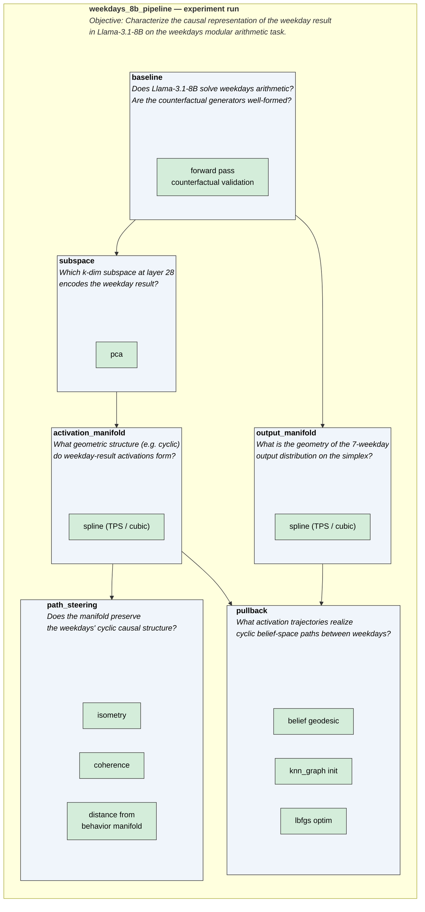

# Causal Abstraction for Mechanistic Interpretability


A framework for **mechanistic interpretability** — reverse-engineering the algorithms language models use internally using **causal abstraction**.

You write a high-level causal model describing *how you think* an LM solves a task, then run experiments to test whether the LM's internal components actually implement that algorithm.

## Quick Start

1. **Clone and install:**
   ```bash
   git clone https://github.com/goodfire-ai/causalab.git
   cd causalab
   uv sync
   ```
2. **Explore the tutorials.** The [weekdays geometry demo](demos/weekdays_geometry.ipynb) and the hands-on notebooks in [`demos/onboarding_tutorial/`](demos/onboarding_tutorial/) walk through residual-stream tracing, activation patching, DAS/DBM, boundless DAS, cross-model patching, attention-pattern analysis, and steering — end to end.
3. **Run an experiment pipeline.** `scripts/run_exp.sh` resolves a runner config by name and runs it:
   ```bash
   ./scripts/run_exp.sh weekdays_8b_pipeline
   ```
   Equivalently, invoke the Hydra runner directly with the config's path under `causalab/configs/`:
   ```bash
   uv run python -m causalab.runner.run_exp --config-name runners/weekdays/weekdays_8b_pipeline
   ```
   Runner configs live under [`causalab/configs/runners/`](causalab/configs/runners/); each composes a task, a model, and an ordered chain of analyses (see [Experiment Structure](#experiment-structure)).

## Core Concepts

### Causal Models

A causal model is your hypothesis about how the LM solves a task. It consists of:

- **Variables**: concepts that might be represented in the network (e.g., "subject name", "indirect object")
- **Values**: possible assignments to each variable
- **Parent–Child Relationships**: directed dependencies
- **Mechanisms**: functions that compute a variable's value given its parents'

### Causal Abstraction

Mechanistic interpretability aims to reverse-engineer the algorithm a network implements. Causal abstraction grounds this: an algorithm is a causal model, a network is a causal model, and "implementation" is the abstraction relation between two models. The algorithm is a **high-level causal model**, the network is a **low-level causal model**, and when the high-level mechanisms are accurate simplifications of the low-level mechanisms, the algorithm is a **causal abstraction** of the network.

### Interchange Interventions

Interchange interventions test whether a high-level variable aligns with specific features in the LM. The intervention replaces activations from one input with activations from a counterfactual input, isolating one causal pathway at a time.

Method-level techniques for *constructing* the feature space being intervened on — DAS, DBM, PCA, Boundless DAS, SAE — live in [`causalab/methods/`](causalab/methods/) and are selected as options inside analyses (e.g. `subspace.method: das`, `locate.method: interchange`).

### Experiment Structure

A causalab experiment starts with a **task** and a **research objective**, for example: *Characterize the causal representations in the Llama-3.2-1B model for the entity binding task*. The **research objective** breaks down into a series of individual **research questions**: *Does the model solve the task at all?* *At which layer and token position are causally relevant representations located?* *What geometric structure does the representation expose?* An **analysis** wraps one or more mechanistic interpretability **methods** to answer a **research question**. Causalab provides a modular set of **methods** and **analyses**, and you can add more as needed. The central Hydra config structure organizes all experiment parameters, containing defaults for models, tasks, and analyses. A specific experiment is described by a runner config that defines the order of analyses as well as optional overrides for default parameters. The diagram below shows the nesting of a full experiment run into analyses (blue), which apply one or more methods (green). The runner config that follows fully describes the same experiment.



Runner config (`causalab/configs/runners/weekdays/weekdays_8b_pipeline.yaml`):

```yaml
defaults:
  - /base

    # Set task and model
  - /task: natural_domains_arithmetic_weekdays
  - /model: llama31_8b

    # Set the sequence order of analyses
  - /analysis/baseline
  - /analysis/subspace
  - /analysis/activation_manifold
  - /analysis/output_manifold
  - /analysis/path_steering
  - /analysis/pullback
  - _self_

# Optionally override defaults
task:
  target_variable: result

subspace:
  layers: [28]

activation_manifold:
  layers: [28]

path_steering:
  n_extra_pairs: 29
  isometry:
    n_interior_per_pair: 4
```

Run it with:

```bash
./scripts/run_exp.sh weekdays_8b_pipeline
```

Each analysis writes its artifacts under `artifacts/`, keyed by task / model / analysis. Runner configs carry an optional `slurm:` block (GPU count, walltime); pass `--slurm` to `run_exp.sh` to dispatch the run as an `sbatch` job on a cluster.

## Repository Structure

The codebase follows a strict layering. See [`docs/CODEBASE.md`](docs/CODEBASE.md) for the full breakdown, layering invariants, and config conventions.

```
causalab/
├── causal/        # Causal model primitives
├── tasks/         # Task definitions (causal_models.py, counterfactuals.py, …)
├── neural/        # Model API surface — pipeline.py, units.py, LM_units.py,
│                  #   featurizer.py, activations/
├── methods/       # Reusable interpretability tools — DAS, DBM, PCA, SAE,
│                  #   manifold builders, scoring metrics
├── io/            # Single source of truth for disk I/O + shared plot primitives
├── analyses/      # Research-question wrappers (baseline/, locate/, subspace/, …)
├── runner/        # Hydra dispatcher — run_exp.py
└── configs/       # Hydra configs — analysis/, model/, task/, runners/
demos/             # Onboarding notebooks + the weekdays_geometry pipeline notebook
artifacts/         # Run outputs, keyed by task / model / analysis (gitignored)
```

**Dependency flow:** `tasks/` and `causal/` are independent. `neural/` depends on neither. `io/` depends only on `neural/`, `tasks/`, `causal/`. `methods/` depends on `neural/`, `causal/`, `io/`. `analyses/` depends on all four. `runner/` is a thin shell over `analyses/`.

### Task packages (`causalab/tasks/<name>/`)

Each task is a self-contained Python package consumed by the analyses through a fixed interface:

| File | Purpose |
|------|---------|
| `causal_models.py` | Causal model: variables, values, mechanisms |
| `counterfactuals.py` | Generates counterfactual pairs for each variable |
| `token_positions.py` | Maps variable names to token positions in the input |
| `config.py` | Constants: variable value lists, max tokens, task name |
| `templates.py` | Input text templates with placeholders |

Tasks and analyses are fully separated — define a new task and every analysis works automatically.

### Available Analyses

The runner is built around eight named **analyses**. Each answers a specific research question and may consume artifacts from earlier analyses. Chain them in a single run by listing multiple `- /analysis/<name>` entries in a runner config's `defaults:` block.

| Analysis | Research question | Depends on |
|---|---|---|
| **baseline** | Can the model solve the task? Are counterfactual generators well-formed? | — |
| **locate** | Which (layer, token_position) encodes each causal variable? | baseline |
| **subspace** | What k-dimensional subspace captures the variable's representation? | locate |
| **activation_manifold** | What is the geometric structure of activations as the variable varies? | subspace |
| **output_manifold** | What is the geometry of output distributions on the probability simplex? | baseline |
| **path_steering** | Does the subspace/manifold faithfully preserve causal structure? | subspace, activation_manifold |
| **pullback** | What activation trajectories realize prescribed belief-space paths? | activation_manifold, output_manifold |
| **attention_pattern** | Which attention heads attend to which token types? | — |

Each analysis is configured by a Hydra YAML at `causalab/configs/analysis/<name>.yaml` and invoked through a runner config under `causalab/configs/runners/<group>/<name>.yaml`. Each analysis package also has its own `README.md` documenting its configuration and outputs.

### Composing a pipeline

Analyses form a dependency DAG. Always run `baseline` first; each later analysis auto-discovers the artifacts it needs from earlier steps.

```
baseline ───────────────────────────────────────────────────────────►
    │
    ├──► locate ──► subspace ──► activation_manifold ──► path_steering
    │                                    │
    │                                    └──► pullback ◄──┐
    │                                                     │
    └──► output_manifold ─────────────────────────────────┘

attention_pattern   (independent — no upstream dependencies)
```

**Auto-discovery.** When a config param is left `null` (its default), the runner locates the upstream output automatically — prefer `null` over hardcoded paths so runner configs stay portable:

| Analysis | Param left `null` | Auto-discovered |
|---|---|---|
| `subspace` | `layers` | `best_cell` from `locate/interchange/{variable}/results.json` |
| `subspace` | `token_positions` | all task-defined positions |
| `activation_manifold` | `subspace` | most recent `subspace/` dir |
| `activation_manifold` | `layers` | `best_cell` from subspace metadata |
| `path_steering` | `subspace` / `activation_manifold` | most recent respective dir |
| `pullback` | `activation_manifold` | most recent `activation_manifold/` dir |
| `pullback` | `belief_path.output_manifold_ckpt` | most recent `output_manifold/` dir (required — no fallback) |

Verify a runner's fully-resolved config before executing it:

```bash
uv run python -m causalab.runner.run_exp --config-name <name> --cfg job
```

### Key parameters per analysis

Only the knobs that need a decision are listed; everything else defaults sensibly from `causalab/configs/analysis/<name>.yaml`.

- **baseline** — `n_train` / `n_test` (in the `task:` block; `enumerate_all: true` exhausts the input space); `batch_size`.
- **locate** — `method`: `interchange` (fast, no training; recommended first) vs `dbm_binary` (trained masks, minimal component set). `mode`: `centroid` (works with any counterfactual type) vs `pairwise` (only informative when `task.resample_variable` names the localized variable — see `docs/CODEBASE.md` §5). `layers`: coarse scan (every 4th) then narrow.
- **subspace** — `method`: `pca` (fast, no training), `das` (supervised rotation), `dbm` / `boundless` (masks), `fixed` (thread a precomputed rotation, e.g. SAE decoder directions). `k_features`: ~2–3× the number of distinct variable values for PCA; start at 8–16.
- **activation_manifold** — `smoothness`: TPS regularization (`0.0` = exact interpolation through centroids; raise if noisy). `skip_decoding_eval: true` skips the reconstruction test during exploration.
- **output_manifold** — `intrinsic_mode`: `pca` (Hellinger-PCA coordinates) vs `parameter` (causal-model parameter coordinates — better for ordinal values like weekdays).
- **path_steering** — `eval_criteria`: start with `["isometry"]`, add `coherence` / `conformal` for a full characterization. `path_modes`: default `[geometric, linear]`. Append `receptive_field` to `visualizations` for the decision-map viewer.
- **pullback** — `belief_path.n_steps`: waypoint resolution. `selected_pairs` / `max_pairs`: which class pairs to compute. Requires `output_manifold` to have run first.
- **attention_pattern** — `layers` / `heads`: `null` = all. `source_token_types` / `target_token_types`: task position names to compute token-type attention stats.

A pre-flight gate is worth adding to a chain only if it *could plausibly fail*: pair a should-pass case with an informative should-fail case (not one rigged by construction, e.g. `locate` at `L=0, BOS`, where no model has signal), run both on a small dataset, and narrow the sweep only once a clear signal separates them.

## Environment setup

### Installation

```bash
git clone https://github.com/goodfire-ai/causalab.git
cd causalab
uv sync
```

For development:

```bash
uv run pre-commit install  # set up git hooks
```

### Running experiments

`scripts/run_exp.sh` is the convenience entry point: it resolves a runner config by bare name (discovered under `causalab/configs/runners/`), runs it inline, and can dispatch to SLURM with `--slurm`.

```bash
./scripts/run_exp.sh weekdays_8b_pipeline                 # inline
./scripts/run_exp.sh --slurm weekdays_8b_pipeline         # sbatch
```

Under the hood it calls the [Hydra](https://hydra.cc/) runner, which you can also invoke directly with the config's path under `causalab/configs/` (without the `.yaml` suffix):

```bash
uv run python -m causalab.runner.run_exp --config-name runners/weekdays/weekdays_8b_pipeline
```

Override any config value on the command line, e.g. `subspace.layers=[24]`.

Optional tab-completion for `run_exp.sh` config names:

```bash
source scripts/completion.bash   # bash
source scripts/completion.zsh    # zsh
```

### Running tests

```bash
uv run pytest -m "not slow and not gpu"  # quick
uv run pytest                            # full
```

See [`docs/TESTS.md`](docs/TESTS.md) for the test-tier taxonomy (markers) and conventions.
