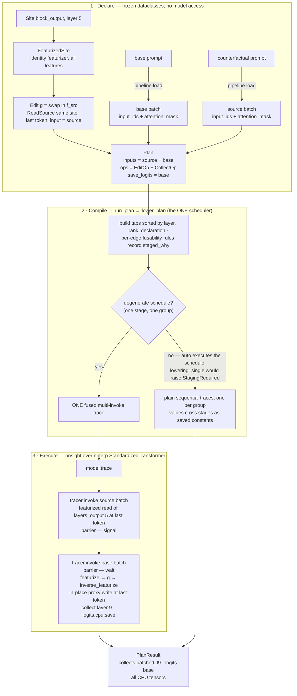
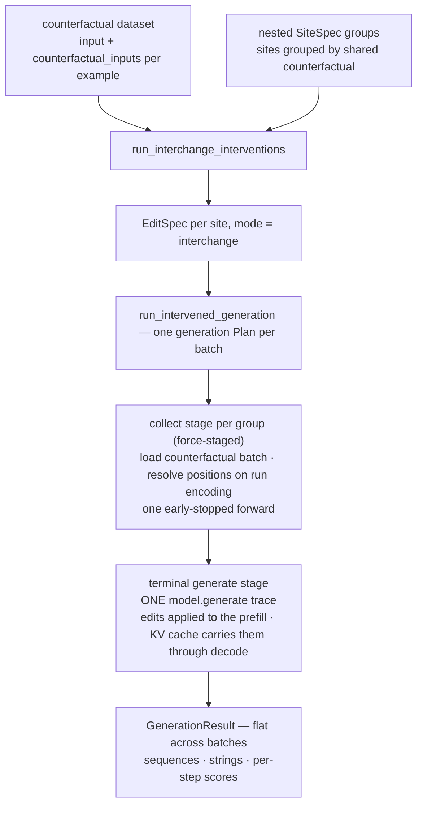

# Neural

[
  Conventions for this doc: 
  - Primitives from this module should always be highlighted as code, eg.: `causalab.neural` first defines an intervention `Plan`.
  - Write concise and only information relevant to this specific paragraph.

]

`causalab.neural` owns the direct interface to neural network internals and provides seven intervention modes. Everything here answers *where* to intervene, *how* to read from or intervene on the activation space.

## Quickstart

Let's use an interchange intervention (aka. activation patch) as a running example. Here, we run a forward pass on a `source` prompt and collect the activation at a `Site` and `TokenPosition`, then run another forward pass on a base prompt and insert the `source` activation at a `Site` and `TokenPosition`. This code snippet loads a model, declares where to read and write, builds an `Edit`, wraps it in a `Plan`, and executes.

```python
from causalab.neural.edit import Edit, ReadSource
from causalab.neural.featurized_site import FeaturizedSite
from causalab.neural.pipeline import LMPipeline
from causalab.neural.plan import EditOp, Plan, run_plan
from causalab.neural.site import Site

LAYER = 5
TOKEN_POSITION = [-1] 

pipeline = LMPipeline("meta-llama/Llama-3.2-1B")
base = pipeline.load([{"raw_input": "In Rome they speak"}])
source = pipeline.load([{"raw_input": "In Paris they speak"}])

site = FeaturizedSite(Site("block_output", LAYER))
swap = Edit(
    site,
    g=lambda f, f_src: f_src,
    read_sources=(ReadSource(site, positions=TOKEN_POSITION, input="source"),),
    positions=TOKEN_POSITION,
)

result = run_plan(
    pipeline.model,
    Plan(inputs={"source": source, "base": base}, ops=(EditOp("base", swap),), save_logits=("base",)),
)
# result.logits["base"] — logits on the base prompt under the layer-5 patch
```

The rest of this doc unpacks each piece.


## Intervention modes

An intervention always lands on a **site** (a component and layer in the network) and applies one of seven pre-defined **mode** — a choice of feature-space transform `g` over the site's activations. 

| Mode                | Reads                | Feature-space `g`                               |
|---------------------|---------------------|-------------------------------------------------|
| `collect`           | site                | identity → save                                 |
| `replace`           | (shape only)        | constant source vector                          |
| `steer`             | site                | `f + factor·v`                                  |
| `interchange`       | site + source-site  | `f_src` (full or `feature_ids` swap)            |
| `interpolate`       | site + source-site  | `fn(f_base=f, f_src=s, **params)`               |
| `noise`             | site                | `f + scale·randn(generator=seeded)`             |
| `mask`              | site + source-site  | `(1−gate)·f + gate·f_src`, gate from θ          |


## The neural network and its parts: Pipeline, Sites, TokenPositions

`causalab.neural` uses two libraries under the hood to efficiently compose interventions: [NNsight](https://nnsight.net/documentation/), which flexibly manages hooks in PyTorch and vLLM, and [NNterp](https://ndif-team.github.io/nnterp/), an NNsight wrapper that standardizes site names across transformer implementations and ships additional interpretability tools.

### Causalab's `LMPipeline`

NNterp wraps a HuggingFace causal LM in an nnsight `LanguageModel` and renames every architecture to the same module tree — `layers`, `self_attn`, `mlp`, `lm_head`, for example — so the same accessor code works on GPT-2, Llama, Qwen, and the other supported families. `LMPipeline` is the causalab entry point: it loads tokenizer + weights, wraps the HF module in nnterp's `StandardizedTransformer` (`pipeline.model`; raw HF at `pipeline.hf_model`), and owns the tokenization, padding and position ids and device resolution.

### Sites

A `Site(component, layer)` names *where* in the network to read or write.

| Component | What it is | nnterp accessor |
|---|---|---|
| `embeddings` | token-embedding output | `token_embeddings` |
| `block_input` | residual stream entering a block | `layers_input[i]` |
| `block_output` | residual stream leaving a block | `layers_output[i]` |
| `attention_output` | whole attention sublayer output | `attentions_output[i]` |
| `mlp_input` / `mlp_output` | MLP sublayer input / output | `mlps_input[i]` / `mlps_output[i]` |
| `mlp_activation` | intermediate MLP activation | raw submodule tap (architecture-specific) |

Per-head views (`HeadView`, `HeadSite`) and editable attention patterns (`AttentionProbabilitiesSite`) are separate wrappers for locations nnterp does not expose as a single named accessor. A `FeaturizedSite` wraps a `Site` with a featurizer (an SAE or DAS subspace) and optional `feature_ids`.

Custom sites for arbitrary custom models are **not implemented yet**; onboarding a new architecture today means extending nnterp's rename table (and, for `mlp_activation`, `_MLP_ACTIVATION_TAPS` in `site.py`).

### The primitives: `TokenPosition`, `Edit`, `SiteSpec`, `EditSpec`

- **`TokenPosition`** — *where* on the sequence axis (sites pick the depth axis; this picks the token). A `ComponentIndexer` that resolves declarative specs — fixed indices (`first`/`last`/`nth`), template variables, offsets, or specs keyed on causal-model settings — against a run encoding. Build with `build_token_positions`; `paired_token_position` / `combined_token_position` give base and counterfactual prompts different or unioned positions.
- **`Edit`** — the read-modify-write primitive: read a `FeaturizedSite`'s features, apply a feature-space transform, write back (`f' = g(f, *aux)`). Each `ReadSource` supplies one auxiliary value — another site read in-trace, a precomputed tensor, or the same site under a different plan input (cross-input interchange). `g=None` is a pure collect; the `modes.py` constructors just pick `g` and wire the `ReadSource`s.
- **`SiteSpec`** — the declarative dataset-scale form of *where + how*: a `FeaturizedSite` plus a `TokenPosition`, a result `key`, and the feature `width`, as a frozen value with functional updates (`with_featurizer` / `with_feature_ids` / `with_positions`).
- **`EditSpec`** — a `SiteSpec` plus a named mode (`interchange` / `interpolate` / `replace` / `add` / `noise`) and its params; the public wrappers build these per site, then lower them onto `Edit`s and a `Plan`.

### Worked sketch: interchange at one site

Activation patching is the canonical story. Run a forward on the `source` prompt and read its activation at a `Site` and token position; run another forward on the `base` prompt and write that value in at the same (or paired) site and position.

```python
from causalab.neural.edit import Edit, ReadSource
from causalab.neural.featurized_site import FeaturizedSite
from causalab.neural.pipeline import LMPipeline
from causalab.neural.plan import EditOp, Plan, run_plan
from causalab.neural.site import Site
from causalab.neural.token_positions import build_token_positions

LAYER = 5

pipeline = LMPipeline("meta-llama/Llama-3.2-1B")
positions = build_token_positions(
    {"last": {"type": "index", "position": -1}},
    template="In {city} they speak",
    pipeline=pipeline,
)
last = positions["last"]  # TokenPosition — resolves per example at run time

base = pipeline.load([{"raw_input": "In Rome they speak"}])
source = pipeline.load([{"raw_input": "In Paris they speak"}])

site = FeaturizedSite(Site("block_output", LAYER))
swap = Edit(
    site,
    g=lambda f, f_src: f_src,
    read_sources=(ReadSource(site, positions=last, input="source"),),
    positions=last,
)

plan = Plan(inputs={"source": source, "base": base}, ops=(EditOp("base", swap),), save_logits=("base",))
result = run_plan(pipeline.model, plan)
```

Building `Plan`s by hand is the right mental model for one-off probes. For a full counterfactual dataset, the public wrappers in `causalab.neural.activations` (`run_interchange_interventions`, `collect_features`, …) batch examples, resolve positions on the run encoding, and lower onto the staged executor — covered in [The same interchange at dataset scale](#the-same-interchange-at-dataset-scale) below.


## NNsight Plans

`causalab.neural` first defines an intervention `Plan`, then executes it through NNsight and NNterp. A `Plan` is a declarative spec: named inputs (pre-tokenized batch dicts), an ordered tuple of ops (`CollectOp` or `EditOp`), and what to save (logits, collects, gradients, generated sequences). The compiler in `plan.py` and `staged.py` lowers that spec onto the minimum number of nnsight traces.

A plan's **collect stages** run plain (or early-stopped) forward passes — one fused multi-invoke trace when dependencies allow, otherwise a sequence of per-input traces with values crossing stage boundaries as saved constants. An optional **generation stage** (`Plan.generate`) ends in a terminal `model.generate` trace: edits on the prefill persist through KV-cached decode, and ops can target specific generation steps via `step` (0 = prefill, *k* = the *k*-th decode pass).

For interchange across prompts, the typical layout is: one collect stage that reads every counterfactual group's source activations (force-staged when generation is involved), then a generate stage on the base input with each `EditOp` applied during prefill. The Quickstart and worked sketch above are the degenerate case — one stage, one fused trace, no generation.

Plan structure and lowering details live in `causalab/neural/plan.py` and `causalab/neural/staged.py`. The scheduler records why any cross-input edge could not fuse (`staged_why` — backwards reads, cross-model patching, mismatched padded lengths, generate-with-variable-intervention, and a few others) and either executes the staged schedule (`lowering="auto"`, the default) or refuses (`lowering="single"`).

### Efficiency optimizations

The engine is built around a few recurring wins:

- **Fused forward passes** — when producer and consumer share one model, run forward in rank, and their inputs are frame-aligned, cross-input values ride a single left-padded fused forward with `tracer.barrier` synchronization instead of separate traces. Anything that breaks those rules stages automatically (see the `staged_why` table in [Why an edge stages](#why-an-edge-stages--the-staged_why-vocabulary)).
- **Batching** — dataset wrappers (`dataset.py`, `activations/`) chunk counterfactual examples into batches; each batch builds one generation or collect plan and flattens results in a single `GenerationResult`.
- **Early-stopped forwards** — shallow collects call `tracer.stop()` after the deepest tap so you never pay for layers below the read (unless persistent edits are installed — a stop before a later edit site would strand the mediator).
- **Validate and preflight** — `validate_model_load` runs nnterp's load-time tests and records scan support; `preflight_plan` dry-runs a plan on meta tensors (`model.scan()`) to catch out-of-range layers, width mismatches, and featurizer shape errors before any GPU forward. Opt in at run time with `run_plan(..., preflight=True)`.
- **Persistent model edits** — `install_edits` applies a static `Edit` (e.g. a fixed steering vector) to every future traced forward via `model.edit(inplace=True)` — useful for whole-eval steering without threading a `Plan` through every call site. `uninstall_edits` restores the base model bitwise.

## Module map

| File | Role | Public API |
|------|------|-----------|
| `pipeline.py` | tokenize / load weights / generate; wraps `StandardizedTransformer` | `Pipeline`, `LMPipeline`, `resolve_device`, `device_for_layer`, `ensure_position_ids` |
| `site.py` | `(component, layer)` → nnterp accessor + positional slice; ragged gather/scatter | `Site`, `collect_sites`, `collect_ordered`, `RaggedIndex` |
| `featurized_site.py` | a `Site` wrapped in a `(featurize, inverse)` pair + feature-id selection | `FeaturizedSite` |
| `head_view.py` | per-head value/query/attention-value projections (the reshape nnterp lacks) | `HeadView`, `HeadSite` |
| `attention_probs.py` | editable attention pattern (nnterp `attention_probabilities[i]`; needs `enable_attention_probs=True` at load) + its two modes | `AttentionProbabilitiesSite`, `knockout`, `renormalize` |
| `edit.py` | the read-modify-write primitive: site + feature-space `g` + read-sources | `Edit`, `ReadSource` |
| `modes.py` | the seven mode constructors over `Edit` | `collect`, `replace`, `interchange`, `interpolate`, `steer`, `noise`, `mask`, `MaskGate`, `SeededNoise` |
| `plan.py` | declarative `(inputs × ops)` → minimal nnsight trace program(s) | `Plan`, `CollectOp`, `EditOp`, `GradientRequest`, `PlanResult`, `run_plan` |
| `staged.py` | the one scheduler + executor: stage layering, strictness facts, terminal generate stage | `lower_plan`, `lower_staged`, `run_plan_staged`, `StagedProgram`, `LoweredPlan` |
| `persistent.py` | model-lifetime edits via nnsight `model.edit()`: install / verify / uninstall (CAP7) | `install_edits`, `installed_edits`, `uninstall_edits`, `persistent_edits`, `PersistentEditError` |
| `dataset.py` | batched dataset execution: collect + intervened generation (incl. cross-model) | `collect_dataset_features`, `run_intervened_generation`, `resolve_spec_positions`, `cf_input_key` |
| `trainable.py` | ED3: grad contract, training edit shapes, loss slice (the outer loop lives in `causalab/methods/edit_training.py` per CODEBASE §3 inv. 1) | `das_edit`, `dbm_edit`, `traced_label_loss`, `concat_label_inputs`, `label_ce_loss`, … |
| `positions.py` | batch-first position resolution on the run encoding | `resolve_positions`, `resolve_positions_batched` |
| `preflight.py` | zero-compute `scan()` gate: position specs + plans vs a model before any forward (CAP5) | `preflight_plan`, `check_scan_support`, `PreflightReport`, `PreflightError` |
| `specs.py` | the declarative where-vocabulary: frozen site/edit values over the engine (WU1, #503) + the spec bundle save/load | `SiteSpec`, `EditSpec`, `save_site_specs`, `load_site_specs`, `SITE_SPECS_FORMAT_VERSION` |
| `featurizer.py` | feature-space transforms | `Featurizer`, `ComposedFeaturizer`, `Identity*Module` |
| `token_positions.py` | declarative token-position specs → resolved token indices; `ComponentIndexer` (the resolver base class) | `ComponentIndexer`, `TokenPosition`, `Template`, `build_token_positions`, `build_token_position_factories`, `paired_token_position`, `combined_token_position` |
| `validate.py` | model-load validation gate (+ per-model scan-support column) | `validate_model_load`, `run_nnterp_tests` |

## Core abstractions

- **`Pipeline` / `LMPipeline`** — `LMPipeline` wraps a HuggingFace causal LM in
  an nnterp `StandardizedTransformer` (`pipeline.model`; the raw HF module at
  `pipeline.hf_model`). `load()` tokenizes a batch of traces, applies the chat
  template, left-pads, and builds `offset_mapping` (+ opt-in `position_ids`);
  `generate()` runs plain generation. Pass `load_weights=False` for a
  config-only pipeline (shapes without weights).

- **Site → Edit → Plan** — a `Site` names *where* (component, layer, positions);
  `FeaturizedSite` adds *how* (featurizer + feature ids, with the error-term
  contract: only selected features move); an `Edit` is `f' = g(f, *aux)` over a
  site; a `Plan` lowers `(inputs × collect/edit ops)` onto the minimum number
  of nnsight traces (`run_plan`), honoring forward order and padding frames.
  Walked end to end in
  [The #390 engine in detail](#the-390-engine-in-detail-a-worked-interchange-intervention)
  below.

- **Persistent edits (`persistent.py`, CAP7)** — where pyvene's
  `IntervenableModel` was ephemeral (a per-batch plan threaded everywhere),
  nnsight's `model.edit(inplace=True)` installs an edit **on the model
  object**. `install_edits(model, steer(...))` applies a static `Edit` (e.g. a
  fixed steering vector) to every future traced forward — a whole eval with no
  per-batch Plan threading; `installed_edits` is the verifying read (raises
  `PersistentEditError` on registry↔backbone drift), `uninstall_edits`
  restores the base model bitwise. Composition contract: a persistent edit
  makes the model *the edited model* — Plans, collects, and traced generate
  compose on top (at a shared site the persistent edit fires first; a plan
  write lands after it), while frame-bound edits (absolute/per-row positions,
  cross-input reads) and the raw-HF path (`LMPipeline.generate`, which
  bypasses nnsight edits) are refused loudly. Full contract in the module
  docstring; pinned in `tests/neural/test_persistent.py`.

- **`SiteSpec` / `EditSpec` (the declarative where-surface, `specs.py`)** — a
  `SiteSpec` *composes* an engine `FeaturizedSite` with a declarative position
  spec, an explicit opaque result `key`, and the raw feature `width`; an
  `EditSpec` adds a named mode (`interchange`/`interpolate`/`replace`/`add`/
  `noise`) and its declarative params. Both are frozen values with functional
  updates (`with_featurizer`/`with_feature_ids`/`with_positions`). Grouping is
  plain nested sequences: group `g` of `Sequence[Sequence[SiteSpec|EditSpec]]`
  reads its sources from `example["counterfactual_inputs"][g]` (bound to plan
  input `cf_input_key(g)`). Named-subset specs persist via
  `save_site_specs`/`load_site_specs` (JSON + safetensors; loads are
  constructive). The retired pyvene-era unit vocabulary was deleted by the
  where-unification sweep (#491/#508).

- **`Featurizer`** — paired featurize/inverse modules with `is_trivial()`
  (identity) and `>>` composition (`ComposedFeaturizer`, which tracks per-stage
  reconstruction error). Concrete subclasses (SAE, subspace, …) live in
  `methods/` and are restored via lazy subclass dispatch on load.

- **`TokenPosition` / `Template`** — `Template` fills `{variable}` placeholders and
  maps character ranges → token indices via `offset_mapping` (results cached by
  tokenizer/text). `TokenPosition` (a `ComponentIndexer`) resolves indices
  dynamically against a pipeline. Build from declarative specs with
  `build_token_positions`; combine with `paired_token_position` (different
  positions for base vs. counterfactual) and `combined_token_position` (union).

## The #390 engine in detail: a worked interchange intervention

The nnterp rebase (#390) replaced the pyvene backbone — an `IntervenableModel`
assembled from dynamically-generated intervention subclasses, keyed by
component-location strings — with a small declarative engine compiled onto
**nnsight** traces. Everything you configure is a plain frozen dataclass with
no model access; two compilers lower those values onto the minimum number of
forward passes. This section walks one simple interchange end to end: every
input, every abstraction it passes through, every nnsight call it makes, and
every output.

### The configuration surface

All intervention configs are immutable dataclasses, validated at construction
— malformed specs fail before any forward pass:

| Config value | File | What it declares |
|---|---|---|
| `Site(component, layer)` | `site.py` | **where** — one of seven components (`embeddings`, `block_input`, `attention_output`, `mlp_input`, `mlp_activation`, `mlp_output`, `block_output`; the pyvene vocabulary, 1:1) at one layer. Model-free: the `StandardizedTransformer` is supplied at read/write time. |
| `FeaturizedSite(site, featurizer, feature_ids)` | `featurized_site.py` | **how** — the site read/written through a feature space. `featurizer` defaults to identity; `feature_ids` selects a static subspace (reads gather those columns, writes scatter into them). Error-term contract: the reconstruction error and untouched columns always come from base. |
| `ReadSource(value, positions, input)` | `edit.py` | one auxiliary value `g` reads — another `FeaturizedSite` (read in-trace) or a precomputed tensor. `input="source"` makes the read **cross-input**: read that plan input's activation to write this one's. |
| `Edit(site, g, read_sources, positions)` | `edit.py` | the read-modify-write `f' = g(f, *aux)`. `read_sources` is a declarative field (not baked into `g`'s closure) so the compiler can see what an edit depends on. `g=None` is a pure collect. |
| `CollectOp(input, site, key, positions)` / `EditOp(input, edit)` | `plan.py` | one site-op bound to a named plan input. `step` on either addresses one generation step of a generation plan (`0` = prefill, `k` = the k-th KV-cached decode pass, a one-token frame — CAP2, #455). |
| `Plan(inputs, ops, save_logits, gradients, models, generate)` | `plan.py` | the full spec `(inputs × ops × what-to-save)`. `models` binds an input to a different model (cross-model patching, PL4); `generate` (`GenerateSpec`) makes it a **generation plan** — ONE `model.generate` trace, stepped ops on a bounded `tracer.iter`, results in `PlanResult.sequences`/`scores`; `gradients` (`GradientRequest`) is training IR headroom (ED3). |
| `EditSpec(site, mode, vector, scale, …)` | `specs.py` | dataset-scale: one `SiteSpec` plus a mode string (`interchange` / `interpolate` / `replace` / `add` / `noise`) — what the public wrappers build per site. |

### The protocols

Two kinds of protocol ship with the engine.

**Structural interfaces** (`typing.Protocol`) — what the layers demand of each
other, so whole components and single attention heads are addressed uniformly:

- `SiteLike` (`site.py`) — `layer`, `forward_rank_on(model)`, in-trace `read`.
  `Site` and `head_view.HeadSite` both satisfy it; `collect_sites` accepts any
  mix.
- `WritableSite` (`site.py`) — a `SiteLike` that also writes; what
  `FeaturizedSite` wraps, so featurized (and Edit/Plan) machinery never cares
  whether the location is a whole sublayer or one head.
- `PositionResolver` (`positions.py`) — the `ComponentIndexer.index` call
  shape; `TokenPosition` and its combinators satisfy it by inheritance.

**Intervention protocols (the seven modes)** — on the new stack a mode is
nothing but a choice of feature-space `g` and read-sources over `Edit`, so
each pyvene intervention subclass collapsed to a constructor in `modes.py`:

| mode | reads | feature-space `g` |
|---|---|---|
| `collect` | site | identity → save |
| `replace` | (constant) | the given vector |
| `steer` | site | `f + factor·v` |
| `interchange` | site + source | `f_src` (full or `feature_ids`-subspace swap) |
| `interpolate` | site + source | `fn(f_base=f, f_src=s, **params)` |
| `noise` | site | `f + scale·randn` (seeded, advancing `SeededNoise` stream) |
| `mask` | site + source | `(1−gate)·f + gate·f_src`, learnable `MaskGate` |

Semantics are pyvene-parity, pinned against a raw-`register_forward_hook`
oracle in `tests/neural/test_modes.py`.

### Worked example: interchange at layer 5, last token

Goal: swap the layer-5 residual stream at the **last token** of a base prompt
with the same site's activation under a counterfactual prompt, then read (a)
the logits under the patch and (b) a layer-9 activation *under* the patch —
the collect∘intervene fusion pyvene needed the mixed-model machinery for.

**Inputs** — everything the run consumes:

1. **A pipeline.** `LMPipeline("meta-llama/Llama-3.2-1B")` loads tokenizer +
   weights and wraps the HF module in an nnterp `StandardizedTransformer`
   (`pipeline.model`; the raw HF module stays reachable at
   `pipeline.hf_model`).
2. **Two pre-tokenized batches.** `pipeline.load([...])` applies the chat
   template if configured, left-pads, and returns
   `{"input_ids", "attention_mask"}` on the model's device. Multi-input plans
   need pre-tokenized inputs (the compiler reads `input_ids` to align frames
   and slice logits).
3. **Token positions.** Here the literal last column `[-1]` (safe under left
   padding). Real runs resolve declarative `TokenPosition` specs against the
   batch's own run encoding via `resolve_positions_batched`, which returns
   per-row indices born in the padded frame — equal-width or ragged
   (`RaggedIndex`).
4. **The site + feature space.** `FeaturizedSite(Site("block_output", 5))` —
   identity featurizer, all features. Substituting a trained rotation +
   `feature_ids` here is the *only* change a subspace interchange (DAS) needs.
5. **The edit and the plan** — built below.

```python
from causalab.neural.edit import Edit, ReadSource
from causalab.neural.featurized_site import FeaturizedSite
from causalab.neural.pipeline import LMPipeline
from causalab.neural.plan import CollectOp, EditOp, Plan, run_plan
from causalab.neural.site import Site

pipeline = LMPipeline("meta-llama/Llama-3.2-1B")
base = pipeline.load([{"raw_input": "In Rome they speak"}])
source = pipeline.load([{"raw_input": "In Paris they speak"}])

fsite = FeaturizedSite(Site("block_output", 5))   # where + how

swap = Edit(
    fsite,                                         # write here on the base input
    g=lambda f, f_src: f_src,                      # feature-space transform
    read_sources=(                                 # ... reading the same site
        ReadSource(fsite, positions=[-1], input="source"),  # under "source"
    ),
    positions=[-1],                                # write at the last token
)

plan = Plan(
    inputs={"source": source, "base": base},
    ops=(
        EditOp("base", swap),
        CollectOp("base", FeaturizedSite(Site("block_output", 9)),
                  key="patched_l9", positions=[-1]),
    ),
    save_logits=("base",),
)

result = run_plan(pipeline.model, plan)
```

Note the cross-input interchange is spelled as a plain `Edit` with
`ReadSource(..., input="source")`. The `modes.interchange` constructor builds
the *single-input* variants (an earlier-firing site on the same input, or a
precomputed source tensor — pyvene's `source_representations` pattern);
naming another plan input is what only the Plan compiler can realize.

**What `run_plan` does** (the one scheduler + one executor, EU2 #483; this
plan schedules as the *degenerate* program — one stage, ONE fused trace):

1. **Route special plans.** A **generation plan**
   (`Plan.generate`) schedules like any other, ending in a **terminal
   generate stage** (CAP2 #455 + EU3 #484): its *ops* address ONE input —
   the generated one — and every read into the generate trace (a
   cross-input `ReadSource(..., input=…)` or a same-input read after the
   written site, which reroutes to the clean prefill-frame pass) is
   force-staged (`"generate-with-variable-intervention"`, checked before any fusability rule)
   into an earlier collect stage; the saved constants then feed ONE
   `model.generate` trace emitted last, every tap riding ONE bounded
   `tracer.iter[[k1, k2, …]]` (an explicit step list — never an unbounded
   slice, the documented deadlock; an out-of-range step is refused at
   construction because nnsight silently skips it and abandons the trace
   body) entered as the trace body's first statement — nnsight's step
   counter registers at loop entry, so a tap emitted before the loop would
   shift every later step on modules it touches (measured). Step-less and
   `step=0` ops fire at the prefill and persist through the KV-cached
   decode (pyvene's `intervene_on_prompt=True` semantics); a `step=k` op
   fires at the k-th decode pass, whose frame is one token wide.
   A **gradient plan** (`GradientRequest`) is not headroom anymore (CAP3 +
   EU2): after model-free gates (grad mode on, raw-activation `wrt`) it is
   lowered like any plan, gated on **schedule shape** (exactly one trace of
   one invoke — `NotImplementedError` "single-input plans only" otherwise,
   keyed on trace count), and executed by the single-trace gradient path
   (graph-intact saves, one `loss.backward()` after the trace closes).
2. **Dependency analysis.** `"source"` produces a cross-input value,
   `"base"` consumes it — one producers → consumers phase, so the edge rides
   in-trace and both invokes share one fused trace. (Chained flow, e.g.
   A→B→C, exceeds one phase — the scheduler simply layers it across a stage
   boundary and `auto` executes the multi-trace schedule; only
   `lowering="single"` strictness turns that schedule fact into a
   `StagingRequired`.)
3. **Tap building.** Each op is decomposed into taps keyed
   `(layer, forward_rank_on(model), declaration order)`: the source read is a
   *produce* tap in the `"source"` invoke at rank `(5, 90)`; the RMW write is
   a *consume* tap in the `"base"` invoke at the same rank; the layer-9
   collect sorts after it. Sorting taps per invoke honours nnsight's
   constraint that one trace touches modules in forward-execution order (an
   unordered read list is a `MissedProviderError`).
4. **Per-edge fusability rules.** An edge rides in-trace only if it runs
   forward in rank, joins frame-aligned inputs (nnsight fuses the invokes
   into ONE left-padded forward, so mixed lengths would shift the shorter
   inputs' resolved positions) on the same model, its producer is not itself
   an in-trace consumer, and the group's one barrier can serve every edge
   (latest produce hook at or before the earliest consume hook — equality,
   same site, is the canonical interchange). An edge that fails a rule is
   *staged* instead — the scheduler records the per-edge reason
   (`staged_why` — see the vocabulary table below) and the plan runs as
   plain sequential traces, values
   crossing stage boundaries as saved constants (no `model.session()` — see
   `staged.py`'s "No session" policy). Under `lowering="single"` the same
   recorded facts assemble a `StagingRequired` message; nothing is raised
   under `auto`.
5. **Emission.** One `model.trace()` with one `tracer.invoke(inputs)` per
   input, producers defined first, synchronized by one `tracer.barrier(2)`:

   ```python
   with model.trace() as tracer:
       with tracer.invoke(source_inputs):          # rows 0..b in the fused batch
           value = fsite.read(model, [-1])          # featurize(layers_output[5][:, [-1]])
           barrier()                                # signal: value is available
       with tracer.invoke(base_inputs):             # rows b..2b
           barrier()                                # wait for the source read
           # featurize base → g(f, f_src) → inverse_featurize with base error
           # → in-place proxy write: layers_output[5][:, [-1]] = reconstruction
           swap_write(model)
           collects["patched_l9"] = l9_site.read(model, [-1]).cpu().save()
           logits = model.logits.cpu().save()       # trace-scoped: full fused batch
   ```

   nnsight runs both invokes as **one fused forward** over the concatenated
   batch; per-invoke reads are row-scoped to their own input's rows. Writes
   mutate the read proxy in place (`proxy[:, positions] = value`) — nnsight
   tracks the mutation and propagates it into the rest of the forward, which
   is why the layer-9 collect and the logits see the patch. Values are moved
   to the site's device/dtype first (sharded `hf_device_map` models place
   layers on different GPUs). Per-invoke `position_ids` are re-fused by the
   compiler (`_fuse_position_ids`) because nnsight's invoke batching merges
   only `input_ids`/`attention_mask`/`labels`.
6. **Result assembly.** The fused logits are saved once and sliced back into
   per-input rows by invoke definition order.

**Outputs** — a `PlanResult`, everything CPU (the package convention):

- `result.logits["base"]` — `(1, seq, vocab)`: the base prompt's logits under
  the layer-5 patch. (`"source"` was not in `save_logits`, so its rows are
  dropped.)
- `result.collects["patched_l9"]` — `(1, 1, hidden)`: layer 9 at the last
  token, *downstream of* the patch, same forward.



### Why an edge stages — the `staged_why` vocabulary

Step 4 above decides, per cross-invoke edge, whether it rides the fused
trace or crosses a stage boundary as a saved constant. Every edge staged
*by rule* is recorded in `StagedProgram.staged_why` under one of six
reasons (`_STAGED_WHY` in `causalab/neural/staged.py`) — the schedule facts
`lowering="single"` refusal messages are assembled from. In check order:

| Reason | The edge stages because… | The staged schedule |
|---|---|---|
| `generate-with-variable-intervention` | its consumer is the terminal `model.generate` invoke, and a generate trace accepts only constants. Checked before every fusability rule, so even a frame-aligned forward-rank edge stages (EU3, #484) | the producer runs in an earlier collect stage; the generate trace consumes the saved value |
| `intervene-backwards` | it reads a site at a later forward rank than the site it writes — one forward pass cannot deliver a value backward in time | the read runs in an earlier trace; the write consumes it as a saved constant |
| `cross-model` | its producer and consumer inputs are bound to different models (`Plan.models`) — two models never share one fused forward (PL4, #406) | each trace runs on its input's model; the value crosses as a saved tensor |
| `variable-token-positions` | its inputs are not pre-tokenized, or their padded lengths differ — one left-padded fused forward would shift the shorter inputs' resolved positions | each input keeps its own frame in its own trace; nothing shifts |
| `chain-across-invokes` | its producer already consumes an in-trace value (the A→B→C chain): the middleman would have to stand on both sides of the trace's ONE barrier — one producers → consumers phase per trace | the chain is cut at the second hop; the downstream value crosses a stage boundary |
| `separate-concurrent-interventions` | independent edges — each forward-in-rank on its own — cannot share the group's single barrier: some producer saves after another edge's consumer applies (the measured `MissedProviderError` shape) | the group dissolves (`_rendezvous_conflict`); producers run a stage earlier, consumers read saved values |

Edges staged only as a consequence of their endpoints' layering (their
stages simply differ) carry no entry. Only a genuine cross-input **cycle**
is refused outright — no trace order can deliver values in both directions;
break it by declaring one input twice.

### Interfaces to nnsight / nnterp

Everything the engine asks of the backbone, and where:

| nnsight / nnterp API | Engine call site | What for |
|---|---|---|
| `StandardizedTransformer` (nnterp) | `LMPipeline._setup_model` → `pipeline.model` | model wrapping; proxies `.config`/`.device`/`.dtype`/`.generation_config`; raw HF module at `._model` (`pipeline.hf_model`) |
| standardized accessors `layers_input[i]`, `layers_output[i]`, `mlps_input[i]`, `mlps_output[i]`, `attentions_output[i]`, `token_embeddings`, `num_layers` | `Site._proxy` | the component vocabulary → in-trace read/write handles (tuple outputs unwrapped by nnterp on `__getitem__`) |
| raw submodule tap (`model.model.layers[i].mlp.<child>.input/output`) | `Site` (`mlp_activation` only) | the one component nnterp has no named accessor for, resolved per architecture via `_MLP_ACTIVATION_TAPS` |
| `model.trace(inputs)` | `collect_ordered`, `run_plan`, `staged` | one traced forward; the trace body runs interleaved with the forward, hence the forward-order tap constraint |
| `tracer.invoke(inputs)` | `plan._emit_invokes` | multi-input fusion: invokes concatenate into ONE left-padded forward, reads row-scoped per invoke |
| `tracer.barrier(n)` | `plan._emit_invokes` | the cross-invoke rendezvous moving source values into the base invoke (producers signal, consumers wait) |
| `tracer.stop()` | `collect_ordered`, every plan/staged trace saving no logits (`plan._stop_carrier`) | early-stop after the trace's deepest tap (CAP6, #459) — a shallow collect never pays for the remaining layers or the unembed; in a fused multi-invoke trace the stop rides the last invoke touching the deepest hook |
| in-trace proxy indexing / in-place assignment | `Site.read` / `Site.write` | positional gather/scatter (`proxy[:, idx]`, per-row `(batch, k)`, flat ragged) and the write nnsight propagates into the forward |
| `.cpu()` + `.save()` on proxies | every collect | materialize values past trace exit; CPU offload convention |
| `model.logits` | `run_plan`, `staged` | nnterp's trace-scoped logits accessor — saved once per fused trace, sliced per input |
| `model.generate(inputs, **hf_kwargs)` + `model.generator.output.save()` | `plan._emit_generate_trace` (the ONE intervened-generation emitter), `dataset._plain_generate` (the un-intervened baseline — not a Plan) | intervened generation: edits applied to the prefill persist through KV-cached decode (pyvene's `intervene_on_prompt=True` semantics) |
| `tracer.iter[[k1, k2, …]]` (always a bounded, explicit step list) | `plan._emit_generate_trace` | decode-step edits/collects (CAP2, #455): the loop body fires at generation step k (pass 0 = prefill; decode frames are one token wide); unbounded `iter[:]` is the documented deadlock and an out-of-range step silently skips + abandons the trace body — both refused up front |
| `model.session()` | **unused — deliberately** | removed from the staged executor (EU1, #482): measured time-free and benefit-free, values cross traces as concrete saved tensors either way; re-introduction gate in `staged.py`'s "No session" policy |
| `model.edit(inplace=True)` / `clear_edits()` / `_default_mediators` | `persistent.install_edits` / `uninstall_edits`; `site.backbone_has_edits` | model-lifetime edits: one default mediator per installed `Edit`, re-run on every future trace; the mediator count is the verify ground truth, and its presence suppresses `tracer.stop()` early-exit (a stop before the edit's module event strands the mediator — measured `MissedProviderError`) |
| invoke-batching quirk (`LanguageModel._batch` merges only `input_ids`/`attention_mask`/`labels`) | `plan._fuse_position_ids` | compiler-owned fix: fused-shape `position_ids` ride the first invoke |

### The same interchange at dataset scale

Analyses never build Plans by hand — they call the public wrapper over a
*counterfactual dataset* (`CounterfactualExample`: a base `input` plus
`counterfactual_inputs`, one per group) and nested `SiteSpec` groups (the
declarative where-surface: engine site, featurizer, position resolver —
grouped so each group shares one counterfactual input):

```python
from causalab.neural import LMPipeline
from causalab.neural.token_positions import build_token_positions
from causalab.neural.activations.site_grids import build_residual_stream_sites
from causalab.neural.activations.interchange_mode import run_interchange_interventions

pipeline = LMPipeline("meta-llama/Llama-3.2-1B", max_new_tokens=3)
positions = build_token_positions(
    {"last": {"type": "index", "position": -1}},
    template="In {city} they speak",
    pipeline=pipeline,
)
grid = build_residual_stream_sites(
    pipeline, layers=[5], token_positions=[positions["last"]]
)  # {(5, "last"): [[SiteSpec(fsite=FeaturizedSite(Site("block_output", 5)), ...)]]}

dataset = [{
    "input": {"raw_input": "In Rome they speak"},
    "counterfactual_inputs": [{"raw_input": "In Paris they speak"}],
}]
outputs = run_interchange_interventions(
    pipeline, dataset, grid[(5, "last")], batch_size=32, output_scores=10,
)
```

`run_interchange_interventions` wraps every site in an
`EditSpec(site, mode="interchange")` and hands the groups to
`run_intervened_generation`, which per batch builds ONE generation `Plan`
(an `EditOp` per edit spec on the base input, each group's counterfactual
batch as its own plan input read through cross-input `ReadSource`s, a
`GenerateSpec`) and lets `run_plan` derive the **split-forward layout** (the
pyvene-parity choice for generation — EU4, #485):

1. one `pipeline.load(..., return_offsets_mapping=True)` per batch side — the
   run encoding both feeds the model and anchors position resolution
   (`resolve_positions_batched`), so indices are born in the padded frame;
2. one fused, early-stopped force-staged collect trace per counterfactual
   group, reading every source-needing unit's featurized activation (on
   `source_pipeline`'s model — bound via `Plan.models` — when patching
   cross-model);
3. ONE terminal `model.generate` trace over the base batch with every edit
   applied during the prefill — persisting through the KV-cached decode;
4. one flat `GenerationResult` (EU5a, #486): CPU `sequences
   (n_examples, max_new_tokens)`, `strings` (always a list), per-step
   `scores (n_examples, vocab)` — concatenated across the internal batches;
   the wrapper compresses to top-k (`compress_scores_top_k`) when
   `output_scores` is an int and returns the `GenerationResult` itself
   (EU5b, #487) — `to_raw_results()` survives only as the io-only view at
   the artifact boundary.



Collect-only execution (`collect_dataset_features`) skips the generate pass
and lowers straight onto `run_plan` — one fused, early-stopped forward per
batch with one `CollectOp` per spec.

## `activations/` — dataset-scale wrappers

The public wrappers that execute the modes the spec layer configures, all
lowering onto `dataset.py` / `plan.py`.

| File | Role |
|------|------|
| `site_grids.py` | build `SiteSpec` grids per component type — `build_residual_stream_sites`, `build_attention_head_sites`, `build_attention_output_sites`, `build_mlp_sites` — plus `grid_component`, `extract_grid_dimensions_from_targets` (not re-exported; import from the module path) |
| `collect.py` | collect activations / features — `collect_features` |
| `interchange_mode.py` | activation swapping base↔counterfactual — `run_interchange_interventions` (same-model and cross-model via `source_pipeline`) |
| `interpolate.py` | arbitrary featurized interpolation `fn(f_base, f_src, **params)` — `run_interpolation_interventions` |

## Data flow

Canonical sequence:

```
LMPipeline(model)                     # 0  load model + tokenizer
  → build_token_positions(...)        # 2  where: token indices
  → build_*_sites(...)                # 2  where: component + layer, grouped
                                      #    into a SiteSpec grid
  → spec.with_featurizer(Featurizer)  # 3  how: feature space (identity by
                                      #    default; functional attach)
  → run_interchange_interventions(    # 4  run the mode on the engine
        pipeline, dataset, groups)    #    (EditSpec → run_intervened_generation)
  → GenerationResult                  # 5  ONE flat result (scores_top_k via
                                      #    compress_scores_top_k for int
                                      #    output_scores)
```

Scoring the outputs (IIA, base accuracy, label predictions) is the metric
layer's job — `causalab/methods/metric.py` (`outputs_from_logits`,
`as_generation_result`, `score_base_outputs`, `score_intervention_outputs`,
`score_label_predictions`).

Training (DAS/DBM) composes `trainable.py`'s primitives; the orchestration
lives in `causalab/methods/trained_subspace/train.py`.

### Persistence

`SiteSpec` bundles round-trip via `save_site_specs`/`load_site_specs`
(`specs.py`): one `sites.json` (per spec: key, structured site record,
feature ids, position *name*, width, format version) plus safetensors for
non-trivial featurizers (`Featurizer.to_dict`/`from_dict`). Loads are
constructive — they *return* specs; named positions rebind through the
caller's `token_positions` mapping. The loader keeps a legacy branch for
pre-#508 `units_metadata.json` bundles.
