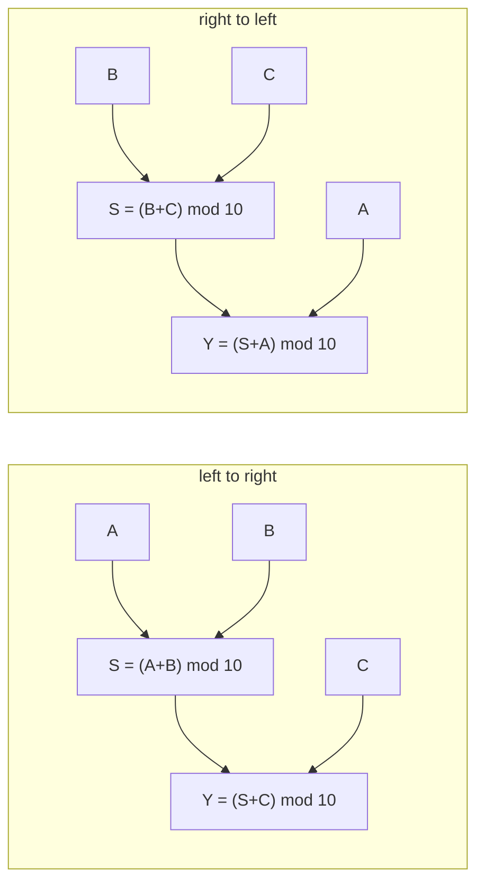

# Can an intervention tell two algorithms apart when their outputs never differ?

| | |
|---|---|
| **Question** | Two causal models compute the same function on every input. Does an intervention distinguish them? |
| **Method** | interchange interventions on the causal models — no neural network, no dataset |
| **Model** | none |
| **Data** | none: the input space is 10³ triples and is enumerated |
| **Documents** | none: this demo's artifact is the pair of causal graphs, built in the snippet below |
| **Cost** | CPU, under half a second |
| **Reproduced** | ✓ 2026-08-31, CPU, `causalab.causal.causal_model` |

## TL;DR

A **causal model** is a graph of variables, each computed from its parents, and
the reason interpretability starts there is that a graph says more than the
function it computes. Two graphs for `(A + B + C) mod 10` — one summing left to
right, one right to left — agree on **all 1000** inputs, so no amount of
input/output testing separates them. Interchanging their one *intermediate*
variable separates them on **914 of 1000** random pairs, against an exact chance
level of 0.900. Interchanging the *output* separates them on **0**, and that
zero is an identity rather than a failure: it is what makes "intervene on the
inside" a method rather than a preference.

## The protocol

This demo touches no network, so it has no intervention protocol and no
dataset. The artifact that fully determines the experiment is the **pair of
causal graphs**, and building them is the whole setup.

A causal model is `mechanisms` plus `values`: each variable declares its
parents and a function of them, and `values` declares what it may take.



The two differ in one edge set and nothing else. `S` is the partial sum, and
the disagreement is about *which* partial sum a system computes on the way to
the answer — the smallest possible difference between two algorithms for one
function.

Every causal model here declares two reserved variables: `raw_input`, the value
a network would be fed, and `raw_output`, the value its output would be
compared against. They are what lets the same graph later stand as a hypothesis
about a network ([01](../onboarding_tutorial/01_define.md)); nothing in this
demo needs a network for them to mean something.

| piece | says | why this and not that |
|---|---|---|
| `input_var(DIGITS)` | `A`, `B`, `C` have no parents | an input variable's mechanism is its domain; a graph with no roots has nothing to intervene *from* |
| `Mechanism(parents=…, compute=…)` | one variable, its parents, its function | parents are declared rather than inferred from the closure, so the graph is a value the library can read without running it |
| `values` | each variable's domain | `DIGITS` here, `None` for the raw pair — an enumerable domain is what makes `enumerate_inputs` and the exhaustive check in Q1 possible at all |
| `trace["S"] = …` | the intervention | assignment into a copied trace *is* the do-operator; the copy is what keeps the base trace readable afterwards |

## Run it

```bash
uv run python - <<'PY'
import itertools, random
from causalab.causal.causal_model import CausalModel
from causalab.causal.trace import Mechanism, input_var

DIGITS = list(range(10))

def build(order):
    """'ltr': S = (A+B)%10, Y = (S+C)%10.   'rtl': S = (B+C)%10, Y = (S+A)%10."""
    values = {v: DIGITS for v in ("A", "B", "C", "S", "Y")} | {"raw_input": None, "raw_output": None}
    m = {"A": input_var(DIGITS), "B": input_var(DIGITS), "C": input_var(DIGITS),
         "raw_input":  Mechanism(parents=["A","B","C"], compute=lambda t: [t["A"], t["B"], t["C"]]),
         "raw_output": Mechanism(parents=["Y"], compute=lambda t: t["Y"])}
    if order == "ltr":
        m["S"] = Mechanism(parents=["A","B"], compute=lambda t: (t["A"] + t["B"]) % 10)
        m["Y"] = Mechanism(parents=["S","C"], compute=lambda t: (t["S"] + t["C"]) % 10)
    else:
        m["S"] = Mechanism(parents=["B","C"], compute=lambda t: (t["B"] + t["C"]) % 10)
        m["Y"] = Mechanism(parents=["S","A"], compute=lambda t: (t["S"] + t["A"]) % 10)
    return CausalModel(m, values, id=f"add_{order}")

ltr, rtl = build("ltr"), build("rtl")

def interchange(model, base, cf, variable):
    """Fix `variable` to the value this model computes on `cf`; read the output."""
    t = model.new_trace(base).copy()
    t[variable] = model.new_trace(cf)[variable]
    return t["raw_output"]

# Q1 -- do the two graphs compute the same function?
n_all = 10 ** 3
disagree = sum(ltr.new_trace(i)["raw_output"] != rtl.new_trace(i)["raw_output"]
               for i in ({"A": a, "B": b, "C": c} for a, b, c in itertools.product(DIGITS, repeat=3)))
print(f"Q1  inputs enumerated                       {n_all}")
print(f"Q1  inputs on which the outputs differ      {disagree}")

random.seed(0)
draw = lambda: {"A": random.choice(DIGITS), "B": random.choice(DIGITS), "C": random.choice(DIGITS)}
pairs = [(draw(), draw()) for _ in range(1000)]

# Q2 -- does an interchange on the intermediate tell them apart?
d_S = sum(interchange(ltr, b, c, "S") != interchange(rtl, b, c, "S") for b, c in pairs)
print(f"Q2  pairs                                   {len(pairs)}")
print(f"Q2  pairs distinguished by interchanging S  {d_S}  ({d_S / len(pairs):.3f})")

# Q3 -- the floor: pairs on which both interchanges are no-ops
noop = sum(ltr.new_trace(b)["S"] == ltr.new_trace(c)["S"]
           and rtl.new_trace(b)["S"] == rtl.new_trace(c)["S"] for b, c in pairs)
print(f"Q3  pairs where both interchanges are no-ops {noop}  ({noop / len(pairs):.3f})")
print(f"Q3  pairs where the two agree anyway         {len(pairs) - d_S}  ({(len(pairs) - d_S) / len(pairs):.3f})")

# Q4 -- interchanging the OUTPUT instead
d_Y = sum(interchange(ltr, b, c, "Y") != interchange(rtl, b, c, "Y") for b, c in pairs)
print(f"Q4  pairs distinguished by interchanging Y   {d_Y}  ({d_Y / len(pairs):.3f})")
PY
# Q1  inputs enumerated                       1000
# Q1  inputs on which the outputs differ      0
# Q2  pairs                                   1000
# Q2  pairs distinguished by interchanging S  914  (0.914)
# Q3  pairs where both interchanges are no-ops 11  (0.011)
# Q3  pairs where the two agree anyway         86  (0.086)
# Q4  pairs distinguished by interchanging Y   0  (0.000)
```

**Hardware.** None. **Measured: 0.40 s** of wall clock on one laptop core (best of three,
interpreter start-up included), for the 1000-input enumeration and all three
1000-pair sweeps. Everything in this
demo is arithmetic over integers, which is the reason to do it before booking
anything: the questions it answers are the ones a GPU cannot answer any better.

## Experimental design

An **intervention** fixes a variable to a value and recomputes its descendants.
An **interchange intervention** does not name the value: it takes the value the
*same model* computes on a second input, and installs that. The difference
matters here because "4" is a number a reader has to invent, while "whatever
`S` is on `A=3, B=1`" is a number the graph supplies — and on a network, where
no reader can invent a plausible activation, only the second form is available
at all.

Both graphs compute `(A + B + C) mod 10`, since addition mod 10 is associative.
So they are **extensionally equal** and **structurally different**, which is
exactly the situation interpretability is in: a network's behaviour is
observable and its algorithm is not.

**Q1 — do the two graphs ever disagree on an output?** The count over all 10³
inputs. Null: 0, and here the null is the *prediction* — a non-zero count would
mean one of the two graphs is not an addition and the comparison is void.

**Q2 — does interchanging the intermediate `S` distinguish them?** The
proportion of 1000 random pairs on which the two post-interchange outputs
differ. **The floor is 0.900, exactly**, and it is derivable rather than
estimated — see the box below. A result near 0.9 means the intervention is
decisive; a result near 0.0 would mean the two graphs are indistinguishable
even from the inside.

**Q3 — how much of the 0.100 residue is a no-op?** The proportion of pairs on
which the interchange changes nothing in *either* graph, because the two inputs
happen to produce the same partial sum. Expected 0.010: two independent
congruences mod 10.

**Q4 — does interchanging the output `Y` distinguish them?** Same measurement,
one variable later. Expectation: 0.000, and not as a disappointment.

> **Why is Q2's floor exactly 0.900?** Interchanging `S` from the counterfactual
> makes the left-to-right graph answer `(A_cf + B_cf + C_base) mod 10` and the
> right-to-left graph answer `(B_cf + C_cf + A_base) mod 10`. Those agree
> precisely when `A_cf − A_base ≡ C_cf − C_base (mod 10)` — two independent
> uniform differences, which coincide with probability 1/10. So the two graphs
> are *guaranteed* to look alike on a tenth of any random pair set, and no
> experimental care removes it. A measured 0.914 is that identity, measured.

> **Why intervene on `S` and not on `A`, `B` or `C`?** An input variable has no
> parents, so fixing it is the same as feeding a different input — and Q1 has
> already established that feeding different inputs tells the two graphs
> nothing. The intermediate is the only place where the two disagree, so it is
> the only place an intervention can find them out. That sentence, transposed
> to a network, is the whole of activation patching.

## Results

Run on 2026-08-31, CPU, `causalab.causal.causal_model` at this branch. Every
number below is from the snippet above, at `random.seed(0)`.

### Q1 — never, on any input

✓ **0 of 1000** inputs produce different outputs. Addition mod 10 is
associative, so this is arithmetic passing, not a finding: any other number
would mean one of the two graphs is not the function it claims.

What it establishes is the demo's premise. The two graphs are
**behaviourally identical**, so every input/output test — every benchmark,
every accuracy number, every held-out split — is blind to the difference
between them, by construction rather than by bad luck.

**Verdict.** Never. Behaviour cannot separate these two hypotheses.

### Q2 — yes, on 914 of 1000 pairs

**Finding.** Interchanging `S` separates the two graphs on **0.914** of random
pairs, against the exact chance level of **0.900** derived above. With 1000
draws the standard error is 0.009, so 0.914 is 1.5 standard errors from the
identity — the measurement *is* the identity, which is the strongest form this
result can take.

The point is not the third decimal. It is that a quantity which is identically
0.000 under behavioural testing is 0.9 under an intervention on the inside, and
the whole difference is *where the experiment reaches*.

**Verdict.** Yes. A variable neither graph exposes at its interface is the one
that tells them apart.

### Q3 — a tenth of the residue is the graphs agreeing, not the method failing

The 86 pairs on which the two agree are 0.086 of the set, against the 0.100 the
congruence above predicts. Of those, **11** — 0.011, against a predicted 0.010 —
are pairs where the interchange is a no-op in *both* graphs, because the two
inputs happened to produce the same partial sum.

✓ Both numbers land on their predicted values, so the residue is fully
accounted for: it is the arithmetic, not a shortfall in the design. A reader
who saw 0.914 without the floor would be entitled to ask what the other 8.6%
was doing; this is the answer, and it is the reason the floor belongs in the
sentence with the number.

**Verdict.** All of it. 0.086 measured against 0.100 predicted, of which 0.011
against 0.010 predicted is the interchange doing nothing at all.

### Q4 — no, and the zero is an identity

✓ **0 of 1000**. Interchanging `Y` makes both graphs answer `Y_cf`, and Q1 has
already established that `Y_cf` is the same value in both. So the zero is not a
weak result, a bug, or a sign that the sweep was too small: it is `0 = 0`,
and it would stay 0 for any number of pairs and any seed.

This is the sharpest thing the demo has to say. **The output is the one variable
an intervention learns nothing from**, because it is the variable the two
hypotheses were assumed to share. An experiment that patches only at the last
layer has made exactly this mistake, and its null result means nothing.

**Verdict.** No, by identity. Intervene upstream of where the hypotheses agree,
or do not intervene.

## Limits

- Two hypotheses, one intermediate variable, one arithmetic task. A real
  hypothesis space is larger and its members rarely differ in one edge.
- The 0.900 floor is a property of *this* pair of graphs. Two hypotheses that
  differ less would have a floor closer to 1.0 — the same measurement, less
  evidence per pair — and nothing here computes that floor automatically.
- Everything is exact because every variable is a digit. A causal model over
  continuous values has no enumerable input space, so Q1's exhaustive check
  becomes a sample and the premise becomes a claim.
- The demo shows that an intervention *can* separate two hypotheses. It says
  nothing about whether a network implements either — that needs an alignment
  between the graph's variables and the network's activations, which is what
  every other demo here is about.
- `raw_input` and `raw_output` are declared and never used: no network is fed
  and no output is compared. They are here because the *next* demo needs them.

## Next

- **[01 — Define the task](../onboarding_tutorial/01_define.md)** asks the same
  question of a *dataset* rather than a pair of graphs: given one causal model
  with two candidate variables, which counterfactual designs separate them, and
  by how much.
- **[02 — Trace one pair](../onboarding_tutorial/02_trace.md)** does to a
  network what Q2 does here — installs a value harvested from a second input
  and reads what changes — with the residual stream in the role of `S`.
