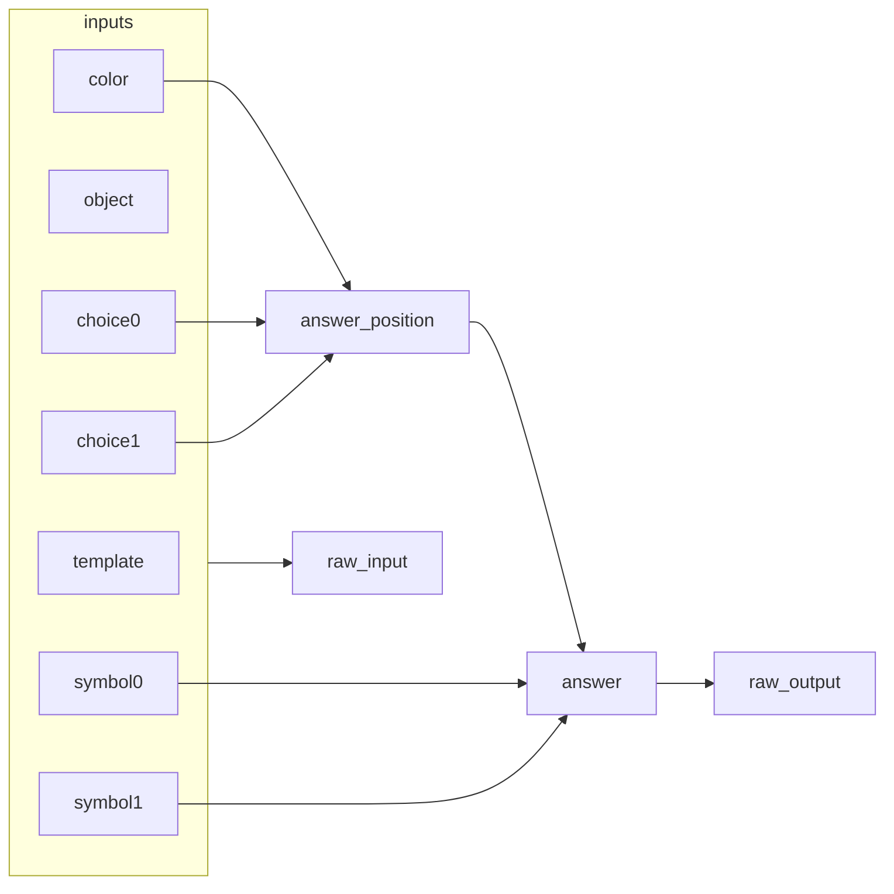

# 01 — Can this counterfactual dataset tell two variables apart?

| | |
|---|---|
| **Question** | Does a counterfactual dataset distinguish the causal variable we care about from the one next to it? |
| **Method** | interchange interventions on the causal model — no neural network |
| **Model** | none |
| **Data** | `mcqa/pairs_n64_s0` — 64 pairs, `different_symbol` design |
| **Documents** | none: this demo builds the dataset the next two run on |
| **Cost** | CPU, under a second |
| **Reproduced** | ✓ 2026-08-31, CPU, `causalab.causal.causal_utils` |

## TL;DR

Before any activation is patched, a counterfactual dataset already decides which
hypotheses an experiment can tell apart. On multiple-choice questions with two
candidate variables — the **answer** symbol and the **position** the answer sits
in — a random pair of prompts separates them, but leaves `answer_position`
confounded with doing nothing on 47% of pairs. Changing only the answer symbols
between the two prompts drives that confound to **0.000 over 64 pairs**, which is
what makes the next two demos measurable at all.

## The protocol

This demo touches no network, so it has no intervention protocol. The artifact
that fully determines the experiment is the **dataset**, and building it is the
step the following demos consume.

The task is multiple-choice question answering (Wiegreffe et al.,
[arXiv:2407.15018](https://arxiv.org/abs/2407.15018)): a colour is stated, then
asked about.

```
The cup is red. What color is the cup?
M. orange
Z. red
Answer:
```

A **causal model** is a directed graph of variables, each with a mechanism that
computes its value from its parents. `causalab/tasks/MCQA/causal_models.py`
defines this one:



Read the arrows off `cm.parents`: `answer_position ← color, choice0, choice1`
(which slot holds the stated colour), `answer ← answer_position, symbol0,
symbol1` (the symbol in that slot), `raw_input ← all seven inputs`, and
`raw_output ← answer`.

`answer_position` is the hypothesis: the model finds *which slot* holds the
right colour, and reads the symbol out of that slot. `answer` is the output
side of the same step — the symbol itself. They sit one edge apart, and an
experiment that cannot separate them is an experiment about neither.

Every causal model here declares two reserved variables: `raw_input`, the value
a network is fed, and `raw_output`, the value its output is compared against.

Serializing turns the causal model plus a counterfactual generator into a table
of bytes:

```bash
uv run python scripts/build_task_dataset.py \
    --task MCQA --n 64 --seed 0 --target-variable answer \
    --out demos/onboarding_tutorial/data/mcqa/pairs_n64_s0.json
# wrote demos/onboarding_tutorial/data/mcqa/pairs_n64_s0.json (64 rows, digest fb090897ec40…)
```

One row, elided to the columns a document names:

```json
{
  "input":                 "The cup is red. What color is the cup?\nM. orange\nZ. red\nAnswer:",
  "counterfactual_inputs": ["The cup is red. What color is the cup?\nJ. orange\nQ. red\nAnswer:"],
  "base_answer": " Z",
  "cf_answer":   " Q",
  "label":       " Q",
  "answer_position": "1",
  "symbol0": "M", "symbol1": "Z", "object": "cup", "color": "red"
}
```

| column | says | why this and not that |
|---|---|---|
| `input` / `counterfactual_inputs` | the two prompts a pair compares | a list, so a document addresses `counterfactual_inputs[0]` and a second counterfactual needs no new column |
| `base_answer`, `cf_answer` | what each prompt answers on its own | a `logit_diff` metric names both; keeping them apart from `label` is what lets a metric ask "did it move" separately from "did it land" |
| `label` | what the causal model answers **after** the interchange | for `different_symbol` this equals `cf_answer`; for a design that resamples several variables it would not |
| everything else | the causal model's variables, per row | a position spec can anchor to them, and `validate --data` checks the reference |

Serializing ahead of the run is what keeps a document's digest a function of
committed bytes: a ref resolves by reading a file, so `validate` needs no task
code, no tokenizer and no network. The sidecar
`pairs_n64_s0.manifest.json` records the parameters — the table is a build
product, the manifest is the recipe.

## Run it

```bash
uv run python - <<'PY'
import random
from causalab.causal.causal_utils import can_distinguish_with_dataset
from causalab.tasks.MCQA.causal_models import positional_causal_model as cm
from causalab.tasks.MCQA import counterfactuals as gens

for name in ("random_counterfactual", "different_symbol", "same_symbol_different_position"):
    random.seed(0)
    pairs = [getattr(gens, name)() for _ in range(64)]
    answer   = can_distinguish_with_dataset(pairs, cm, ["answer"])
    position = can_distinguish_with_dataset(pairs, cm, ["answer_position"])
    both     = can_distinguish_with_dataset(pairs, cm, ["answer"], cm, ["answer_position"])
    print(f"{name:32s} {answer['proportion']:6.3f} {position['proportion']:6.3f} {both['proportion']:6.3f}")
PY
```

`can_distinguish_with_dataset` runs the interchange on the *causal model* and
reports the proportion of pairs on which two hypotheses produce different
outputs. Hardware: none — this is arithmetic over strings, and it is the whole
reason to do it before booking a GPU.

## Experimental design

An **interchange intervention** fixes a variable to the value it would have
taken under a second input. Fix `answer_position` to the counterfactual's value
and the causal model answers with the symbol in that slot; fix `answer` and it
answers with the counterfactual's symbol. When those two land on the same
string, the pair **confounds** the variables: no experiment run on it can say
which one a network implements.

We compare three counterfactual designs, all sampling from the same task:

| design | the counterfactual is |
|---|---|
| `random_counterfactual` | an independently sampled question |
| `different_symbol` | the same question with new answer symbols |
| `same_symbol_different_position` | the same symbols, the correct colour moved to the other slot |

**Q1 — does a random pair separate `answer` from the null hypothesis?** The
proportion of pairs on which interchanging `answer` changes the output. Null:
0.0, meaning the two prompts already answer the same thing.

**Q2 — does it separate `answer_position`?** Same, for the positional variable.
Random pairs put the correct answer in the same slot about half the time, so
the expectation here is ≈0.5 — and a variable that is confounded with *doing
nothing* on half the dataset halves the evidence any downstream IIA carries.

**Q3 — does a design exist that drives Q2 to a clean 0 or 1?** The two crafted
designs each hold one variable fixed by construction, so each should be
saturated: 1.000 for the variable it varies, 0.000 for the one it does not.

**Q4 — do the crafted designs still separate the two variables from each
other?** The column that matters most, and the one a saturated Q3 does not
imply: a design could pin both variables to the same value and be useless while
looking decisive.

> **Why does `different_symbol` deconfound?** The counterfactual keeps the
> correct colour in the same slot and changes both symbols. Interchanging
> `answer_position` therefore returns a symbol from the *original* prompt, and
> interchanging `answer` returns one from the *counterfactual* — two strings
> that cannot collide, because the designs share no symbols.

## Results

### Q1 — a random pair separates `answer`

| design | `answer` | `answer_position` | `answer` vs `answer_position` |
|---|---|---|---|
| `random_counterfactual` | **1.000** | 0.531 | 1.000 |
| `different_symbol` | 1.000 | 0.000 | 1.000 |
| `same_symbol_different_position` | 0.000 | 1.000 | 1.000 |

Proportion of 64 pairs (seed 0) on which the two hypotheses give different
causal-model outputs. Reproduced 2026-08-31 on CPU by the snippet above.

Interchanging `answer` changes the output on every random pair. The symbol
alphabet is large enough that two independently sampled questions almost never
share their answer symbol.

**Verdict.** Yes — 64/64.

### Q2 — a random pair does not separate `answer_position`

0.531, or 34 of 64 pairs. On the other 30 the correct colour already sits in the
same slot in both prompts, so fixing the position to the counterfactual's value
fixes it to the value it already had.

**Verdict.** No. Half the dataset is inert for this variable, and a downstream
IIA computed on it is diluted by exactly that fraction — not wrong, just
measuring a mixture of an intervention and a no-op.

### Q3 — the crafted designs saturate

`different_symbol` reaches 0.000 on `answer_position`: the correct colour never
moves, so the positional variable never has anything to interchange.
`same_symbol_different_position` is its mirror at 0.000 on `answer`: the symbols
never change, so the answer symbol never has anything to interchange.

✓ Both are 0.000 rather than merely small — this is a property of the
generators, not a statistical result, and any other value would be a bug in the
generator.

**Verdict.** Yes, and by construction, which is the point: a design is a proof
about the dataset, not a measurement of it.

### Q4 — and they still separate the two variables

1.000 for all three designs, including the random one. Interchanging `answer`
and interchanging `answer_position` land on different symbols on every pair.

**Finding.** The three designs disagree about which variable is *exercised*
while agreeing that the two are separable. So Q3 and Q4 really are different
questions, and a demo that only reported Q4 would have called the random design
adequate.

## Limits

- The three columns say what the *causal model* can distinguish, not what a
  network does. A dataset that separates two hypotheses perfectly still yields
  nothing if the network implements neither.
- 0.531 is one draw at seed 0. The claim that random pairs are ≈50% inert is a
  property of the generator; the third decimal is not.
- `different_symbol` fixes `answer_position` by *never varying it*. That buys a
  clean measurement of `answer` at the cost of any evidence about position — 02
  and 03 therefore locate the symbol, and say nothing about the slot.
- Only two candidate variables are compared. A real hypothesis space has more,
  and the pairwise table grows quadratically.

## Next

- **[02 — Trace one pair](02_trace.md)** takes `mcqa/pair_n1_s0`, one row of
  this table, and asks where in the network the answer symbol lives.
- **[03 — Locate across the population](03_localize.md)** takes all 64 rows and
  turns the same intervention into an IIA grid — the measurement Q3 is what
  makes readable.
