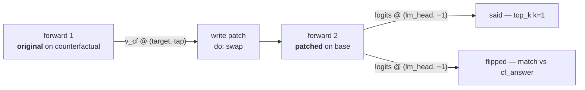
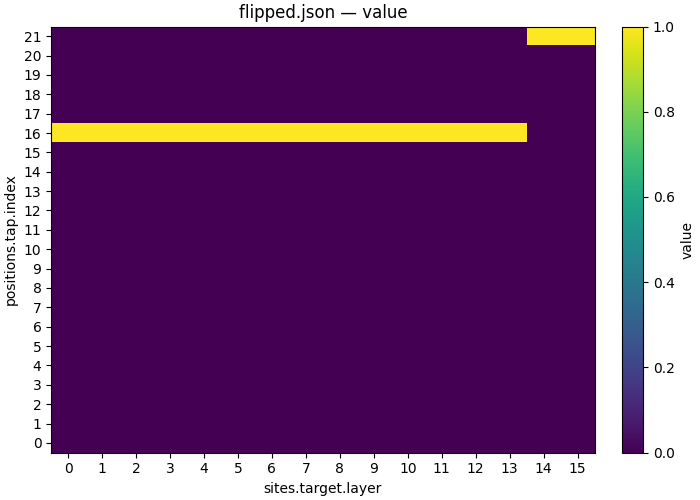

# 02 — Trace one pair through the residual stream

| | |
|---|---|
| **Question** | For one input pair, which (layer, token position) cells carry the answer symbol? |
| **Method** | interchange intervention at every cell of a 16 × 22 grid, read back as text |
| **Model** | `meta-llama/Llama-3.2-1B-Instruct` @ `main`, bf16 |
| **Data** | `mcqa/pair_n1_s0` — **one** pair, `different_symbol` design ([01](01_define.md)) |
| **Documents** | [`protocols/mcqa_trace_scan.json`](protocols/mcqa_trace_scan.json) · [`workflows/mcqa_trace.json`](workflows/mcqa_trace.json) |
| **Cost** | 352 points × 2 forwards = 704 single-row forwards |
| **Reproduced** | ✓ 2026-08-31, `pytorch_hooks` on one H100 80GB, at digest `0685b0fafc6037ae…`; the run predates the `token_form: "space_prefixed"` pin these documents now carry, which is the form `auto` already resolved to, so the token ids and every number are unchanged and only the digest moved — the document now digests `b9c21dcd7e557be0…` |

## TL;DR

A transformer keeps a **residual stream** per token, and any question about
where information sits can be asked by replacing one cell of it and watching
what the model then says. Swapping the counterfactual's residual into the base
prompt at each of 16 layers × 22 positions gives a picture of one pair's
routing: the answer symbol is readable at the symbol token from the first layer,
and at the answer slot only in the last few — the hop between the two is the
model moving the variable to where the unembedding will read it.

## The protocol

[`protocols/mcqa_trace_scan.json`](protocols/mcqa_trace_scan.json), inlined
verbatim — the file is what `causalab run` reads, and
`tests/demos/test_demos.py` checks these bytes against it.

```json
{
  "version": "1",
  "description": "Trace one MCQA pair: interchange the residual stream at every (layer, token position) of a single row, and read back what the model says. Two axes -- sites.target.layer over all 16 blocks, positions.tap.index over all 22 tokens of the row -- expand to 352 points. One row is what makes a dense index sweep well defined: token indices are a property of a tokenization, so a many-row document addresses positions by name instead (see mcqa_locate_scan.json).",
  "model": {"key": "meta-llama/Llama-3.2-1B-Instruct", "revision": "main", "dtype": "bf16"},
  "data": {
    "base":           {"dataset": "mcqa/pair_n1_s0", "field": "input"},
    "counterfactual": {"dataset": "mcqa/pair_n1_s0", "field": "counterfactual_inputs[0]"}
  },
  "positions": {
    "tap": {"index": {"sweep": {"range": [0, 22]}}}
  },
  "sites": {
    "target":  {"component": "block_output", "layer": {"sweep": {"range": [0, 16]}}},
    "lm_head": {"component": "lm_head"}
  },
  "reads": {
    "v_cf":   {"site": "target",  "pos": "tap", "model": "original", "input": "counterfactual"},
    "logits": {"site": "lm_head", "pos": -1,    "model": "patched",  "input": "base"}
  },
  "writes": {
    "patch": {"site": "target", "pos": "tap", "do": {"swap": "v_cf"}}
  },
  "intervened_models": {
    "patched": {"input": "base", "writes": ["patch"]}
  },
  "metrics": {
    "said":    {"kind": "top_k", "of": "logits", "k": 1, "by": "prob"},
    "flipped": {"kind": "match", "of": "logits", "expected": "cf_answer", "token_form": "space_prefixed"}
  },
  "save": [
    {"value": "said",    "model": "patched", "input": "base", "file_path": "said.json"},
    {"value": "flipped", "model": "patched", "input": "base", "file_path": "flipped.json"}
  ]
}
```

One point of the sweep, as a graph:



| section | says | why this and not that |
|---|---|---|
| `positions.tap` | a sweep over `{"index": 0…21}` | a *dense* index sweep, legal here because the document has one row. Indices are a property of one tokenization, so [03](03_localize.md) addresses positions differently |
| `sites.target` | `block_output`, layer swept `0…15` | the block's output is the residual stream after the MLP is added. `block_input`, `block_mid` and `attention_output` are the other three taps on the same stream |
| `writes.patch` | `swap` at the same `(site, pos)` the read used | the two move together because both name `target` and `tap`: axis identity is name identity, so one axis edit moves the read, the write and the metric at once |
| `metrics.said` | `top_k` with `k: 1`, `by: "prob"` | the greedy answer as *text*, one cell at a time. `by` is mandatory: on a vocabulary projection `prob` is what a reader means, on a residual stream it would be probabilities of nothing |
| `metrics.flipped` | `match` against `cf_answer` | the same cell as a 0/1: did the patch install the counterfactual's answer. `said` is for reading, `flipped` is for plotting |

The two metrics read the same `logits`. That is deliberate — a metric binds to
exactly one read, and reducing one read two ways costs one forward, not two.

## Run it

```bash
uv run causalab validate demos/onboarding_tutorial/protocols/mcqa_trace_scan.json \
    --data-root demos/onboarding_tutorial/data --data
# OK: demos/onboarding_tutorial/protocols/mcqa_trace_scan.json — 352 points, digest b9c21dcd7e557be0…
```

```bash
uv run causalab explain demos/onboarding_tutorial/protocols/mcqa_trace_scan.json \
    --data-root demos/onboarding_tutorial/data
# digest    b9c21dcd7e557be042306fa74962c2116d7f1bc8fd8bd604e541b83a89d1e464
# model     meta-llama/Llama-3.2-1B-Instruct@main bf16
# axes      positions.tap.index (22 values), sites.target.layer (16 values)
# points    352
# requires  ['component:block_output', 'component:block_output:write', 'component:lm_head', 'full_logits', 'paired_forward']
# forwards  2 per point
#   original on counterfactual: v_cf
#   patched on base: logits
# save
#   said (model=patched, input=base) -> said.json
#   flipped (model=patched, input=base) -> flipped.json
# first point [tap.index=0,target.layer=0] digest 5bc2ae38e4ab689d…
```

```bash
uv run causalab run demos/onboarding_tutorial/protocols/mcqa_trace_scan.json \
    --data-root demos/onboarding_tutorial/data \
    --out runs/mcqa_trace --device cuda --dtype bf16
```

**Hardware.** 704 forwards over a single 22-token row on a 1.2 B model —
roughly 2.5 GB of bf16 weights, so any GPU with 8 GB is enough. **Measured: 49 s
of wall clock** on one H100 80GB, model load included, for the whole 352-point
sweep. Both `validate` and `explain` are pure: no weights, no network, no
accelerator, so the two blocks above run on a laptop.

## Experimental design

The pair is row 0 of `mcqa/pair_n1_s0`:

| | base | counterfactual |
|---|---|---|
| prompt | `The cup is red. What color is the cup?` | *identical* |
| | `M. orange` | `J. orange` |
| | `Z. red` | `Q. red` |
| | `Answer:` | `Answer:` |
| answer | `" Z"` | `" Q"` |

The two differ in the two answer symbols and nowhere else — the
`different_symbol` design of [01](01_define.md).

Both prompts tokenize to 22 tokens. The tail is what the questions address:

| index | 11 | 12 | 13 | 14 | 15 | 16 | 17 | 18 | 19 | 20 | 21 |
|---|---|---|---|---|---|---|---|---|---|---|---|
| token | `?\n` | `M` | `.` | ` orange` | `\n` | `Z` | `.` | ` red` | `\n` | `Answer` | `:` |
| role | | symbol0 | | choice0 | | **symbol1** | | choice1 | | | **answer slot** |

The correct colour is *red*, in slot 1, so `Z` at index 16 is the answer symbol
and index 21 is where the model writes its prediction.

**Q1 — is the signal at the answer symbol in the earliest layers?** `flipped` at
(L0, 16). Null: 0, which would mean the embedding difference between the two
prompts does not reach the block output — a bug, not a finding.

**Q2 — is it at the answer slot in the latest layers?** `flipped` at (L15, 21).
Null: 0, equally a bug: the unembedding reads position 21, so by the last layer
the answer has to be there.

**Q3 — where does it move between the two?** The layer at which the flip leaves
column 16 and appears at column 21. This is the only question of the three whose
answer was not fixed by the setup.

**Q4 — does the distractor symbol carry the answer too?** `flipped` at column
12. The `different_symbol` design resamples *both* symbols (`M`→`J` as well as
`Z`→`Q`), so column 12 also differs between the prompts and also has something
to interchange. But `J` sits in the slot holding *orange*, and the question asks
about *red*. Expectation: 0 at column 12 at every layer, despite a real
difference being patched there.

> **Why one row and not sixty-four?** A dense sweep over token indices is only
> well defined when every row tokenizes the same way. With one row it is exact;
> with sixty-four it silently averages different tokens into one column. [03](03_localize.md)
> keeps the population and gives up the density.

> **Why `top_k` as well as `match`?** `match` says whether the patch installed
> the counterfactual's answer; it cannot say what happened when the answer is
> neither. `top_k` with `k: 1` returns the token the model actually emitted, so
> a cell that produces a third thing is legible instead of being a 0.

## Results

Run on 2026-08-31, one H100 80GB, reference engine (`pytorch_hooks`), bf16,
document digest `b9c21dcd7e557be0…` as stamped into `mcqa_trace/protocol.json`.
All 352 points completed.

The picture below is the whole run. It needs one thing the protocol above cannot
give it: a **figure step**. `causalab.io.plots.workflow_figures` reads a table's
sweep axes from the step record a *workflow* writes, and a bare `causalab run` of
a protocol writes `protocol.json`, which carries the points but not the axes — so
`axes_for` returns `()`, `aggregate` collapses all 352 cells into one row, and the
renderer raises `KeyError: 'sites.target.layer'`.

One protocol step plus one script step fixes that, and it is the other legitimate
shape rather than a workaround: nothing fans out and nothing is chained, so there
is no scheduling in it at all — the only reason to write it is that a table and
the picture of that table are two products of one experiment, recorded under one
digest. [`workflows/mcqa_trace.json`](workflows/mcqa_trace.json), inlined
verbatim so `tests/demos/test_demos.py` can hold this copy to the file:

```json
{
  "version": "1",
  "description": "The 02_trace demo's scan with a figure after it. One protocol step and one script step is the smallest workflow that is not a protocol: nothing here fans out, and the reason to write it is that a table and the picture of that table are two products of one experiment. It is also the only way a dense index sweep gets a figure -- causalab.io.plots.workflow_figures reads a table's sweep axes from the step record a workflow writes, so the same protocol run on its own produces a table no shipped renderer can draw.",
  "output_dir": "mcqa_trace",
  "steps": {
    "scan": {
      "type": "intervention_protocol",
      "document": "../protocols/mcqa_trace_scan.json"
    },
    "heatmap": {
      "type": "script",
      "script": {"module": "causalab.io.plots.workflow_figures"},
      "inputs": {
        "table": {"step": "scan", "file": "flipped.json"},
        "plot": "heatmap",
        "x": "sites.target.layer",
        "y": "positions.tap.index"
      },
      "outputs": {
        "figure": "flipped_grid.png",
        "plotted": {"file": "flipped_grid.json"}
      }
    }
  }
}
```

**The scan step names the protocol, it does not restate it.** `document` points
at the same `../protocols/mcqa_trace_scan.json` documented above, so the
experiment is bit-for-bit the one this demo describes — its campaign digest is
still `b9c21dcd7e557be0…`. Adding a figure did not change what runs.

**`plotted` is not optional in spirit.** A `.png` carries no record, so the
`heatmap` step declares `flipped_grid.json` beside it: the exact rows that were
drawn, in the same directory, under the same step digest.

```bash
uv run causalab explain demos/onboarding_tutorial/workflows/mcqa_trace.json \
    --data-root demos/onboarding_tutorial/data
# digest    0fd35a654a442a867181fe5488056537f191b3e5a4c5d60b509898c59d881be1
# schedule  2 levels
#   level 0: scan
#   level 1: heatmap
#   scan: intervention_protocol ../protocols/mcqa_trace_scan.json — 352 point(s), campaign digest b9c21dcd7e557be0…
#   heatmap: script causalab.io.plots.workflow_figures -> flipped_grid.json, flipped_grid.png
```

```bash
uv run causalab run demos/onboarding_tutorial/workflows/mcqa_trace.json \
    --data-root demos/onboarding_tutorial/data \
    --out runs --device cuda
```

Note the absent `--dtype`: this is a workflow, so the flag is refused and the
step's own document supplies `bf16` — the same rule as
[03](03_localize.md#run-it).



*This run: all 352 cells of `flipped.json`, drawn by the workflow's own `heatmap`
step. Rows are the 22 token positions, columns the 16 layers; a bright cell is
one where patching made the model say the counterfactual's `" Q"` instead of the
base's `" Z"`. Look at which rows are bright, and at where each one stops.*

Two of the twenty-two positions are ever non-zero, and the other twenty are zero
at every depth. That is the whole finding, and it is sharper than the reference
figure it replaces: **index 16 carries the answer from L0 to L13, index 21 from
L14 to L15, and no cell is ever ambiguous.**

### Q1 — yes, from the embedding up

✓ `flipped` at (L0, index 16) is **1.0**. The patched model says `" Q"` at
probability **0.897**. The two prompts differ exactly at that token, so this is
the sanity check passing, not a finding: the embedding difference does reach the
block output.

**Verdict.** Yes.

### Q2 — yes, at the last two layers

✓ `flipped` at (L15, index 21) is **1.0**, `" Q"` at probability **0.848**. The
unembedding reads position 21, so anything else would have meant the model's own
answer is not where it writes it. Column 21 is 1 at L14 and L15 and 0 below.

**Verdict.** Yes.

### Q3 — the hop is between L13 and L14, and no layer carries both

**Finding, and it corrects the reference.** The pre-refactor figure this demo
used to show had one row — L12 — where *both* columns were legible, and the
prose here read the hop off that overlap. On the document's own pair there is
**no such layer**: index 16 is 1 for L0–L13 and 0 for L14–L15, index 21 is 0 for
L0–L13 and 1 for L14–L15, and the two never overlap. The
transition is a clean partition between **L13 and L14**, two layers later than
the reference's L12 and with no band where the variable is readable in both
places at once.

The positions between the two are 0 everywhere, as before: whatever carries the
symbol across, it is not laid down in the intervening token positions.

That the greedy read-out flips all-or-nothing is what makes the partition clean
— it is also what a single pair can and cannot tell you, which is why the
population scan in [03](03_localize.md) sees the same hop as a *gradient* rather
than a step.

**Verdict.** Between L13 and L14. No layer carries both.

### Q4 — yes, the distractor position is silent

✓ This is the question the reference figure could not answer, because its
counterfactual changed only one symbol. Running the document answers it:
`flipped` at `positions.tap.index = 12` — symbol0, the distractor — is **0.0 at
every one of the 16 layers**, exactly the null the design predicts. Patching the
wrong symbol never moves the answer; at (L15, 12) the model still says `" Z"` at
probability 0.853, its base answer.

**Verdict.** 0 at every layer, as predicted. The `different_symbol` design
buys a distractor position that stays silent.

## Limits

- One pair. The routing pattern is often stable across inputs, but a single
  trace cannot say so — that is [03](03_localize.md)'s job, and it is why 03 exists.
- **The protocol on its own cannot render its own figure**, which is why this
  demo also ships a two-step workflow, inlined in [Results](#results). The
  figure script
  (`causalab.io.plots.workflow_figures`) reads a table's sweep axes from the
  `_step.json` a *workflow step* writes; a bare `causalab run` of a protocol
  writes `protocol.json` instead, so `axes_for` returns `()` and the renderer
  collapses all 352 cells into one. Nothing is wrong with either shape: the
  protocol is the experiment and the workflow is the experiment plus its
  picture.
- The grid is `block_output` only. A signal that is present in
  `attention_output` and cancelled by the MLP is invisible here.
- There is no embedding row: `embeddings` is a separate, layer-less component,
  so it is a second one-line document rather than a row of this sweep.

## Next

- **[03 — Locate across the population](03_localize.md)** runs this
  intervention over all 64 pairs and turns "what did it say" into "how often was
  it right", which is what makes the L13/L14 hop a claim rather than an anecdote.
