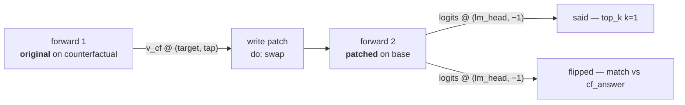
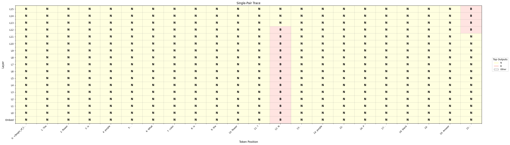

# 02 — Trace one pair through the residual stream

| | |
|---|---|
| **Question** | For one input pair, which (layer, token position) cells carry the answer symbol? |
| **Method** | interchange intervention at every cell of a 16 × 22 grid, read back as text |
| **Model** | `meta-llama/Llama-3.2-1B-Instruct` @ `main`, bf16 |
| **Data** | `mcqa/pair_n1_s0` — **one** pair, `different_symbol` design ([01](01_define.md)) |
| **Documents** | [`protocols/mcqa_trace_scan.json`](protocols/mcqa_trace_scan.json) |
| **Cost** | 352 points × 2 forwards = 704 single-row forwards |
| **Reproduced** | ⚠ figure carried from the pre-refactor reference run on a different pair |

## TL;DR

A transformer keeps a **residual stream** per token, and any question about
where information sits can be asked by replacing one cell of it and watching
what the model then says. Swapping the counterfactual's residual into the base
prompt at each of 16 layers × 22 positions gives a picture of one pair's
routing: the answer symbol is readable at the symbol token from the first layer,
and at the answer slot only in the last few — the hop between the two is the
model moving the variable to where the unembedding will read it.

## The protocol

```json
{
  "version": "1",
  "description": "Trace one MCQA pair: interchange the residual stream at every (layer, token position) of a single row, and read back what the model says. Two axes -- sites.target.layer over all 16 blocks, positions.tap.index over all 22 tokens of the row -- expand to 352 points. One row is what makes a dense index sweep well defined: token indices are a property of a tokenization, so a many-row document addresses positions by name instead (see mcqa_locate_scan.json).",
  "model": {"key": "meta-llama/Llama-3.2-1B-Instruct", "revision": "main", "dtype": "bf16"},
  "data": {
    "base":           {"dataset": "mcqa/pair_n1_s0", "field": "input"},
    "counterfactual": {"dataset": "mcqa/pair_n1_s0", "field": "counterfactual_inputs[0]"}
  },
  "positions": {
    "tap": {"index": {"sweep": {"range": [0, 22]}}}
  },
  "sites": {
    "target":  {"component": "block_output", "layer": {"sweep": {"range": [0, 16]}}},
    "lm_head": {"component": "lm_head"}
  },
  "reads": {
    "v_cf":   {"site": "target",  "pos": "tap", "model": "original", "input": "counterfactual"},
    "logits": {"site": "lm_head", "pos": -1,    "model": "patched",  "input": "base"}
  },
  "writes": {
    "patch": {"site": "target", "pos": "tap", "do": {"swap": "v_cf"}}
  },
  "intervened_models": {
    "patched": {"input": "base", "writes": ["patch"]}
  },
  "metrics": {
    "said":    {"kind": "top_k", "of": "logits", "k": 1, "by": "prob"},
    "flipped": {"kind": "match", "of": "logits", "expected": "cf_answer"}
  },
  "save": [
    {"value": "said",    "model": "patched", "input": "base", "file_path": "said.json"},
    {"value": "flipped", "model": "patched", "input": "base", "file_path": "flipped.json"}
  ]
}
```

One point of the sweep, as a graph:



| section | says | why this and not that |
|---|---|---|
| `positions.tap` | a sweep over `{"index": 0…21}` | a *dense* index sweep, legal here because the document has one row. Indices are a property of one tokenization, so [03](03_localize.md) addresses positions differently |
| `sites.target` | `block_output`, layer swept `0…15` | the block's output is the residual stream after the MLP is added. `block_input`, `block_mid` and `attention_output` are the other three taps on the same stream |
| `writes.patch` | `swap` at the same `(site, pos)` the read used | the two move together because both name `target` and `tap`: axis identity is name identity, so one axis edit moves the read, the write and the metric at once |
| `metrics.said` | `top_k` with `k: 1`, `by: "prob"` | the greedy answer as *text*, one cell at a time. `by` is mandatory: on a vocabulary projection `prob` is what a reader means, on a residual stream it would be probabilities of nothing |
| `metrics.flipped` | `match` against `cf_answer` | the same cell as a 0/1: did the patch install the counterfactual's answer. `said` is for reading, `flipped` is for plotting |

The two metrics read the same `logits`. That is deliberate — a metric binds to
exactly one read, and reducing one read two ways costs one forward, not two.

## Run it

```bash
uv run causalab validate demos/onboarding_tutorial/protocols/mcqa_trace_scan.json \
    --data-root demos/onboarding_tutorial/data --data
# OK: demos/onboarding_tutorial/protocols/mcqa_trace_scan.json — 352 points, digest 0685b0fafc6037ae…
```

```bash
uv run causalab explain demos/onboarding_tutorial/protocols/mcqa_trace_scan.json \
    --data-root demos/onboarding_tutorial/data
# digest    0685b0fafc6037ae0dd32543862eed426922147ff613e9ea36abcb5c1d182c22
# model     meta-llama/Llama-3.2-1B-Instruct@main bf16
# axes      positions.tap.index (22 values), sites.target.layer (16 values)
# points    352
# requires  ['component:block_output', 'component:block_output:write', 'component:lm_head', 'full_logits', 'paired_forward']
# forwards  2 per point
#   original on counterfactual: v_cf
#   patched on base: logits
# save
#   said (model=patched, input=base) -> said.json
#   flipped (model=patched, input=base) -> flipped.json
# first point [tap.index=0,target.layer=0] digest 1c044b2aacb9e5f8…
```

```bash
uv run causalab run demos/onboarding_tutorial/protocols/mcqa_trace_scan.json \
    --data-root demos/onboarding_tutorial/data \
    --out runs/mcqa_trace --device cuda --dtype bf16
```

**Hardware.** 704 forwards over a single 22-token row on a 1.2 B model —
roughly 2.5 GB of bf16 weights, so any GPU with 8 GB is enough, and the run is
minutes rather than hours. Both `validate` and `explain` are pure: no weights,
no network, no accelerator, so the two blocks above run on a laptop. This is an
estimate from the point count, not a measured wall clock.

## Experimental design

The pair is row 0 of `mcqa/pair_n1_s0`:

| | base | counterfactual |
|---|---|---|
| prompt | `The cup is red. What color is the cup?` | *identical* |
| | `M. orange` | `J. orange` |
| | `Z. red` | `Q. red` |
| | `Answer:` | `Answer:` |
| answer | `" Z"` | `" Q"` |

The two differ in the two answer symbols and nowhere else — the
`different_symbol` design of [01](01_define.md).

Both prompts tokenize to 22 tokens. The tail is what the questions address:

| index | 11 | 12 | 13 | 14 | 15 | 16 | 17 | 18 | 19 | 20 | 21 |
|---|---|---|---|---|---|---|---|---|---|---|---|
| token | `?\n` | `M` | `.` | ` orange` | `\n` | `Z` | `.` | ` red` | `\n` | `Answer` | `:` |
| role | | symbol0 | | choice0 | | **symbol1** | | choice1 | | | **answer slot** |

The correct colour is *red*, in slot 1, so `Z` at index 16 is the answer symbol
and index 21 is where the model writes its prediction.

**Q1 — is the signal at the answer symbol in the earliest layers?** `flipped` at
(L0, 16). Null: 0, which would mean the embedding difference between the two
prompts does not reach the block output — a bug, not a finding.

**Q2 — is it at the answer slot in the latest layers?** `flipped` at (L15, 21).
Null: 0, equally a bug: the unembedding reads position 21, so by the last layer
the answer has to be there.

**Q3 — where does it move between the two?** The layer at which the flip leaves
column 16 and appears at column 21. This is the only question of the three whose
answer was not fixed by the setup.

**Q4 — does the distractor symbol carry the answer too?** `flipped` at column
12. The `different_symbol` design resamples *both* symbols (`M`→`J` as well as
`Z`→`Q`), so column 12 also differs between the prompts and also has something
to interchange. But `J` sits in the slot holding *orange*, and the question asks
about *red*. Expectation: 0 at column 12 at every layer, despite a real
difference being patched there.

> **Why one row and not sixty-four?** A dense sweep over token indices is only
> well defined when every row tokenizes the same way. With one row it is exact;
> with sixty-four it silently averages different tokens into one column. [03](03_localize.md)
> keeps the population and gives up the density.

> **Why `top_k` as well as `match`?** `match` says whether the patch installed
> the counterfactual's answer; it cannot say what happened when the answer is
> neither. `top_k` with `k: 1` returns the token the model actually emitted, so
> a cell that produces a third thing is legible instead of being a 0.

## Results

> **Not yet regenerated.** The document above has not been run since the
> protocol refactor. The figure below is the same experiment from the
> pre-refactor pipeline, on a *different* pair and a counterfactual that
> resampled only one symbol — so it answers Q1–Q3 and cannot answer Q4.

### Q1 — yes, from the embedding up



*Reference run: Llama-3.2-1B-Instruct, pre-refactor `locate` single-pair trace.
Rows are layers (embedding at the bottom), columns are token positions; each
cell is the greedy output token after patching there. Base answer `N`, red cells
`B` — the counterfactual's answer. Look at which column is red in which rows.*

✓ Column 12 — the answer symbol — is red from the embedding row through L12. The
two prompts differ exactly there, so this is a sanity check, not a finding.

**Verdict.** Yes.

### Q2 — yes, at the last four layers

✓ Column 21, the answer slot, is red at L12–L15. The unembedding reads position
21, so anything else would mean the model's own answer is not where it writes
it.

**Verdict.** Yes.

### Q3 — the hop is at L12

**Finding.** L12 is the only row where *both* columns are red. Below it the
answer is legible only at the symbol; above it only at the slot. So one band of
layers moves the variable from where it entered to where it is read — the
attention step that a population-scale scan will quantify in [03](03_localize.md).

The columns between the two are red nowhere. Whatever carries the symbol
across, it is not laid down in the intervening token positions.

**Verdict.** Between L11 and L13, with L12 the crossing point.

### Q4 — no result

The reference figure's counterfactual changed one symbol, so it has no
distractor column to look at. Running the document above produces the answer:
`flipped` at `positions.tap.index = 12`, expected 0 at every layer.

## Limits

- One pair. The routing pattern is often stable across inputs, but a single
  trace cannot say so — that is [03](03_localize.md)'s job, and it is why 03 exists.
- The figure predates the document. The quantity matches (`top_k k=1` is the
  same greedy token the reference plotted) but the pair and the counterfactual
  design do not.
- The grid is `block_output` only. A signal that is present in
  `attention_output` and cancelled by the MLP is invisible here.
- There is no embedding row: `embeddings` is a separate, layer-less component,
  so it is a second one-line document rather than a row of this sweep.

## Next

- **[03 — Locate across the population](03_localize.md)** runs this
  intervention over all 64 pairs and turns "what did it say" into "how often was
  it right", which is what makes L12 a claim rather than an anecdote.
