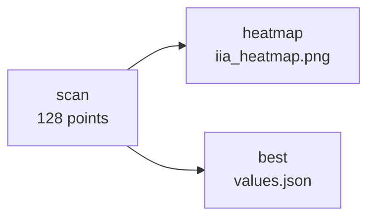
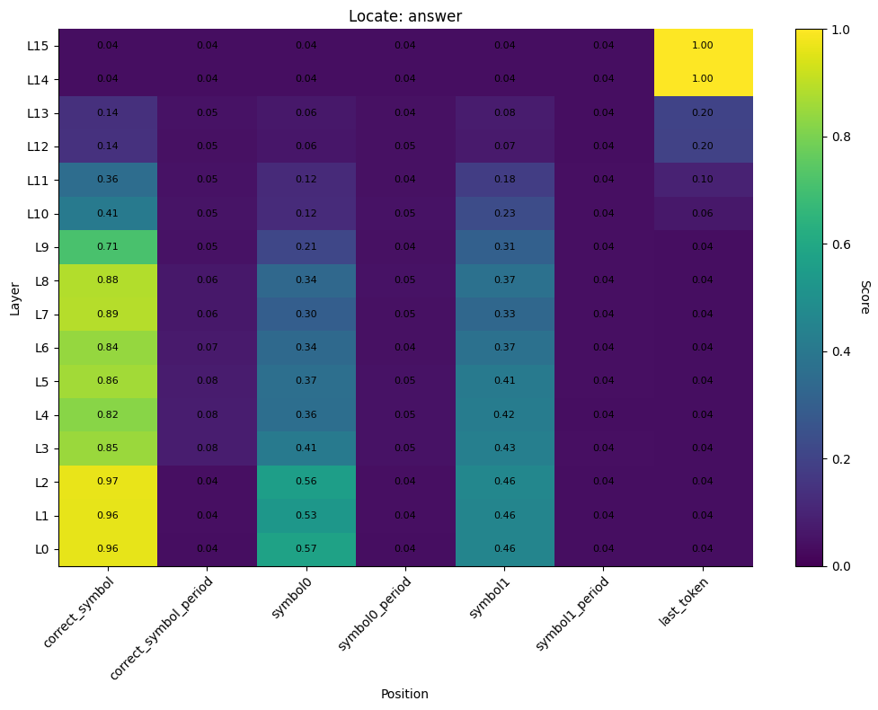

# 03 — Localize the variable across a population

| | |
|---|---|
| **Question** | Across 64 pairs, which (layer, token position) cell most reliably carries the answer symbol? |
| **Method** | interchange intervention on a 16 × 8 grid, scored by interchange-intervention accuracy |
| **Model** | `meta-llama/Llama-3.2-1B-Instruct` @ `main`, bf16 |
| **Data** | `mcqa/pairs_n64_s0` — 64 pairs, `different_symbol` design ([01](01_define.md)) |
| **Documents** | [`protocols/mcqa_locate_scan.json`](protocols/mcqa_locate_scan.json) · [`workflows/mcqa_locate.json`](workflows/mcqa_locate.json) |
| **Cost** | 128 points × 2 forwards, 64 rows each = 16 384 row-forwards |
| **Reproduced** | ⚠ figure carried from the pre-refactor reference run, scored in centroid mode |

## TL;DR

[02](02_trace.md) answered a question about one pair. A research question lives
at the level of populations: *across all inputs*, which cell encodes the
variable? The same interchange, run over 64 pairs and scored by **interchange
intervention accuracy** — the fraction of pairs on which patching makes the
model answer what the causal model says it should — turns the trace into a
number per cell. The picture is the same hop, now with a scale on it, and the
one cell it names is what the next stage would train a subspace in.

## The protocol

[`protocols/mcqa_locate_scan.json`](protocols/mcqa_locate_scan.json), inlined
verbatim — the file is what `causalab run` reads, and
`tests/demos/test_demos.py` checks these bytes against it.

```json
{
  "version": "1",
  "description": "Locate the answer-symbol variable across the population: the same interchange as the single-pair trace, over 64 pairs, scored by IIA at a 16-layer x 8-position grid. Positions are fixed negative indices, not names: every prompt this task template emits is 22 tokens with the same tail, so counting back from the end resolves to the same token in every row -- which a symbol *letter* does not (a row whose symbol is 'W' has a second 'W' inside 'What').",
  "model": {"key": "meta-llama/Llama-3.2-1B-Instruct", "revision": "main", "dtype": "bf16"},
  "data": {
    "base":           {"dataset": "mcqa/pairs_n64_s0", "field": "input"},
    "counterfactual": {"dataset": "mcqa/pairs_n64_s0", "field": "counterfactual_inputs[0]"}
  },
  "positions": {
    "tap": {"sweep": [
      {"index": -11},
      {"index": -10},
      {"index": -9},
      {"index": -8},
      {"index": -6},
      {"index": -5},
      {"index": -4},
      {"index": -1}
    ]}
  },
  "sites": {
    "target":  {"component": "block_output", "layer": {"sweep": {"range": [0, 16]}}},
    "lm_head": {"component": "lm_head"}
  },
  "reads": {
    "v_cf":   {"site": "target",  "pos": "tap", "model": "original", "input": "counterfactual"},
    "logits": {"site": "lm_head", "pos": -1,    "model": "patched",  "input": "base"}
  },
  "writes": {
    "patch": {"site": "target", "pos": "tap", "do": {"swap": "v_cf"}}
  },
  "intervened_models": {
    "patched": {"input": "base", "writes": ["patch"]}
  },
  "metrics": {
    "iia":        {"kind": "match",      "of": "logits", "expected": "cf_answer"},
    "logit_diff": {"kind": "logit_diff", "of": "logits", "a": "cf_answer", "b": "base_answer"}
  },
  "save": [
    {"value": "iia",        "model": "patched", "input": "base", "file_path": "iia.json"},
    {"value": "logit_diff", "model": "patched", "input": "base", "file_path": "logit_diff.json"}
  ]
}
```

The document differs from [02](02_trace.md)'s in exactly two places: the data
ref names 64 rows instead of 1, and `positions.tap` sweeps eight *specs*
instead of twenty-two *indices*. Everything else — the site, the write, the
model graph — is the same experiment.

| section | says | why this and not that |
|---|---|---|
| `positions.tap` | a sweep over eight `{"index": n}` entries, all negative | fixed offsets from the end. The task template emits a constant tail, so `-6` is the same token in all 64 rows |
| `metrics.iia` | `match` against `cf_answer` | IIA: did patching make the model answer what the causal model answers under the same intervention. `cf_answer` and `label` are the same column for this design ([01](01_define.md)) |
| `metrics.logit_diff` | `cf_answer` minus `base_answer` | the graded companion to a binary metric. A cell that moves the logits without winning the argmax reads 0 on `iia` and positive here |
| `save` | both metrics, as JSON tables | one file per metric, an array of row objects, one row per (example, point) — `jq`-readable on purpose |

The whole grid is one document, so the parser expands 128 points and plans them
together: the counterfactual harvest is shared by content across every point
that reads the same value, where 128 separate runs would have re-loaded the
model 128 times.

### As a workflow

Scanning is only half of it — the grid has to be rendered and reduced to the
cell a next stage would use. [`workflows/mcqa_locate.json`](workflows/mcqa_locate.json)
adds both, and the file is inlined here the same way — verbatim, so
`tests/demos/test_demos.py` can hold this copy to it:

```json
{
  "version": "1",
  "description": "The 03_localize demo end to end: scan the (layer x position) grid, render it, and reduce it to the one cell the next stage would target. Nothing orders these steps -- `heatmap` and `best` both reference `scan`, so the runner derives that they may run together the moment the scan finishes.",
  "output_dir": "mcqa_locate",
  "steps": {
    "scan": {
      "type": "intervention_protocol",
      "document": "../protocols/mcqa_locate_scan.json"
    },
    "heatmap": {
      "type": "script",
      "script": {"module": "causalab.io.plots.workflow_figures"},
      "inputs": {
        "table": {"step": "scan", "file": "iia.json"},
        "plot": "heatmap",
        "x": "sites.target.layer",
        "y": "positions.tap"
      },
      "outputs": {
        "figure": "iia_heatmap.png",
        "plotted": {"file": "iia_heatmap.json"}
      }
    },
    "best": {
      "type": "script",
      "script": {"module": "causalab.workflow.scripts.select"},
      "inputs": {
        "table": {"step": "scan", "file": "iia.json"},
        "choose": "max",
        "emit": {"best_layer": "sites.target.layer", "best_pos": "positions.tap"}
      },
      "outputs": {
        "values": {
          "file": "values.json",
          "keys": {"best_layer": 0, "best_pos": {"index": -6}}
        }
      }
    }
  }
}
```



Nothing in the document orders those steps. `heatmap` and `best` each reference
`scan`'s `iia.json`, and that reference *is* the dependency edge — so the runner
derives two levels and may run the second one's steps together.

The `keys` block is load-bearing rather than documentation: a later document
whose `set` pulls `best_layer` out of this step cannot resolve it before the run,
so the loader validates that document against the declared representative and
substitutes the real value at run time.

## Run it

```bash
uv run causalab validate demos/onboarding_tutorial/workflows/mcqa_locate.json \
    --data-root demos/onboarding_tutorial/data
# OK: demos/onboarding_tutorial/workflows/mcqa_locate.json — 3 steps, digest 7dd122b239ad4e36…
```

```bash
uv run causalab explain demos/onboarding_tutorial/workflows/mcqa_locate.json \
    --data-root demos/onboarding_tutorial/data
# digest    7dd122b239ad4e3653822cf1226263aea256cb6c7d5f8c3f41b3575b12cace64
# schedule  2 levels
#   level 0: scan
#   level 1: heatmap, best
#   scan: intervention_protocol ../protocols/mcqa_locate_scan.json — 128 point(s), campaign digest 8228e1e94bb6c247…
#   heatmap: script causalab.io.plots.workflow_figures -> iia_heatmap.json, iia_heatmap.png
#   best: script causalab.workflow.scripts.select -> values.json
```

```bash
uv run causalab run demos/onboarding_tutorial/workflows/mcqa_locate.json \
    --data-root demos/onboarding_tutorial/data \
    --out runs --device cuda --dtype bf16
```

**Hardware.** 128 points × 2 forwards × 64 rows on a 1.2 B model. One GPU with
8 GB; the batch is 64 short rows, so the run is dominated by point count rather
than by memory. Estimated from `explain`, not measured.

## Experimental design

The eight positions, as offsets from the end of a 22-token prompt:

| `pos` | −11 | −10 | −9 | −8 | −6 | −5 | −4 | −1 |
|---|---|---|---|---|---|---|---|---|
| token | `?\n` | symbol0 | `.` | choice0 | symbol1 | `.` | choice1 | `:` |

Two of them — symbol0 and symbol1 — are candidates for "the answer symbol", and
which one it is *depends on the row*: the correct colour sits in slot 1 in **34
of 64** rows and in slot 0 in the other 30.

**Q1 — is there a cell with high IIA at all?** The maximum over the grid. Null:
the grid is flat near 0, meaning the residual stream at these positions does not
carry the variable in a form an interchange can move.

**Q2 — where is it?** The `best_layer` / `best_pos` the `select` step emits.
[02](02_trace.md) predicts the answer slot (`-1`) in the last layers.

**Q3 — do the symbol columns show the hop the single-pair trace showed?** The
profile down the symbol columns against the profile down `-1`: high early and
decaying, against low early and high late, crossing somewhere in the middle.

**Q4 — what does a fixed index cost, compared to a position that knows which
slot is correct?** Neither symbol column can exceed the fraction of rows in
which it holds the correct symbol. So the ceiling is **0.531 at −6 and 0.469 at
−10**, and a cell that reaches its ceiling is carrying the variable perfectly on
the rows it applies to. If both columns come in near those two numbers rather
than near 1.0, the deficit is the position spec's, not the model's.

> **Why fixed indices and not `{"variable": "symbol0"}`?** Because a symbol is
> one letter and a letter is not a unique substring. A `variable` position
> resolves by finding the row's value in the row's text and demands exactly one
> occurrence; on this table a row whose symbol is `W` also contains the `W` of
> `What`. Counting both prompts of each pair, `{"variable": "symbol0"}` refuses
> on 14 of 64 rows and `{"variable": "symbol1"}` on 15 — **24 of 64** rows
> refuse one or the other. The template's tail is
> constant, so counting back from the end is exact where a name is not.
>
> The proper fix is neither: per §2.2 of the [spec](../../docs/intervention_protocol.md),
> anything per-row and task-semantic is a **column**, computed when the table is
> built. A task that serialized `"\nZ."` — a unique anchor for the correct
> symbol — would give a `{"column": …}` position that is both row-aware and
> checkable. See [Limits](#limits).

> **Why `match` and not a scan mode?** The pre-refactor `locate` analysis
> offered "pairwise" and "centroid" modes, and centroid existed because the
> default counterfactual generator resampled several variables at once, which
> pairwise scoring could not read. The protocol layer has no scan modes: the
> deconfounding is the *dataset's* job, and [01](01_define.md) shows
> `different_symbol` doing it. So the plain pairwise metric is the right one
> here — not because the mode was removed, but because the dataset earned it.

## Results

> **Not yet regenerated.** The document above has not been run since the
> protocol refactor. The figure below is the same grid from the pre-refactor
> pipeline, scored in **centroid mode** — a different quantity from the IIA the
> document computes. It is here because the routing pattern is the finding and
> the pattern is the same; the numbers are not this document's.

### Q1 — yes



*Reference run: Llama-3.2-1B-Instruct, pre-refactor `locate`, centroid mode over
the full MCQA dataset. Rows are layers, columns are the task's named positions.
Cell values are centroid accuracy, not the IIA above. Look at the two bright
regions and where they sit.*

The grid is far from flat: 0.96–0.97 at one column in the early layers, 1.00 at
another in the last two, and 0.04–0.08 across most of the rest.

**Verdict.** Yes — the variable is movable by an interchange, and the cells that
move it are a small minority.

### Q2 — the answer slot, in the last two layers

`last_token` scores 1.00 at L14 and L15 and 0.20 or less everywhere below L13.
That is the cell `select` would emit, and the cell a subspace method would then
be trained in.

**Verdict.** (L15, answer slot) on the reference run.

### Q3 — yes, and the crossing is visible in the numbers

**Finding.** `correct_symbol` reads 0.96, 0.96, 0.97 at L0–L2, holds 0.82–0.89
through L8, then falls: 0.71 at L9, 0.41 at L10, 0.36 at L11, 0.14 at L12–L13,
0.04 at L14–L15. `last_token` does the reverse, sitting at 0.04 until L11 and
reaching 1.00 at L14. The two profiles cross between L11 and L13 — the same band
[02](02_trace.md)'s single trace put at L12, now from 64 pairs instead of one.

The unrelated positions never leave the floor: both `_period` columns stay at
0.04–0.08 throughout, which is what a cell carrying nothing looks like on this
scale.

**Verdict.** Yes, crossing at L11–L13.

### Q4 — no result

The reference run used the task's `correct_symbol` position, which resolves to
the right slot per row and therefore has no ceiling below 1.0 — that is why its
symbol column reaches 0.96 rather than 0.53. The document above, with fixed
indices, cannot; running it produces the two numbers to compare against 0.531
and 0.469.

## Limits

- The figure's quantity is centroid accuracy, the document's is IIA. They agree
  about which cells matter and they are not the same number.
- The fixed-index positions cap the two symbol columns at 0.531 and 0.469 by
  construction. That is a property of this dataset's slot balance and would
  change with a different seed.
- The proper fix is a task-side change: serialize a unique per-row anchor for
  the correct symbol so `{"column": …}` resolves it. This demo does not make
  that change, and the ceiling in Q4 is what it costs.
- `block_output` only, and one write per point. Two cells that are jointly
  necessary but individually inert are invisible to a grid of single patches —
  that is what path patching is for
  ([`causalab/configs/protocols/path_patching.json`](../../causalab/configs/protocols/path_patching.json)).
- 64 pairs. `logit_diff` is saved alongside `iia` precisely because a binary
  metric on 64 examples is coarse.

## Next

- **[weekdays_geometry](../weekdays_geometry/weekdays_geometry.md)** takes this
  from one question to four: does the model solve the task, where is the
  variable, how few directions carry it, and what does the model say from the
  points in between.
- The located cell is the input to a subspace method. `das` and `dbm`
  ([`causalab/configs/protocols/`](../../causalab/configs/protocols/)) train a
  featurizer at exactly the cell `best` emits.
