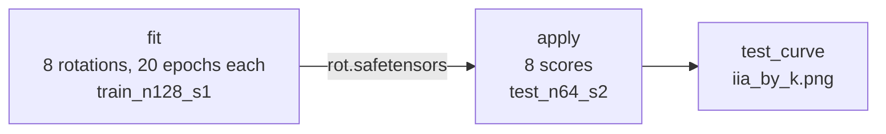
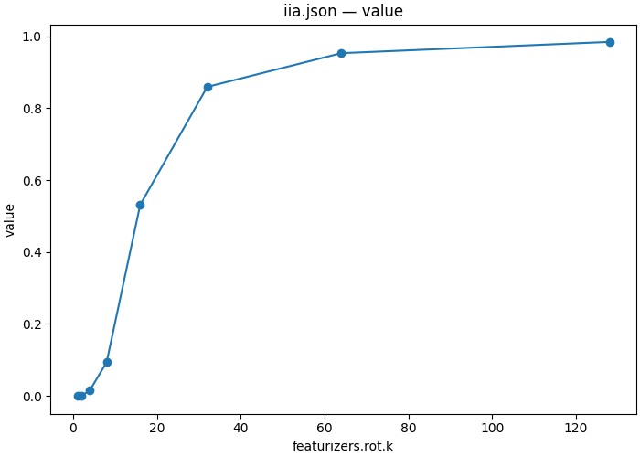

# 04 — How few directions carry the answer symbol?

| | |
|---|---|
| **Question** | At the cell [03](03_localize.md) located, what is the smallest subspace an interchange can move the answer symbol through? |
| **Method** | a rotation trained by gradient descent on the interchange objective, k swept 1…128, then applied to a held-out split |
| **Model** | `meta-llama/Llama-3.2-1B-Instruct` @ `main`, bf16 |
| **Data** | fit on `mcqa/train_n128_s1` (128 pairs), score on `mcqa/test_n64_s2` (64 pairs) |
| **Documents** | [`workflows/mcqa_subspace.json`](workflows/mcqa_subspace.json) · [`protocols/mcqa_das_fit.json`](protocols/mcqa_das_fit.json) · [`protocols/mcqa_das_apply.json`](protocols/mcqa_das_apply.json) |
| **Cost** | 8 fits × 20 epochs × 128 pairs, then 8 × 64 scored pairs |
| **Reproduced** | ✓ 2026-08-31, `pytorch_hooks` on one H100 80GB, digest `d1f96dd3213ba5b2…` |

## TL;DR

**Distributed Alignment Search** replaces "swap the whole 2048-wide residual"
with "swap its component in a *k*-dimensional subspace, and learn which
subspace". Trained at the cell [03](03_localize.md) located and scored on a
split it never saw, the answer symbol needs far more room than the method's
reputation suggests: held-out IIA is **0.000 at k ≤ 2**, **0.531 at k = 16**,
**0.859 at k = 32** and **0.953 at k = 64**, against **0.969** for the whole
vector. And the trained rotation at k = 32 beats an *untrained* principal basis
of the same width by 0.031 ([05](05_variance_vs_cause.md)) — so most of what
this cell needs is width, not alignment.

## The protocol

A workflow, because the number worth reporting comes from a document that did
not do the training. [`workflows/mcqa_subspace.json`](workflows/mcqa_subspace.json),
inlined verbatim:

```json
{
  "version": "1",
  "description": "The 04_subspace demo end to end: fit a rotation per k on the train split, apply each one to the test split, and draw both curves. The apply step's document names fit/rot.safetensors, and that reference is the whole dependency -- nothing here declares an order.",
  "output_dir": "mcqa_subspace",
  "steps": {
    "fit": {
      "type": "intervention_protocol",
      "document": "../protocols/mcqa_das_fit.json"
    },
    "apply": {
      "type": "intervention_protocol",
      "document": "../protocols/mcqa_das_apply.json"
    },
    "test_curve": {
      "type": "script",
      "script": {"module": "causalab.io.plots.workflow_figures"},
      "inputs": {
        "table": {"step": "apply", "file": "iia.json"},
        "plot": "lines",
        "x": "featurizers.rot.k"
      },
      "outputs": {"figure": "iia_by_k.png", "plotted": {"file": "iia_by_k.json"}}
    }
  }
}
```



**Three levels, and the middle one is the point.** `apply`'s document names
`fit/rot.safetensors`, and that reference is the whole dependency: the fit
produces an artifact, the application consumes it, and nothing else passes
between them. A single document with a `train` block would have produced a
number too, and that number would have been wrong — see the box in
[Experimental design](#experimental-design).

### The fit

[`protocols/mcqa_das_fit.json`](protocols/mcqa_das_fit.json), inlined verbatim:

```json
{
  "version": "1",
  "description": "Fit a k-dimensional orthogonal subspace of the residual stream at the cell 03 located (L14, answer slot), by gradient descent on the interchange objective. The sweep is k itself -- 1 through 128 directions out of 2048 -- so one document answers 'how few directions are enough' rather than 'does 8 work'. The scores this run saves are TRAIN scores: rot.safetensors is the product, and mcqa_das_apply.json is what reads it back on a split this never saw.",
  "model": {"key": "meta-llama/Llama-3.2-1B-Instruct", "revision": "main", "dtype": "bf16"},
  "data": {
    "base":           {"dataset": "mcqa/train_n128_s1", "field": "input"},
    "counterfactual": {"dataset": "mcqa/train_n128_s1", "field": "counterfactual_inputs[0]"}
  },
  "positions": {
    "best": {"index": -1}
  },
  "sites": {
    "target":  {"component": "block_output", "layer": 14},
    "lm_head": {"component": "lm_head"}
  },
  "featurizers": {
    "rot": {"kind": "subspace", "k": {"sweep": [1, 2, 4, 8, 16, 32, 64, 128]}, "parametrization": "cayley"}
  },
  "reads": {
    "v_cf":   {"site": "target",  "pos": "best", "model": "original", "input": "counterfactual", "featurizer": "rot"},
    "logits": {"site": "lm_head", "pos": -1,     "model": "patched",  "input": "base"}
  },
  "writes": {
    "patch": {"site": "target", "pos": "best", "featurizer": "rot", "do": {"swap": "v_cf"}}
  },
  "intervened_models": {
    "patched": {"input": "base", "writes": ["patch"]}
  },
  "metrics": {
    "iia": {"kind": "match",         "of": "logits", "expected": "cf_answer", "token_form": "space_prefixed"},
    "ce":  {"kind": "cross_entropy", "of": "logits", "target": "label", "token_form": "space_prefixed"}
  },
  "train": {
    "objective":  [[1.0, "ce"]],
    "params":     ["rot"],
    "optimizer":  {"name": "adamw", "lr": 1e-3, "weight_decay": 0.0},
    "steps":      {"epochs": 20},
    "batch":      {"pairs": 32},
    "precision":  {"feature": "fp32", "loss": "fp32"},
    "eval":       {"every": {"epochs": 1}, "split": "mcqa/test_n64_s2", "metrics": ["iia"]},
    "seed": 0
  },
  "save": [
    {"value": "iia", "model": "patched", "input": "base", "file_path": "iia.json"},
    {"value": "ce",  "model": "patched", "input": "base", "file_path": "ce.json"},
    {"value": "rot", "site": "target", "file_path": "rot.safetensors"}
  ]
}
```

| section | says | why this and not that |
|---|---|---|
| `featurizers.rot` | `subspace`, `k` swept, `parametrization: "cayley"` | only *choices* are authored. The width `d` = 2048 is derived from (model, site), so a rotation cannot disagree with the stream it rotates. Cayley keeps the matrix orthogonal by construction rather than by penalty |
| `reads.v_cf` + `writes.patch` both name `rot` | so the read is `Qᵀx` and the write scatters back through `Q` | one featurizer on both ends is what makes this a *subspace* interchange rather than a full swap. Everything orthogonal to the k directions is the error term and comes from the base |
| `train.objective` | `[[1.0, "ce"]]` | cross-entropy against `label`, which for this design is the counterfactual's answer ([01](01_define.md)). IIA is a `match` — an argmax — so it has no gradient; CE is the differentiable stand-in and IIA is what is *reported* |
| `train.params` | `["rot"]` | the only trainability declaration in the document. The model's weights are not in it and cannot be |
| `train.eval` | `{"split": "mcqa/test_n64_s2", …}` | writes `train_eval.json` beside the fit — the eval-split score per epoch, which is not the same thing as this document's `iia.json` |
| `save` | `iia`, `ce`, **and `rot`** | every trained featurizer must have a `save` entry. `rot.safetensors` is the actual product; the two tables are diagnostics |

The sweep is on `featurizers.rot.k`, so one document expands to eight fits and
the runner plans them together — eight rotations from one model load.

### The application

[`protocols/mcqa_das_apply.json`](protocols/mcqa_das_apply.json), inlined verbatim:

```json
{
  "version": "1",
  "description": "Apply each fitted rotation to a split the fit never saw. No train section: the featurizer's file_path loads the artifact mcqa_das_fit.json wrote, and its ArtifactIdentity (model, site, k, parametrization, dtype) is checked on load, so an apply against the wrong cell or the wrong k refuses instead of scoring. The k sweep here is the same axis name as the fit's, so the two zip rather than cross -- each point loads the entry fitted at its own k.",
  "model": {"key": "meta-llama/Llama-3.2-1B-Instruct", "revision": "main", "dtype": "bf16"},
  "data": {
    "base":           {"dataset": "mcqa/test_n64_s2", "field": "input"},
    "counterfactual": {"dataset": "mcqa/test_n64_s2", "field": "counterfactual_inputs[0]"}
  },
  "positions": {
    "best": {"index": -1}
  },
  "sites": {
    "target":  {"component": "block_output", "layer": 14},
    "lm_head": {"component": "lm_head"}
  },
  "featurizers": {
    "rot": {"kind": "subspace", "k": {"sweep": [1, 2, 4, 8, 16, 32, 64, 128]}, "parametrization": "cayley",
            "file_path": "fit/rot.safetensors"}
  },
  "reads": {
    "v_cf":   {"site": "target",  "pos": "best", "model": "original", "input": "counterfactual", "featurizer": "rot"},
    "logits": {"site": "lm_head", "pos": -1,     "model": "patched",  "input": "base"}
  },
  "writes": {
    "patch": {"site": "target", "pos": "best", "featurizer": "rot", "do": {"swap": "v_cf"}}
  },
  "intervened_models": {
    "patched": {"input": "base", "writes": ["patch"]}
  },
  "metrics": {
    "iia":        {"kind": "match",      "of": "logits", "expected": "cf_answer", "token_form": "space_prefixed"},
    "logit_diff": {"kind": "logit_diff", "of": "logits", "a": "cf_answer", "b": "base_answer", "token_form": "space_prefixed"}
  },
  "save": [
    {"value": "iia",        "model": "patched", "input": "base", "file_path": "iia.json"},
    {"value": "logit_diff", "model": "patched", "input": "base", "file_path": "logit_diff.json"}
  ]
}
```

**No `train` section, a different `data`, and a `file_path`.** Those three
differences are the entire demo's methodological content. The featurizer's
`ArtifactIdentity` — model, site, k, parametrization, dtype — is checked when
the file loads, so an apply document pointed at the wrong cell or the wrong
width is refused rather than scored.

> **The `k` sweeps zip, they do not cross.** Both documents sweep
> `featurizers.rot.k`, and axis identity is name identity (§3), so each apply
> point selects the fit at *its own* `k` without an `entry` selector. Sixteen
> points would be the cross product; there are eight.

## Run it

```bash
uv run causalab validate demos/onboarding_tutorial/workflows/mcqa_subspace.json \
    --data-root demos/onboarding_tutorial/data
# OK: demos/onboarding_tutorial/workflows/mcqa_subspace.json — 3 steps, digest d1f96dd3213ba5b2…
```

```bash
uv run causalab explain demos/onboarding_tutorial/workflows/mcqa_subspace.json \
    --data-root demos/onboarding_tutorial/data
# digest    d1f96dd3213ba5b2482dc9f5f36a8e16a517cb7274e2dce2f7a9139b41f41b95
# schedule  3 levels
#   level 0: fit
#   level 1: apply
#   level 2: test_curve
#   fit: intervention_protocol ../protocols/mcqa_das_fit.json — 8 point(s), campaign digest 07b48470a71e90e7…
#   apply: intervention_protocol ../protocols/mcqa_das_apply.json — 8 point(s), authored digest 0ec500816a23258d…
#   test_curve: script causalab.io.plots.workflow_figures -> iia_by_k.json, iia_by_k.png
```

```bash
uv run causalab run demos/onboarding_tutorial/workflows/mcqa_subspace.json \
    --data-root demos/onboarding_tutorial/data \
    --out runs --device cuda
```

`fit` carries a **campaign** digest and `apply` an **authored** one: the apply
document names a file that does not exist until the fit has run, so its artifact
identity is checked at run time rather than at load. `explain` says which of the
two it is for every step, and the distinction is exactly the one
[07](07_cross_model.md) turns into a result.

**Hardware.** Gradients on a 1.2 B model, batch 32 pairs, 20 epochs × 8 widths.
`explain`'s `requires` for the fit includes `grad`, which is what tells an
engine to keep the graph. Any GPU with 16 GB. **Measured: 88 s** of wall clock
on one H100 80GB for all three steps, two model loads included.

## Experimental design

The site is [03](03_localize.md)'s located cell — block 14's output at the answer
slot, where the full-vector interchange scores **0.969**. That number is the
ceiling every question below is read against; **0.000** is the floor, since a
subspace that carries nothing leaves the model saying its own answer.

**Q1 — is there a small subspace at all?** Held-out IIA at k = 1 and k = 2.
A representation that is "a direction" in the usual loose sense would put k = 1
near the ceiling. Null: 0.000.

**Q2 — where does the curve leave the floor, and where does it reach the
ceiling?** The held-out IIA against k. The two knees are the answer to the
demo's title, and the gap between them says whether the variable has a *width*
or a *threshold*.

**Q3 — how much does training buy over not training?** DAS at k = 32 against
[05](05_variance_vs_cause.md)'s PCA basis at k = 32 on the same cell, the same
split and the same metric — 0.828. The difference is what supervision is worth
here, and it is the only fair comparison in the two demos because everything
but the objective is shared.

**Q4 — does the fit overfit, and where?** The fit's own `iia.json` (the training
split, 128 pairs) against the application's (a disjoint 64). A gap that *grows*
with k is the ordinary story; where the gap peaks is not something the setup
fixes.

> **Why is a fit's own `iia.json` not the answer?** Because it is the rotation
> re-scored on the 128 pairs that chose it. A rotation has 2048 × k free
> parameters and the training set has 128 rows, so at k = 32 there are 65 536
> parameters fitted to 128 examples — the arrangement in which a train score is
> guaranteed to be optimistic. The apply document exists so the demo never has
> to trust it, and Q4 measures how much that mattered.

> **Why `cross_entropy` to train and `match` to report?** IIA is an argmax
> indicator: its gradient is zero almost everywhere, so it cannot be optimized.
> CE against the same target is the differentiable surrogate. Reporting CE
> instead would make the demo unreadable against [03](03_localize.md), whose
> number is an IIA — so the document computes both and the objective names one.

> **Why up to k = 128 and not to 2048?** At k = d the rotation is the identity
> up to a basis change and the experiment is [03](03_localize.md) again. 128 is
> 1/16 of the stream, far enough past the ceiling to show the curve flattening
> without paying for widths that answer nothing.

## Results

Run on 2026-08-31, one H100 80GB, reference engine (`pytorch_hooks`), bf16,
workflow digest `d1f96dd3213ba5b2…`. All three steps completed; the fit trained
eight rotations and the application scored eight.

The whole result is one table. **Train** is the fit's own `iia.json` over its 128
training pairs; **test** is the application's over 64 pairs it never saw.

| k | 1 | 2 | 4 | 8 | 16 | 32 | 64 | 128 |
|---|---|---|---|---|---|---|---|---|
| train IIA | 0.023 | 0.023 | 0.094 | 0.461 | 0.945 | **1.000** | **1.000** | **1.000** |
| **test IIA** | 0.000 | 0.000 | 0.016 | 0.094 | 0.531 | 0.859 | 0.953 | **0.984** |
| gap | 0.023 | 0.023 | 0.078 | 0.367 | **0.414** | 0.141 | 0.047 | 0.016 |
| test `logit_diff` | −8.32 | −7.30 | −5.57 | −2.21 | +1.62 | +4.29 | +5.73 | +6.63 |
| train CE | 7.70 | 6.53 | 4.40 | 1.78 | 0.41 | 0.15 | 0.08 | 0.05 |



*This run: `apply/iia.json`, drawn by the workflow's own `test_curve` step —
held-out IIA against subspace width, one point per fitted rotation. Look at
where it leaves zero (between k = 8 and k = 16) and where it flattens (past
k = 64).*

### Q1 — no. One direction carries none of it

**Finding.** Held-out IIA is **0.000** at k = 1 and at k = 2 — 0 of 64 pairs,
twice. Training does not rescue it: the fit's own training score at k = 1 is
0.023, so the rotation could not even memorize 128 examples through one
direction.

`logit_diff` says the same thing without the argmax: **−8.32** at k = 1, which
is the un-intervened model's own margin. One trained direction does not move the
answer, it does not even lean.

**Verdict.** No. Whatever "the answer symbol direction" would mean at this cell,
it is not one direction.

### Q2 — it leaves the floor between k = 8 and 16, and reaches the ceiling at k = 64

**Finding.** The curve is a ramp, not a step:

- **0.000 → 0.094** across k = 1…8. Still floor.
- **0.531 at k = 16.** The single biggest jump, +0.437 for one doubling.
- **0.859 at k = 32**, **0.953 at k = 64**, **0.984 at k = 128.**

The full-vector interchange scores 0.969, so **k = 64 matches the whole
2048-wide stream to within 0.016** and k = 128 exceeds it — a 1/32 slice of the
residual stream does the job of all of it.

The variable therefore has a *width*, not a threshold: no single doubling takes
it from nothing to everything, and the halfway point (k = 16, 0.531) is a real
intermediate rather than an artifact of where the samples fall.

**Verdict.** Floor until k = 8, ceiling by k = 64. The answer to the demo's
title is **32 to 64 directions out of 2048** — an order of magnitude more than
"a direction", an order of magnitude less than the stream.

### Q3 — training buys 0.031 at k = 32

**Finding, and it is the uncomfortable one.** At k = 32, on the same cell, the
same split and the same metric:

| basis at k = 32 | how it was chosen | test IIA |
|---|---|---|
| PCA ([05](05_variance_vs_cause.md)) | top variance, no labels, no gradient | 0.828 |
| DAS (here) | 20 epochs of gradient descent on the interchange objective | **0.859** |

**+0.031, or two pairs in 64.** Twenty epochs of supervision on 128 labelled
pairs buys about as much as adding two more principal components would.

This is not an argument against DAS — a trained rotation still wins, and at
smaller k the comparison would likely widen. It is an argument about *this cell*:
by L14 the answer symbol is spread over enough of the stream that almost any
32-dimensional slice of the right region contains it, and choosing the slice
carefully is a second-order effect.

**Verdict.** 0.031. Width dominates alignment here, and a demo that reported
only the DAS number would have implied the opposite.

### Q4 — yes, and the gap peaks in the middle

**Finding.** The train–test gap is **not** monotone in k, which is the opposite
of the usual expectation:

| k | 1 | 2 | 4 | 8 | 16 | 32 | 64 | 128 |
|---|---|---|---|---|---|---|---|---|
| gap | 0.023 | 0.023 | 0.078 | 0.367 | **0.414** | 0.141 | 0.047 | 0.016 |

It rises to **0.414 at k = 16** and then *falls* to 0.016 at k = 128, even
though k = 128 has four times the parameters. The reason is visible in the same
table: train IIA saturates at 1.000 from k = 32 on, so past that point extra
width cannot buy more training accuracy and goes into generalization instead.
The dangerous regime is the middle one — wide enough to memorize 128 pairs,
narrow enough that memorizing is the cheapest thing to do.

A demo that reported the fit's own number would have called k = 16 a **0.945**
result. It is a 0.531 result. That factor of nearly two is the whole reason the
apply document exists.

**Verdict.** Yes, worst at k = 16, and the fit's own score overstates by 0.414
exactly where a reader is most likely to stop.

## Limits

- 128 training pairs. Every gap in Q4 is partly a statement about that number,
  and the k at which the gap peaks would move with more data.
- One cell, one layer, one position. The width found here is (L14, answer slot)'s
  and says nothing about where the variable is narrower — which, given
  [06](06_components.md)'s finding that the content arrives at exactly one place,
  is the natural next question.
- One seed. `train.seed` is 0 for every point, so the curve has no error bars,
  and the k = 16 knee in particular deserves them. The weekdays demo sweeps
  `train.seed` alongside `k` and this one does not.
- Q3 crosses demos. 05's PCA fit uses the same harvest split and the same test
  split, so the comparison is fair, but the two numbers come from two workflow
  runs rather than one document.
- `early_stop` is not set here, so all eight fits run the full 20 epochs. That
  keeps the comparison across k clean at the cost of possibly training past the
  best held-out epoch — `train_eval.json` records the per-epoch eval score, and
  reading it is how you would find out.

## Next

- **[05 — Variance against cause](05_variance_vs_cause.md)** is Q3's other arm,
  and reads the same cell without any supervision at all.
- **[06 — Which component writes it?](06_components.md)** moves the site rather
  than the subspace, and finds that the 2048 dimensions this demo searches are
  filled from exactly one place at exactly one layer.
