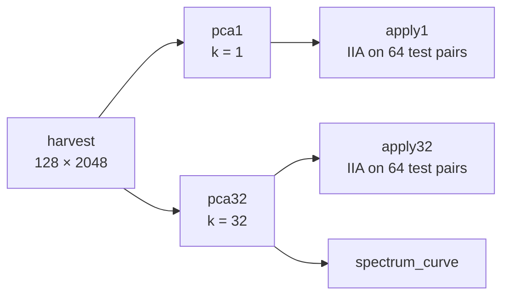
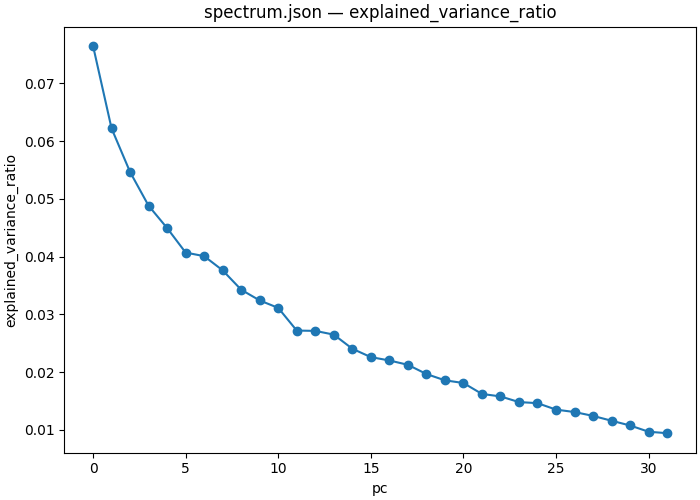

# 05 — Is the direction that explains the most variance the one that carries the variable?

| | |
|---|---|
| **Question** | At the cell [03](03_localize.md) located, does the top principal direction of the activations carry the answer symbol? |
| **Method** | interchange through a fitted PCA basis at two widths, scored by IIA |
| **Model** | `meta-llama/Llama-3.2-1B-Instruct` @ `main`, bf16 |
| **Data** | `mcqa/train_n128_s1` to fit the basis, `mcqa/test_n64_s2` to score it |
| **Documents** | [`workflows/mcqa_pca.json`](workflows/mcqa_pca.json) · [`protocols/mcqa_harvest.json`](protocols/mcqa_harvest.json) · [`protocols/mcqa_pca_apply.json`](protocols/mcqa_pca_apply.json) |
| **Cost** | 1 harvest forward over 128 rows, two SVDs, 2 × 64 scored pairs |
| **Reproduced** | ✓ 2026-08-31, `pytorch_hooks` on one H100 80GB, digest `c7cd0e0bb5a4e0e4…` |

## TL;DR

**PCA** finds the directions along which activations vary most; an
**interchange** finds the directions along which the model's answer moves. They
are not the same directions, and this demo measures the gap. At (L14, answer
slot) the leading principal component explains **7.65%** of the activation
variance and carries **0.000** of the answer symbol — patching through it moves
the model's answer on none of 64 pairs. Widen the basis to 32 components,
**87.2%** of the variance, and IIA goes to **0.828**. Variance is a budget the
causal signal is spent from, not a pointer to it.

## The protocol

A workflow, because the question needs a fit before it needs an intervention.
[`workflows/mcqa_pca.json`](workflows/mcqa_pca.json), inlined verbatim:

```json
{
  "version": "1",
  "description": "The 05_variance_vs_cause demo end to end: harvest the located cell once, fit a principal basis at two widths, and run the same interchange through each. The two apply steps share one document and differ only in the fit they load and the k they declare, which is what makes the pair a controlled comparison rather than two experiments.",
  "output_dir": "mcqa_pca",
  "steps": {
    "harvest": {
      "type": "intervention_protocol",
      "document": "../protocols/mcqa_harvest.json"
    },
    "pca1": {
      "type": "script",
      "script": {"module": "causalab.analysis.fit_pca"},
      "inputs": {"acts": {"step": "harvest", "file": "acts.safetensors"}, "k": 1},
      "outputs": {
        "weight": "basis.safetensors",
        "spectrum": {"file": "spectrum.json",
                     "columns": {"pc": "int64",
                                 "explained_variance": "float64",
                                 "explained_variance_ratio": "float64"}}
      }
    },
    "pca32": {
      "type": "script",
      "script": {"module": "causalab.analysis.fit_pca"},
      "inputs": {"acts": {"step": "harvest", "file": "acts.safetensors"}, "k": 32},
      "outputs": {
        "weight": "basis.safetensors",
        "spectrum": {"file": "spectrum.json",
                     "columns": {"pc": "int64",
                                 "explained_variance": "float64",
                                 "explained_variance_ratio": "float64"}}
      }
    },
    "apply1": {
      "type": "intervention_protocol",
      "document": "../protocols/mcqa_pca_apply.json"
    },
    "apply32": {
      "type": "intervention_protocol",
      "document": "../protocols/mcqa_pca_apply.json",
      "set": {
        "featurizers.pcs.k": 32,
        "featurizers.pcs.file_path": "pca32/basis.safetensors"
      }
    },
    "spectrum_curve": {
      "type": "script",
      "script": {"module": "causalab.io.plots.workflow_figures"},
      "inputs": {
        "table": {"step": "pca32", "file": "spectrum.json"},
        "plot": "lines",
        "x": "pc",
        "value": "explained_variance_ratio"
      },
      "outputs": {"figure": "pca_spectrum.png"}
    }
  }
}
```

`explain` prints the derived schedule; the chart is that, drawn:



Nothing in the document orders those steps. `apply1` names `pca1/basis.safetensors`
and `apply32` names `pca32/basis.safetensors`, and each reference *is* the
dependency edge — so the two arms are independent and the runner may run them
together.

**The two arms share one protocol document.** `apply32` is `apply1` with a `set`
block changing two fields, which is what makes the pair a controlled comparison:
the model, the site, the position, the metric and the split are the same bytes,
and the only difference is how many directions the write is allowed to touch.

### The harvest

[`protocols/mcqa_harvest.json`](protocols/mcqa_harvest.json), inlined verbatim:

```json
{
  "version": "1",
  "description": "Read the residual stream at the located cell (L14, answer slot) on 128 base prompts and write it out. No writes, hence no intervened_models: this is the one un-intervened forward every geometric question starts from, and the tensor it saves is what fit_pca reduces.",
  "model": {"key": "meta-llama/Llama-3.2-1B-Instruct", "revision": "main", "dtype": "bf16"},
  "data": {
    "base": {"dataset": "mcqa/train_n128_s1", "field": "input"}
  },
  "positions": {
    "best": {"index": -1}
  },
  "sites": {
    "target": {"component": "block_output", "layer": 14}
  },
  "reads": {
    "acts": {"site": "target", "pos": "best", "model": "original", "input": "base"}
  },
  "save": [
    {"value": "acts", "model": "original", "input": "base", "file_path": "acts.safetensors"}
  ]
}
```

| section | says | why this and not that |
|---|---|---|
| `data` | only a `base` role | there is no counterfactual: a principal basis is fitted on what the model *does*, with no reference to what would change it. That is the whole meaning of "unsupervised" here |
| no `writes` | and therefore no `intervened_models` | a harvest is one un-intervened forward. The section is absent rather than empty, which is what makes "this document cannot have changed the model" checkable |
| `save` | `.safetensors`, not `.json` | dense numerics are the one thing JSON is wrong for (workflow spec §2.5) |

### The application

[`protocols/mcqa_pca_apply.json`](protocols/mcqa_pca_apply.json), inlined verbatim:

```json
{
  "version": "1",
  "description": "The same interchange as 03, but through a principal basis instead of the whole residual stream: patch only the component of the answer slot that lies in the top-k directions of the harvested activations, and leave the orthogonal remainder alone. k is authored rather than swept because each basis is a separate fit -- the workflow runs this document once per k, and the file_path is what says which fit.",
  "model": {"key": "meta-llama/Llama-3.2-1B-Instruct", "revision": "main", "dtype": "bf16"},
  "data": {
    "base":           {"dataset": "mcqa/test_n64_s2", "field": "input"},
    "counterfactual": {"dataset": "mcqa/test_n64_s2", "field": "counterfactual_inputs[0]"}
  },
  "positions": {
    "best": {"index": -1}
  },
  "sites": {
    "target":  {"component": "block_output", "layer": 14},
    "lm_head": {"component": "lm_head"}
  },
  "featurizers": {
    "pcs": {"kind": "pca", "k": 1, "file_path": "pca1/basis.safetensors"}
  },
  "reads": {
    "v_cf":   {"site": "target",  "pos": "best", "model": "original", "input": "counterfactual", "featurizer": "pcs"},
    "logits": {"site": "lm_head", "pos": -1,     "model": "patched",  "input": "base"}
  },
  "writes": {
    "patch": {"site": "target", "pos": "best", "featurizer": "pcs", "do": {"swap": "v_cf"}}
  },
  "intervened_models": {
    "patched": {"input": "base", "writes": ["patch"]}
  },
  "metrics": {
    "iia":        {"kind": "match",      "of": "logits", "expected": "cf_answer", "token_form": "space_prefixed"},
    "logit_diff": {"kind": "logit_diff", "of": "logits", "a": "cf_answer", "b": "base_answer", "token_form": "space_prefixed"}
  },
  "save": [
    {"value": "iia",        "model": "patched", "input": "base", "file_path": "iia.json"},
    {"value": "logit_diff", "model": "patched", "input": "base", "file_path": "logit_diff.json"}
  ]
}
```


| section | says | why this and not that |
|---|---|---|
| `featurizers.pcs` | `kind: "pca"`, `k`, a `file_path` | `k` and `file_path` are the only authorable fields; the width `d` is derived from (model, site), which is what keeps a document from disagreeing with the tensor it loads |
| the same `pcs` on the read **and** the write | so the read is `Pᵀx` and the write scatters back through `P` | this is the entire difference from [03](03_localize.md). A featurizer on both ends turns a full-vector swap into a **subspace** swap |
| `file_path: "pca1/basis.safetensors"` | a step name, not a path on disk | inside a workflow a step name shadows the artifacts root, so the document says *which fit* without knowing where the run tree will live |

> **What happens to the other 2016 directions?** They are the **error term**.
> §2.5's error-term contract says `err` and unselected dimensions always come
> from the pre-write value, so the base activation's component orthogonal to the
> basis survives untouched. A `k = 1` patch therefore changes one number out of
> 2048 and leaves everything else exactly as the base prompt produced it — which
> is what makes the comparison against `k = 32` a statement about *directions*
> rather than about how much was overwritten.

## Run it

```bash
uv run causalab validate demos/onboarding_tutorial/workflows/mcqa_pca.json \
    --data-root demos/onboarding_tutorial/data
# OK: demos/onboarding_tutorial/workflows/mcqa_pca.json — 6 steps, digest c7cd0e0bb5a4e0e4…
```

```bash
uv run causalab explain demos/onboarding_tutorial/workflows/mcqa_pca.json \
    --data-root demos/onboarding_tutorial/data
# digest    c7cd0e0bb5a4e0e4359a016f1ce0b55d00bfbb9552b6581b88f525f38320304e
# schedule  3 levels
#   level 0: harvest
#   level 1: pca1, pca32
#   level 2: apply1, apply32, spectrum_curve
#   harvest: intervention_protocol ../protocols/mcqa_harvest.json — 1 point(s), campaign digest 2c27ebb86f9e5091…
#   pca1: script causalab.analysis.fit_pca -> basis.safetensors, spectrum.json
#   pca32: script causalab.analysis.fit_pca -> basis.safetensors, spectrum.json
#   apply1: intervention_protocol ../protocols/mcqa_pca_apply.json — 1 point(s), authored digest 1254db6252f31c30…
#   apply32: intervention_protocol ../protocols/mcqa_pca_apply.json — 1 point(s), authored digest 0b29f7a62193d9f8…
#   spectrum_curve: script causalab.io.plots.workflow_figures -> pca_spectrum.png
```

```bash
uv run causalab run demos/onboarding_tutorial/workflows/mcqa_pca.json \
    --data-root demos/onboarding_tutorial/data \
    --out runs --device cuda
```

Note the two `apply` steps carry **authored** digests rather than campaign ones:
their `featurizers.pcs.file_path` names a file that does not exist until `pca1`
and `pca32` have run, so the loader validates them against the producing step's
declared output and defers the artifact's identity check to run time. The same
mechanism is what [07](07_cross_model.md) runs into.

**Hardware.** One 1.2 B model, one forward over 128 rows, an SVD of a
128 × 2048 matrix, and two 64-pair scoring passes. Any GPU with 8 GB.
**Measured: 25 s** of wall clock on one H100 80GB for all six steps, three model
loads included.

## Experimental design

The site is the cell [03](03_localize.md)'s `select` step emitted: **block 14's
output at the answer slot**, where a full-vector interchange scores 0.969.
Everything here holds that fixed and varies only the subspace the interchange is
allowed to move through.

`fit_pca` centres the 128 harvested activations, takes a full SVD, and keeps the
top `k` right singular vectors. The variance ratios are over the sample's whole
spectrum — 128 rows, so the centred covariance has rank at most 127 — which
means a ratio here is a fraction of *all* the variance in the harvest, not of
the part the basis kept.

**Q1 — how concentrated is the variance at this cell?** The explained-variance
ratios. A ratio near 1.0 for PC0 would mean the activations at this cell are
essentially one-dimensional; a flat spectrum means they are not.

**Q2 — does the top principal direction carry the answer symbol?** `apply1`'s
IIA. Null: **0.000**, which is also the informative answer — a single direction
that carries the variable would put IIA near 03's 0.969.

**Q3 — does a 32-dimensional principal subspace carry it?** `apply32`'s IIA,
against 03's full-vector **0.969** at the same cell as the ceiling and 0.000 as
the floor. This is the question that says whether the deficit in Q2 is about
*width* or about *direction*.

**Q4 — does variance rank predict causal usefulness?** Q1's ratios read against
Q2 and Q3. If the top component were the causal one, `k = 1` would already be
most of the way to 0.969 and each further component would add little.

> **Why fit on one split and score on another?** PCA is unsupervised, so it
> cannot overfit *to the labels* — but it can still overfit the sample, and a
> basis fitted and scored on the same 64 rows is a basis with 2048 free
> parameters evaluated on the data that chose it. The harvest runs on
> `train_n128_s1` and both applications on `test_n64_s2`, which are different
> seeds and share no row. The same discipline [04](04_subspace.md) needs for a
> *trained* rotation costs nothing here, so there is no reason to skip it.

> **Why `k = 1` and `k = 32` and not a sweep?** Because each basis is a separate
> `fit_pca` step, and a `pca` featurizer's `k` has to match the tensor it loads.
> A sweep over `k` would need one fit per point, which is a workflow with 2 × n
> steps rather than an axis. Two widths answer the question asked; a curve is
> [04](04_subspace.md)'s shape, where the sweep is over a featurizer the document
> trains rather than a file it loads.

## Results

Run on 2026-08-31, one H100 80GB, reference engine (`pytorch_hooks`), bf16,
workflow digest `c7cd0e0bb5a4e0e4…`. All six steps completed.

### Q1 — the variance is not concentrated at all

`pca32/spectrum.json`, the step's own declared output:

| component | PC0 | PC1 | PC2 | PC3 | PC4 | … | PC31 |
|---|---|---|---|---|---|---|---|
| explained variance | 3.181 | 2.587 | 2.273 | 2.030 | 1.869 | … | 0.392 |
| ratio | **0.0765** | 0.0622 | 0.0546 | 0.0488 | 0.0449 | … | 0.0094 |

Cumulative: **0.077** through PC0, 0.139 through PC1, 0.242 through PC3, 0.406
through PC7, 0.631 through PC15, **0.872** through PC31.

**Finding.** The spectrum is close to flat. The leading direction takes 7.65% of
the variance and the 32nd still takes 0.94% — a factor of 8 between first and
thirty-second, where a low-dimensional representation would show orders of
magnitude. It takes 32 of at most 127 available directions to reach 87%.

**Verdict.** Not concentrated. 0.0765 for PC0, against the 1/127 = 0.0079 a
perfectly isotropic cloud would give — structured, but only by a factor of ten.

### Q2 — no. The top principal direction carries none of it

**Finding.** `apply1`'s IIA is **0.000** — 0 of 64 pairs. Patching the base
activation's component along PC0 with the counterfactual's does not change the
model's answer on a single pair.

The graded metric says the same thing more strongly. `logit_diff` (cf_answer
minus base_answer) is **−8.54**, essentially the un-intervened value: the model
is not merely failing to flip, it is not moving. One direction out of 2048,
chosen for variance, is causally inert here.

**Verdict.** No. 0.000 against a ceiling of 0.969 at this very cell.

### Q3 — yes, at 32 directions

**Finding.** `apply32`'s IIA is **0.828** — 53 of 64 pairs — and `logit_diff`
turns from −8.54 to **+5.98**. So 32 directions out of 2048, holding 87.2% of
the variance, recover 85% of the full-vector interchange's 0.969.

That is the informative comparison, and it needs both arms to mean anything: the
same document, the same cell, the same 64 pairs, 1 direction versus 32.

**Verdict.** Yes. 0.828, against 0.969 for the whole 2048-wide vector and 0.000
for one principal direction.

### Q4 — variance rank does not predict causal usefulness

**Finding, and it is the demo's point.** PC0 is the single most variable
direction at this cell and contributes **0.000**. The move from `k = 1` to
`k = 32` adds 79.6 percentage points of variance and **82.8** points of IIA —
so the causal signal is roughly *uniform* across the ranks the basis kept, not
concentrated at the top.

Read the two rankings against each other:

| | PC0 alone | PC0…PC31 |
|---|---|---|
| share of variance | 0.077 | 0.872 |
| IIA | 0.000 | 0.828 |
| IIA per unit of variance captured | 0.00 | 0.95 |

If variance rank tracked causal relevance, the first row would already buy a
tenth of the second's IIA. It buys none.

**Verdict.** No. An unsupervised ranking of directions is not a ranking of
causally relevant directions, and at this cell it is not even correlated with
one at the top of the list.



*This run: `pca32/spectrum.json`, drawn by the workflow's own `spectrum_curve`
step — explained-variance ratio against component index, for the 32 components
the basis keeps. Look at how little it falls: the flatness is Q1's answer, and
it is why Q4 has an interesting answer at all.*

## Limits

- One cell. The spectrum's flatness and PC0's inertness are properties of
  (L14, answer slot) on this model, and a cell where the variable arrives rather
  than departs could look different.
- 128 rows for the fit. The centred covariance has rank ≤ 127, so "87.2% of the
  variance" is 87.2% of a 127-dimensional estimate of a 2048-dimensional
  quantity. More rows would lower it.
- Two widths, not a curve. Whether IIA rises smoothly from 0.000 to 0.828 or
  jumps at some k between them is not measured here; [04](04_subspace.md) asks
  that question of a *trained* subspace, which is a different object.
- The comparison to 0.969 crosses splits. 03's full-vector number is on
  `pairs_n64_s0` and these are on `test_n64_s2`, so it is a reference point
  rather than a paired control.
- **`match` is binary**, so 0.000 means "never won the argmax". `logit_diff`'s
  −8.54 is what rules out the reading that PC0 moves the answer a little.

## Next

- **[04 — How few directions carry it?](04_subspace.md)** asks what a *trained*
  subspace does at the same cell, where PCA's `k = 32` reaches 0.828. A rotation
  optimized for the interchange should need fewer directions than one optimized
  for variance — Q4 above is the reason to expect that, and 04 is the
  measurement.
- **[06 — Which component writes it?](06_components.md)** moves the site instead
  of the subspace, and finds that this cell's content arrives from exactly one
  place.
