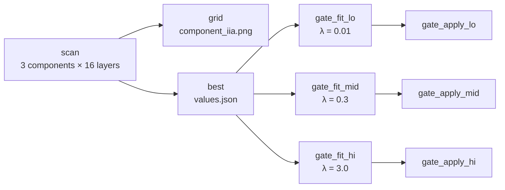
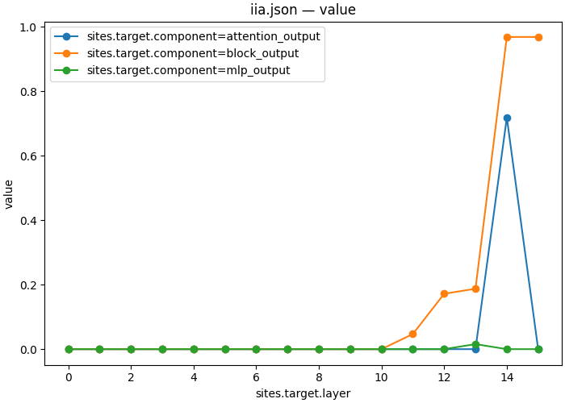

# 06 — Which component writes the answer symbol into the answer slot?

| | |
|---|---|
| **Question** | The answer slot carries the symbol from L14 on. Which of the block's two writers put it there, and how much of the 2048-wide stream does it use? |
| **Method** | interchange with the component as a sweep axis, then a gate featurizer trained under three L1 weights |
| **Model** | `meta-llama/Llama-3.2-1B-Instruct` @ `main`, bf16 |
| **Data** | `mcqa/pairs_n64_s0` to scan, `mcqa/train_n128_s1` to fit, `mcqa/test_n64_s2` to score |
| **Documents** | [`workflows/mcqa_components.json`](workflows/mcqa_components.json) · [`protocols/mcqa_component_scan.json`](protocols/mcqa_component_scan.json) · [`protocols/mcqa_gate_fit.json`](protocols/mcqa_gate_fit.json) · [`protocols/mcqa_gate_apply.json`](protocols/mcqa_gate_apply.json) |
| **Cost** | 48 points × 2 forwards × 64 rows, then 3 fits × 20 epochs and 3 held-out scorings |
| **Reproduced** | ✓ 2026-08-31, `pytorch_hooks` on one H100 80GB, digest `bb0a8ec10cd38eda…` |

## TL;DR

A transformer block adds two things to the residual stream — an attention
output and an MLP output — and `block_output` is their running sum. Making the
component a **sweep axis** asks which summand carries the answer symbol, and the
answer is stark: at layer 14 the attention output scores **IIA 0.719** while
every MLP output in the model scores at most **0.016**. Attention writes the
symbol into the answer slot at exactly one layer; the MLPs never do. Training a
**gate** at that cell then asks how much of the 2048-wide stream the swap needs,
and the honest answer is *most of it*: even an L1 weight strong enough to cost
0.17 of held-out IIA still keeps **1029 of 2048** dimensions.

## The protocol

[`workflows/mcqa_components.json`](workflows/mcqa_components.json), inlined verbatim:

```json
{
  "version": "1",
  "description": "The 06_components demo end to end: scan three components across 16 layers, draw the grid, reduce it to the argmax cell, then fit a gate at that cell under three L1 weights and score each mask on a split it never saw. The scan chooses the site the fit trains at, so 'which component' and 'how much of it' are one chain rather than two experiments with a hand-copied layer number between them. The L1 sweep is three steps rather than an axis because train.objective is a list, and a list-typed field is never a sweep axis.",
  "output_dir": "mcqa_components",
  "steps": {
    "scan": {
      "type": "intervention_protocol",
      "document": "../protocols/mcqa_component_scan.json"
    },
    "grid": {
      "type": "script",
      "script": {
        "module": "causalab.io.plots.workflow_figures"
      },
      "inputs": {
        "table": {
          "step": "scan",
          "file": "iia.json"
        },
        "plot": "lines",
        "x": "sites.target.layer",
        "series": "sites.target.component"
      },
      "outputs": {
        "figure": "component_iia.png",
        "plotted": {
          "file": "component_iia.json"
        }
      }
    },
    "best": {
      "type": "script",
      "script": {
        "module": "causalab.workflow.scripts.select"
      },
      "inputs": {
        "table": {
          "step": "scan",
          "file": "iia.json"
        },
        "choose": "max",
        "emit": {
          "best_layer": "sites.target.layer",
          "best_component": "sites.target.component"
        }
      },
      "outputs": {
        "values": {
          "file": "values.json",
          "keys": {
            "best_layer": 14,
            "best_component": "block_output"
          }
        }
      }
    },
    "gate_fit_lo": {
      "type": "intervention_protocol",
      "document": "../protocols/mcqa_gate_fit.json",
      "set": {
        "sites.target.layer": {
          "artifact": "best",
          "key": "best_layer"
        },
        "sites.target.component": {
          "artifact": "best",
          "key": "best_component"
        },
        "train.objective": [
          [
            1.0,
            "ce"
          ],
          [
            0.01,
            {
              "l1": "gate"
            }
          ]
        ]
      }
    },
    "gate_apply_lo": {
      "type": "intervention_protocol",
      "document": "../protocols/mcqa_gate_apply.json",
      "set": {
        "sites.target.layer": {
          "artifact": "best",
          "key": "best_layer"
        },
        "sites.target.component": {
          "artifact": "best",
          "key": "best_component"
        },
        "featurizers.gate.file_path": "gate_fit_lo/gate.safetensors"
      }
    },
    "gate_fit_mid": {
      "type": "intervention_protocol",
      "document": "../protocols/mcqa_gate_fit.json",
      "set": {
        "sites.target.layer": {
          "artifact": "best",
          "key": "best_layer"
        },
        "sites.target.component": {
          "artifact": "best",
          "key": "best_component"
        },
        "train.objective": [
          [
            1.0,
            "ce"
          ],
          [
            0.3,
            {
              "l1": "gate"
            }
          ]
        ]
      }
    },
    "gate_apply_mid": {
      "type": "intervention_protocol",
      "document": "../protocols/mcqa_gate_apply.json",
      "set": {
        "sites.target.layer": {
          "artifact": "best",
          "key": "best_layer"
        },
        "sites.target.component": {
          "artifact": "best",
          "key": "best_component"
        },
        "featurizers.gate.file_path": "gate_fit_mid/gate.safetensors"
      }
    },
    "gate_fit_hi": {
      "type": "intervention_protocol",
      "document": "../protocols/mcqa_gate_fit.json",
      "set": {
        "sites.target.layer": {
          "artifact": "best",
          "key": "best_layer"
        },
        "sites.target.component": {
          "artifact": "best",
          "key": "best_component"
        },
        "train.objective": [
          [
            1.0,
            "ce"
          ],
          [
            3.0,
            {
              "l1": "gate"
            }
          ]
        ]
      }
    },
    "gate_apply_hi": {
      "type": "intervention_protocol",
      "document": "../protocols/mcqa_gate_apply.json",
      "set": {
        "sites.target.layer": {
          "artifact": "best",
          "key": "best_layer"
        },
        "sites.target.component": {
          "artifact": "best",
          "key": "best_component"
        },
        "featurizers.gate.file_path": "gate_fit_hi/gate.safetensors"
      }
    }
  }
}
```



**The scan chooses the site the fits train at.** `best` emits `best_layer` and
`best_component`, and each fit's `set` block pulls both out of it — so "which
component" and "how much of it" are one chain, with no layer number copied by
hand between two experiments.

> **Why three steps and not a sweep over λ?** The L1 weight lives inside
> `train.objective`, which is a *list* of `[weight, term]` pairs, and a
> list-typed field is never a sweep axis (§3). Three fits and three applications
> is what the spec leaves; it also happens to read better, since each arm's
> `set` block shows the whole objective it trained under.

| step | document | what it contributes |
|---|---|---|
| `scan` | [`mcqa_component_scan.json`](protocols/mcqa_component_scan.json) | three components × 16 layers of interchange at the answer slot, scored by IIA |
| `grid` | `causalab.io.plots.workflow_figures` | draws the scan as a grid, and records the exact rows drawn |
| `best` | `causalab.workflow.scripts.select` | groups the metric table by the producing document's own sweep coordinates and emits the argmax cell |
| `gate_fit_lo` | [`mcqa_gate_fit.json`](protocols/mcqa_gate_fit.json) | trains a per-dimension gate at the cell `best` chose, under an annealed temperature and an L1 penalty |
| `gate_apply_lo` | [`mcqa_gate_apply.json`](protocols/mcqa_gate_apply.json) | scores the fitted mask on a split it never saw, in eval mode where the gate is a hard `θ > 0` split |
| `gate_fit_mid` | [`mcqa_gate_fit.json`](protocols/mcqa_gate_fit.json) | trains a per-dimension gate at the cell `best` chose, under an annealed temperature and an L1 penalty |
| `gate_apply_mid` | [`mcqa_gate_apply.json`](protocols/mcqa_gate_apply.json) | scores the fitted mask on a split it never saw, in eval mode where the gate is a hard `θ > 0` split |
| `gate_fit_hi` | [`mcqa_gate_fit.json`](protocols/mcqa_gate_fit.json) | trains a per-dimension gate at the cell `best` chose, under an annealed temperature and an L1 penalty |
| `gate_apply_hi` | [`mcqa_gate_apply.json`](protocols/mcqa_gate_apply.json) | scores the fitted mask on a split it never saw, in eval mode where the gate is a hard `θ > 0` split |

### The step documents, verbatim

The table above links each of these; this is what they say. Every block is
the file byte for byte — the file is what `causalab run` reads, and
`tests/demos/test_demos.py` fails if a copy here stops matching it.

<details>
<summary><code>scan</code> · <code>protocols/mcqa_component_scan.json</code> — Three components × 16 layers of interchange at the answer slot, scored by IIA (35 lines)</summary>

```json
{
  "version": "1",
  "description": "Which component writes the answer symbol into the answer slot? The same interchange 03 ran, with the component itself as an axis: attention_output and mlp_output are the two things a block adds to the residual stream, block_output is their running sum. Three components x 16 layers at the answer slot, over 64 pairs. Reading the two summands against the sum is what separates 'the answer is here' from 'the answer was put here'.",
  "model": {"key": "meta-llama/Llama-3.2-1B-Instruct", "revision": "main", "dtype": "bf16"},
  "data": {
    "base":           {"dataset": "mcqa/pairs_n64_s0", "field": "input"},
    "counterfactual": {"dataset": "mcqa/pairs_n64_s0", "field": "counterfactual_inputs[0]"}
  },
  "positions": {
    "slot": {"index": -1}
  },
  "sites": {
    "target":  {"component": {"sweep": ["attention_output", "mlp_output", "block_output"]},
                "layer": {"sweep": {"range": [0, 16]}}},
    "lm_head": {"component": "lm_head"}
  },
  "reads": {
    "v_cf":   {"site": "target",  "pos": "slot", "model": "original", "input": "counterfactual"},
    "logits": {"site": "lm_head", "pos": -1,     "model": "patched",  "input": "base"}
  },
  "writes": {
    "patch": {"site": "target", "pos": "slot", "do": {"swap": "v_cf"}}
  },
  "intervened_models": {
    "patched": {"input": "base", "writes": ["patch"]}
  },
  "metrics": {
    "iia":        {"kind": "match",      "of": "logits", "expected": "cf_answer", "token_form": "space_prefixed"},
    "logit_diff": {"kind": "logit_diff", "of": "logits", "a": "cf_answer", "b": "base_answer", "token_form": "space_prefixed"}
  },
  "save": [
    {"value": "iia",        "model": "patched", "input": "base", "file_path": "iia.json"},
    {"value": "logit_diff", "model": "patched", "input": "base", "file_path": "logit_diff.json"}
  ]
}
```

[`protocols/mcqa_component_scan.json`](protocols/mcqa_component_scan.json), inlined verbatim:


| section | says | why this and not that |
|---|---|---|
| `sites.target.component` | a sweep over three component names | the component is document vocabulary like any other field, so it is sweepable, and one document plans all 48 points against one model load. Three separate documents would be three loads and three digests |
| the three names | `attention_output`, `mlp_output`, `block_output` | the two summands and their sum. Reading the summands *against* the sum is what turns "the answer is here" into "the answer was put here by this" |
| `positions.slot` | `{"index": -1}` | the answer slot, the only position [03](03_localize.md) found carrying the variable late |
| `metrics` | `match` **and** `logit_diff` | a binary metric on 64 rows is coarse; the graded one is what distinguishes "did not move it" from "moved it a little" |

</details>

<details>
<summary><code>gate_fit_lo</code> · <code>gate_fit_mid</code> · <code>gate_fit_hi</code> · <code>protocols/mcqa_gate_fit.json</code> — Trains a per-dimension gate at the cell `best` chose, under an annealed temperature and an L1 penalty (49 lines)</summary>

```json
{
  "version": "1",
  "description": "How many of the component's dimensions are needed? A gate featurizer splits the site into sigma(theta)*x and its complement, so a plain swap through it interchanges only the gated dimensions and leaves the rest of the base activation in place. Training theta under an L1 penalty, with the sigmoid's temperature annealed toward a hard 0/1, turns 'which dimensions carry the variable' into an optimization whose answer is a mask. The site is set by the workflow from the scan's argmax, so this document trains where the scan pointed and nowhere else.",
  "model": {"key": "meta-llama/Llama-3.2-1B-Instruct", "revision": "main", "dtype": "bf16"},
  "data": {
    "base":           {"dataset": "mcqa/train_n128_s1", "field": "input"},
    "counterfactual": {"dataset": "mcqa/train_n128_s1", "field": "counterfactual_inputs[0]"}
  },
  "positions": {
    "slot": {"index": -1}
  },
  "sites": {
    "target":  {"component": "block_output", "layer": 14},
    "lm_head": {"component": "lm_head"}
  },
  "featurizers": {
    "gate": {"kind": "gate"}
  },
  "reads": {
    "v_cf":   {"site": "target",  "pos": "slot", "model": "original", "input": "counterfactual", "featurizer": "gate"},
    "logits": {"site": "lm_head", "pos": -1,     "model": "masked",   "input": "base"}
  },
  "writes": {
    "mask": {"site": "target", "pos": "slot", "featurizer": "gate", "do": {"swap": "v_cf"}}
  },
  "intervened_models": {
    "masked": {"input": "base", "writes": ["mask"]}
  },
  "metrics": {
    "iia": {"kind": "match",         "of": "logits", "expected": "cf_answer", "token_form": "space_prefixed"},
    "ce":  {"kind": "cross_entropy", "of": "logits", "target": "label", "token_form": "space_prefixed"}
  },
  "train": {
    "objective":  [[1.0, "ce"], [0.01, {"l1": "gate"}]],
    "params":     ["gate"],
    "optimizer":  {"name": "adamw", "lr": 1e-3, "weight_decay": 0.0},
    "steps":      {"epochs": 20},
    "batch":      {"pairs": 32},
    "anneal":     {"gate.theta.temperature": [1.0, 0.01, 0.5]},
    "precision":  {"feature": "fp32", "loss": "fp32"},
    "eval":       {"every": {"epochs": 1}, "split": "mcqa/test_n64_s2", "metrics": ["iia"]},
    "seed": 0
  },
  "save": [
    {"value": "iia",  "model": "masked", "input": "base", "file_path": "iia.json"},
    {"value": "ce",   "model": "masked", "input": "base", "file_path": "ce.json"},
    {"value": "gate", "site": "target", "file_path": "gate.safetensors"}
  ]
}
```

[`protocols/mcqa_gate_fit.json`](protocols/mcqa_gate_fit.json), inlined verbatim:


A **gate** featurizer splits the site into `(σ(θ)⊙x, (1−σ(θ))⊙x)`. The write is
an ordinary swap, so what actually happens is
`σ(θ)·x_cf + (1−σ(θ))·x_base` — a per-dimension blend whose mixing weights are
the trained parameter. Annealing the sigmoid's temperature from 1.0 to 0.01 over
the first half of training pushes those weights toward 0 and 1, so what the fit
ends with is a *mask* rather than a blend.

[`protocols/mcqa_gate_apply.json`](protocols/mcqa_gate_apply.json), inlined verbatim:

```json
{
  "version": "1",
  "description": "Score the fitted mask on the split it never saw. The gate featurizer's file_path loads the fitted theta and the stage comes back in eval mode, so the swap runs through the same hard theta>0 mask the fit was scored on; there is no train section, so the number here is a held-out one by construction -- which mcqa_gate_fit.json's own iia.json is not. The dtype must match the fit's: it is part of the artifact's identity, and an apply that omits it implies fp32 and is refused.",
  "model": {"key": "meta-llama/Llama-3.2-1B-Instruct", "revision": "main", "dtype": "bf16"},
  "data": {
    "base":           {"dataset": "mcqa/test_n64_s2", "field": "input"},
    "counterfactual": {"dataset": "mcqa/test_n64_s2", "field": "counterfactual_inputs[0]"}
  },
  "positions": {
    "slot": {"index": -1}
  },
  "sites": {
    "target":  {"component": "block_output", "layer": 14},
    "lm_head": {"component": "lm_head"}
  },
  "featurizers": {
    "gate": {"kind": "gate", "file_path": "gate_fit/gate.safetensors"}
  },
  "reads": {
    "v_cf":   {"site": "target",  "pos": "slot", "model": "original", "input": "counterfactual", "featurizer": "gate"},
    "logits": {"site": "lm_head", "pos": -1,     "model": "masked",   "input": "base"}
  },
  "writes": {
    "mask": {"site": "target", "pos": "slot", "featurizer": "gate", "do": {"swap": "v_cf"}}
  },
  "intervened_models": {
    "masked": {"input": "base", "writes": ["mask"]}
  },
  "metrics": {
    "iia":        {"kind": "match",      "of": "logits", "expected": "cf_answer", "token_form": "space_prefixed"},
    "logit_diff": {"kind": "logit_diff", "of": "logits", "a": "cf_answer", "b": "base_answer", "token_form": "space_prefixed"}
  },
  "save": [
    {"value": "iia",        "model": "masked", "input": "base", "file_path": "iia.json"},
    {"value": "logit_diff", "model": "masked", "input": "base", "file_path": "logit_diff.json"}
  ]
}
```

> **The mask is hard at eval time.** `Gate._mask` is a `θ > 0` split when the
> stage is not training, so a gate whose θ never separated is a coin flip on
> gradient noise — and can score well by accident. That is why every arm below
> reports `fit_diagnostics.json`'s `decisive_fraction` beside its IIA, and why
> the arm with the lowest decisive fraction is the one this demo trusts least.

</details>

## Run it

```bash
uv run causalab validate demos/onboarding_tutorial/workflows/mcqa_components.json \
    --data-root demos/onboarding_tutorial/data
# OK: demos/onboarding_tutorial/workflows/mcqa_components.json — 9 steps, digest bb0a8ec10cd38eda…
```

```bash
uv run causalab explain demos/onboarding_tutorial/workflows/mcqa_components.json \
    --data-root demos/onboarding_tutorial/data
# digest    bb0a8ec10cd38edaf2f02b3746c2f43f776667053617450c0fc0b52345249a62
# schedule  4 levels
#   level 0: scan
#   level 1: grid, best
#   level 2: gate_fit_lo, gate_fit_mid, gate_fit_hi
#   level 3: gate_apply_lo, gate_apply_mid, gate_apply_hi
#   scan: intervention_protocol ../protocols/mcqa_component_scan.json — 48 point(s), campaign digest 735580afea94a9c6…
#   grid: script causalab.io.plots.workflow_figures -> component_iia.json, component_iia.png
#   best: script causalab.workflow.scripts.select -> values.json
#   gate_fit_lo: intervention_protocol ../protocols/mcqa_gate_fit.json — 1 point(s), authored digest 89991d579aa40cc3…
#   gate_apply_lo: intervention_protocol ../protocols/mcqa_gate_apply.json — 1 point(s), authored digest 1f6ab23a4e8ce7ab…
#   gate_fit_mid: intervention_protocol ../protocols/mcqa_gate_fit.json — 1 point(s), authored digest 1829fd5bdb7460c8…
#   gate_apply_mid: intervention_protocol ../protocols/mcqa_gate_apply.json — 1 point(s), authored digest ac1cf2782e483aa0…
#   gate_fit_hi: intervention_protocol ../protocols/mcqa_gate_fit.json — 1 point(s), authored digest 2b78b3f4dad84ea6…
#   gate_apply_hi: intervention_protocol ../protocols/mcqa_gate_apply.json — 1 point(s), authored digest 2a40b36cd4639feb…
```

The three fits share one file and have three different digests, because a step's
digest is its document's **with `set` applied**. That is the record saying the
three arms are three experiments rather than one run three times.

```bash
uv run causalab run demos/onboarding_tutorial/workflows/mcqa_components.json \
    --data-root demos/onboarding_tutorial/data \
    --out runs --device cuda
```

**Hardware.** 6144 row-forwards for the scan, then three 20-epoch fits with
gradients on a 1.2 B model. Any GPU with 16 GB. **Measured: 35 s** of wall clock
on one H100 80GB for all nine steps, seven model loads included.

## Experimental design

[03](03_localize.md) established *where*: the answer slot, from L14 on, at
IIA 0.969. This demo asks *by what*, and holds everything else at 03's values —
the same position, the same 64 pairs, the same metric — so the only thing that
varies in the first half is the component.

The three components are one identity apart. In a pre-norm block,

```
block_output(L) = block_input(L) + attention_output(L) + mlp_output(L)
```

so `block_output` at layer L is everything the stream carries after L, while the
two summands are that layer's own contributions.

**Q1 — which summand carries the answer symbol?** `attention_output` against
`mlp_output`, over all 16 layers. Null for both: 0.000, which would mean the
variable is present in the running sum but written by neither — possible if it
arrives from an earlier layer and merely persists.

**Q2 — at how many layers?** The number of layers at which either summand is
non-zero. A variable routed by a circuit would light several; a variable written
once would light one.

**Q3 — does `block_output` behave like the sum of the two?** 03 measured 0.969
at (L14, slot). If `attention_output` at L14 is the writer, its score should be
*at most* that and plausibly lower, since patching the summand leaves the rest
of the stream at its base value.

**Q4 — how many of the 2048 dimensions does the swap need?** The gate's
`hard_mask_size` at three L1 weights, against its held-out IIA. Null for the
sparsity story: a mask that stays near 2048 at every λ, meaning the penalty
buys nothing but damage.

> **Why is `attention_output` expected to score lower than `block_output`?**
> Patching `block_output` replaces the *whole* stream at that position, so the
> base prompt's earlier contributions go too. Patching `attention_output`
> replaces one summand and leaves `block_input` — everything the base computed
> up to L14 — in place. The second is the more specific claim and the harder
> test, so a high score there means more, not less.

> **Why score the gate on a split it never saw?** For the same reason
> [04](04_subspace.md) does: θ has 2048 free parameters and the fit has 128
> pairs. A fit's own `iia.json` is a train score. Each arm here reports both, and
> the two differ by 0.07 at the strongest penalty.

## Results

Run on 2026-08-31, one H100 80GB, reference engine (`pytorch_hooks`), bf16,
workflow digest `bb0a8ec10cd38eda…`. All nine steps completed; the scan produced
3072 per-example records over 48 cells.



*This run: all 48 cells of `scan/iia.json`, drawn by the workflow's own `grid`
step — IIA against layer, one series per component. Look at how many series are
ever off zero, and at how narrow the one that is turns out to be.*

### Q1 — attention. The MLPs never do it

**Finding.** Over all 16 layers:

| component | best cell | IIA | second-best |
|---|---|---|---|
| `attention_output` | L14 | **0.719** | 0.000 (every other layer) |
| `mlp_output` | L13 | **0.016** | 0.000 (every other layer) |
| `block_output` | L14, L15 | 0.969 | 0.188 (L13) |

`mlp_output`'s best cell is **1 pair in 64** — indistinguishable from nothing,
and its `logit_diff` confirms it. Every MLP in the model, at the position where
the answer is read out, is causally irrelevant to which symbol comes out.

**Verdict.** Attention, at 0.719 against the MLPs' 0.016.

### Q2 — one layer, and only one

**Finding.** `attention_output` is **0.000 at fifteen of sixteen layers** and
0.719 at the sixteenth. There is no band, no decay, no second site: layers 0–13
and 15 are all exactly zero, all 64 pairs, all fifteen cells.

That is a sharper localization than anything earlier in this series. 03's grid
had a symbol column live from L0 to L13 and a slot column live at L14–L15;
here the *writer* is a single (component, layer).

**Verdict.** One. Layer 14's attention output, and nothing else.

### Q3 — yes, and the gap is what the identity predicts

✓ `block_output` at L14 is **0.969** and `attention_output` at L14 is **0.719**.
The summand scores lower than the sum, exactly as the block identity says it
must: patching `attention_output` leaves `block_input(14)` — everything the base
prompt computed through L13 — untouched, and on 16 of 64 pairs that residue is
enough to keep the base answer.

The layer below is the other half of the check: `block_output` at L13 is 0.188
while `attention_output` at L13 is 0.000. So the stream *already* carries a
little of the variable at L13 (0.188), no L13 component put it there at the
answer slot, and L14's attention is what makes it decisive.

**Verdict.** Yes. 0.719 ≤ 0.969, and the 0.250 difference is the base's own
residual stream surviving the patch.

### Q4 — no. The mask stays wide at every penalty

The three arms, at the cell `best` chose (`block_output`, layer 14):

| λ (L1 weight) | 0.01 | 0.3 | 3.0 |
|---|---|---|---|
| `hard_mask_size` | 1987 / 2048 | 1926 / 2048 | **1029 / 2048** |
| `decisive_fraction` | 0.972 | 0.947 | **0.669** |
| train IIA | 0.961 | 0.953 | 0.898 |
| **held-out IIA** | **1.000** | **1.000** | **0.828** |

**Finding.** Raising the penalty 300× drops the mask from 97% of the stream to
50% of it, and buys no interpretable minimum: there is no λ at which a small,
decisive set of dimensions survives with the IIA intact. The variable at this
cell is *diffuse*, which is the same thing [04](04_subspace.md) found from the
other side — it needed 32 to 64 rotated directions to reach the ceiling, and
those are directions the gate is not free to choose, since a gate masks the
stream's own coordinates.

**The λ = 3.0 arm is the one to distrust, and its own diagnostic says so.**
`decisive_fraction` 0.669 means a third of the 2048 gate values never left the
undecided band, so a third of that mask is gradient noise resolved by a hard
`θ > 0` split. Its 0.828 is a number about a mask that is only two-thirds a
mask.

✓ The two weaker arms scoring **1.000 held-out** — above the 0.969 full swap —
is not an error: masking out 61 or 122 of the base's own dimensions is a
*different* intervention from replacing all 2048, and it happens to be a
slightly more effective one on these 64 pairs.

**Verdict.** No sparse answer exists here. 1029 dimensions is the sparsest mask
this penalty range produced, it costs 0.17 of IIA, and a third of it is not
decisive.

## Limits

- Three components of the fifty-odd the spec names. `attention_premix`,
  `attention_result` and the per-head sites would say *which head* — that is
  [08](08_attention.md), and it exists because this demo's answer stops at
  "attention".
- One position. The whole scan is the answer slot, so a component that writes
  the symbol somewhere else and has it moved later is invisible here.
- Q4's three λ values are a coarse grid on a log scale. The claim is that no
  sparse decisive mask appears between 0.01 and 3.0, not that none exists.
- `decisive_fraction` 0.669 at λ = 3.0 means that arm's number is soft. A longer
  anneal or more epochs would be the way to harden it, and neither was tried.
- The gate masks the residual stream's own coordinates, which are not a
  privileged basis. [04](04_subspace.md)'s rotation is free to choose the basis
  and needs 32–64 directions; a mask needs 1029. The difference between those
  two numbers is a statement about the basis, not about the model.
- 64 pairs for the scan, 64 for the held-out score. Every IIA here moves in
  steps of 1/64 = 0.016.

## Next

- **[08 — Which head?](08_attention.md)** takes Q2's single layer and asks which
  of its 32 attention heads does the writing, by interchanging the attention
  pattern itself.
- **[10 — Necessity and sufficiency](10_steering.md)** asks the complementary
  question at the same cell: what happens when the contribution is removed, and
  whether one direction can put it back.
