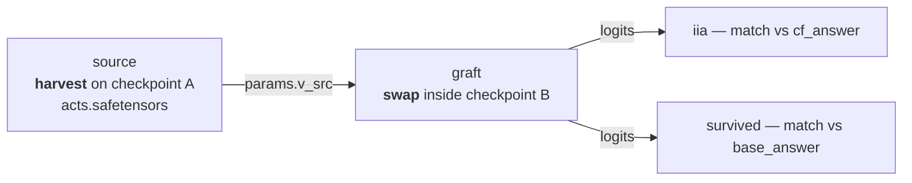

# 07 — Can one checkpoint's activation drive another checkpoint?

| | |
|---|---|
| **Question** | Grafting an activation harvested from one model into a forward of another: does it run, and should it? |
| **Method** | a two-step workflow — harvest to a file, load the file as a `params` constant, swap — run once per source checkpoint |
| **Model** | target `meta-llama/Llama-3.2-1B-Instruct` @ `main`, bf16; sources: the same, and `meta-llama/Llama-3.2-1B` @ `main`, bf16 |
| **Data** | `mcqa/pairs_n64_s0` — 64 pairs, `different_symbol` design ([01](01_define.md)) |
| **Documents** | [`workflows/mcqa_cross_model.json`](workflows/mcqa_cross_model.json) · [`workflows/mcqa_cross_model_refused.json`](workflows/mcqa_cross_model_refused.json) · [`protocols/mcqa_source_harvest.json`](protocols/mcqa_source_harvest.json) · [`protocols/mcqa_cross_patch.json`](protocols/mcqa_cross_patch.json) |
| **Cost** | 2 × (1 harvest forward + 1 patched forward) over 64 rows |
| **Reproduced** | ✓ 2026-08-31, `pytorch_hooks` on one H100 80GB, digests `ea55f32b723f356f…` (ran) and `6c1dcd04df3ea1a0…` (refused) |

## TL;DR

A document names **exactly one** `model.key`, so cross-model patching is not one
document with two networks: it is two documents and a file between them. Written
that way it loads — `validate` and `explain` pass on both arms — and then the
two arms part company at run time. Grafting the instruction-tuned model's own
activation back into itself reproduces [03](03_localize.md)'s interchange to the
third decimal, **IIA 0.969**. Grafting the *pretrained* sibling's activation into
it is **refused**: the harvested tensor carries an `ArtifactIdentity` stamped
with the model that produced it, and the check fires before a single forward
runs. Both documents ship, because the refusal is only a result if the identical
mechanism works when the checkpoints agree.

## The protocol

Two workflows that differ in one field. First the control —
[`workflows/mcqa_cross_model.json`](workflows/mcqa_cross_model.json), inlined verbatim:

```json
{
  "version": "1",
  "description": "The 07_cross_model demo's control arm: harvest the answer-slot activation of the instruction-tuned model and graft it back into the same model. This is the notebook's own validation scenario -- source and target the same checkpoint -- and it has to reproduce an ordinary interchange, because that is what it is. It runs, which is what makes the cross-checkpoint arm's refusal a statement about the two models rather than about the graft.",
  "output_dir": "mcqa_cross_same",
  "steps": {
    "source": {
      "type": "intervention_protocol",
      "document": "../protocols/mcqa_source_harvest.json",
      "set": {
        "model.key": "meta-llama/Llama-3.2-1B-Instruct"
      }
    },
    "graft": {
      "type": "intervention_protocol",
      "document": "../protocols/mcqa_cross_patch.json"
    }
  }
}
```

Then the experiment —
[`workflows/mcqa_cross_model_refused.json`](workflows/mcqa_cross_model_refused.json),
inlined verbatim:

```json
{
  "version": "1",
  "description": "The 07_cross_model demo's experimental arm: harvest on the pretrained checkpoint, graft into the instruction-tuned one. Identical to the control workflow beside it but for the source step's model.key. It loads -- validate and explain both pass -- and it refuses at run time, which is the demo's result and the reason both documents ship.",
  "output_dir": "mcqa_cross_model",
  "steps": {
    "source": {
      "type": "intervention_protocol",
      "document": "../protocols/mcqa_source_harvest.json"
    },
    "graft": {
      "type": "intervention_protocol",
      "document": "../protocols/mcqa_cross_patch.json"
    }
  }
}
```



**The two grafts are the same bytes.** `explain` gives both the authored digest
`fbde3416f010e05d…`, because they load the identical document — the control's
`source` step overrides `model.key` and the experimental one does not. The only
difference in the whole experiment is which checkpoint produced the file, which
is what makes the comparison clean and the refusal interpretable.

Both workflows declare the same two step names, running the same two files —
that is what makes them a controlled pair rather than two experiments:

| step | document | what it contributes | control arm | experimental arm |
|---|---|---|---|---|
| `source` | [`mcqa_source_harvest.json`](protocols/mcqa_source_harvest.json) | one un-intervened forward on the *source* checkpoint; the tensor is the only thing that crosses | `set` → `Llama-3.2-1B-Instruct` | as authored: `Llama-3.2-1B` |
| `graft` | [`mcqa_cross_patch.json`](protocols/mcqa_cross_patch.json) | loads that tensor as a `params` constant and swaps it into the *target* checkpoint's forward | identical bytes, digest `fbde3416f010e05d…` | identical bytes, digest `fbde3416f010e05d…` |

### The step documents, verbatim

The table above links each of these; this is what they say. Every block is
the file byte for byte — the file is what `causalab run` reads, and
`tests/demos/test_demos.py` fails if a copy here stops matching it.

<details>
<summary><code>source</code> · <code>protocols/mcqa_source_harvest.json</code> — One un-intervened forward on the *source* checkpoint; the tensor is the only thing that crosses (20 lines)</summary>

```json
{
  "version": "1",
  "description": "Read the answer-slot residual of the SOURCE checkpoint -- Llama-3.2-1B, the pretrained sibling of the instruction-tuned model every other demo here runs -- on the counterfactual half of each pair. Same architecture, same tokenizer, same 2048-wide stream, different weights. The tensor this saves is the only thing that crosses between the two models: the sole role is 'base' because a document's roles name inputs, not sides of a contrast, and this one has a single forward; a document names exactly one model.key, so a cross-model experiment is two documents and a file, never one document with two networks.",
  "model": {"key": "meta-llama/Llama-3.2-1B", "revision": "main", "dtype": "bf16"},
  "data": {
    "base": {"dataset": "mcqa/pairs_n64_s0", "field": "counterfactual_inputs[0]"}
  },
  "positions": {
    "slot": {"index": -1}
  },
  "sites": {
    "target": {"component": "block_output", "layer": 14}
  },
  "reads": {
    "acts": {"site": "target", "pos": "slot", "model": "original", "input": "base"}
  },
  "save": [
    {"value": "acts", "model": "original", "input": "base", "file_path": "acts.safetensors"}
  ]
}
```

[`protocols/mcqa_source_harvest.json`](protocols/mcqa_source_harvest.json), inlined verbatim:


| section | says | why this and not that |
|---|---|---|
| `model.key` | `meta-llama/Llama-3.2-1B` | the pretrained sibling: same 16 layers, same 2048-wide stream, same tokenizer, different weights. The control workflow overrides this field to the instruction-tuned key and changes nothing else |
| `data.base` | the pair table's **counterfactual** column | the sole role is `base` because a document's roles name *inputs*, not sides of a contrast, and this document runs one forward. What makes it the counterfactual is the `field` |
| no `writes` | one un-intervened forward | this half of a cross-model experiment observes; the other half intervenes |

</details>

<details>
<summary><code>graft</code> · <code>protocols/mcqa_cross_patch.json</code> — Loads that tensor as a `params` constant and swaps it into the *target* checkpoint's forward (37 lines)</summary>

```json
{
  "version": "1",
  "description": "Write the SOURCE checkpoint's answer-slot activation into the TARGET checkpoint and ask what it then answers. The source tensor enters as a params constant, which is the one channel a value has for crossing a model boundary: reads live inside one model's forward, and this document's forward is the instruction-tuned model's. Whether the constant is broadcast over rows or aligned row-by-row is the whole experiment -- see the demo's Results.",
  "model": {"key": "meta-llama/Llama-3.2-1B-Instruct", "revision": "main", "dtype": "bf16"},
  "data": {
    "base": {"dataset": "mcqa/pairs_n64_s0", "field": "input"}
  },
  "positions": {
    "slot": {"index": -1}
  },
  "sites": {
    "target":  {"component": "block_output", "layer": 14},
    "lm_head": {"component": "lm_head"}
  },
  "params": {
    "v_src": {"file_path": "source/acts.safetensors", "entry": {"slot": "acts"}}
  },
  "reads": {
    "logits": {"site": "lm_head", "pos": -1, "model": "grafted", "input": "base"}
  },
  "writes": {
    "graft": {"site": "target", "pos": "slot", "do": {"swap": "v_src"}}
  },
  "intervened_models": {
    "grafted": {"input": "base", "writes": ["graft"]}
  },
  "metrics": {
    "iia":      {"kind": "match", "of": "logits", "expected": "cf_answer",   "token_form": "space_prefixed"},
    "survived": {"kind": "match", "of": "logits", "expected": "base_answer", "token_form": "space_prefixed"},
    "said":     {"kind": "top_k", "of": "logits", "k": 1, "by": "prob"}
  },
  "save": [
    {"value": "iia",      "model": "grafted", "input": "base", "file_path": "iia.json"},
    {"value": "survived", "model": "grafted", "input": "base", "file_path": "survived.json"},
    {"value": "said",     "model": "grafted", "input": "base", "file_path": "said.json"}
  ]
}
```

[`protocols/mcqa_cross_patch.json`](protocols/mcqa_cross_patch.json), inlined verbatim:


| section | says | why this and not that |
|---|---|---|
| `params.v_src` | a `file_path` plus `{"entry": {"slot": "acts"}}` | §2.8: a write operand is a read name, a param name, or a literal scalar — **never a tensor**. A constant vector enters as a `params` entry, and this is the only channel a value has for crossing a model boundary |
| `"slot": "acts"` | which tensor of the bundle | a bundle harvested *from a read* is keyed by that read's name rather than by `value`, and `slot` is the params-only key that says so |
| `metrics.said` | `top_k`, k = 1 | what the model actually emitted. `iia` and `survived` are two 0/1 questions and cannot describe a third outcome; a graft is exactly the intervention that might produce one |

</details>

## Run it

Both arms load. That is the first half of the result, so it is pasted before the
run rather than after:

```bash
uv run causalab validate demos/onboarding_tutorial/workflows/mcqa_cross_model.json \
    --data-root demos/onboarding_tutorial/data
# OK: demos/onboarding_tutorial/workflows/mcqa_cross_model.json — 2 steps, digest ea55f32b723f356f…
```

```bash
uv run causalab validate demos/onboarding_tutorial/workflows/mcqa_cross_model_refused.json \
    --data-root demos/onboarding_tutorial/data
# OK: demos/onboarding_tutorial/workflows/mcqa_cross_model_refused.json — 2 steps, digest 6c1dcd04df3ea1a0…
```

```bash
uv run causalab explain demos/onboarding_tutorial/workflows/mcqa_cross_model_refused.json \
    --data-root demos/onboarding_tutorial/data
# digest    6c1dcd04df3ea1a0bde97750fc5fc48e37dd409e30e3ee690e85f6d4d115e6ae
# schedule  2 levels
#   level 0: source
#   level 1: graft
#   source: intervention_protocol ../protocols/mcqa_source_harvest.json — 1 point(s), campaign digest c5ad2e866c63a9dc…
#   graft: intervention_protocol ../protocols/mcqa_cross_patch.json — 1 point(s), authored digest fbde3416f010e05d…
```

```bash
uv run causalab run demos/onboarding_tutorial/workflows/mcqa_cross_model.json \
    --data-root demos/onboarding_tutorial/data --out runs --device cuda

uv run causalab run demos/onboarding_tutorial/workflows/mcqa_cross_model_refused.json \
    --data-root demos/onboarding_tutorial/data --out runs --device cuda
```

**Hardware.** Two 1.2 B models, one forward each over 64 short rows. Any GPU
with 8 GB. **Measured: 17 s** of wall clock on one H100 80GB for the control's
two steps; the refused arm stops after its harvest, at **16 s**.

## Experimental design

Both arms graft the counterfactual prompt's residual at (L14, answer slot) — the
cell [03](03_localize.md) located — into a base-prompt forward of
`Llama-3.2-1B-Instruct`, and score what comes out.

| arm | source checkpoint | target checkpoint |
|---|---|---|
| control (`mcqa_cross_model`) | `Llama-3.2-1B-Instruct` | `Llama-3.2-1B-Instruct` |
| experiment (`mcqa_cross_model_refused`) | `Llama-3.2-1B` | `Llama-3.2-1B-Instruct` |

**Q1 — does the control reproduce an ordinary interchange?** Its `iia` against
[03](03_localize.md)'s **0.969** at the same cell. This is the notebook's own
validation scenario, and it is a *prediction with a known answer*: routing a
value out to a file and back in must not change it. Null: anything other than
0.969 means the two-step form is not the one-step form and nothing else in this
demo can be trusted.

**Q2 — does the base prompt's own answer survive the graft?** `survived`, a
`match` against `base_answer`. Under a successful interchange this should be
**0.000**, the complement of Q1 — the model says the counterfactual's symbol
instead of its own.

**Q3 — does the cross-checkpoint arm run?** Yes or no, and if no, at which
verb. `validate` and `explain` are pure and see no model weights, so the
interesting question is whether the *run* accepts it.

**Q4 — if it refuses, is the refusal right?** A judgement, argued from what an
activation is, not from what the error message says.

> **Why does a document name only one model?** Because `sites` address modules
> of *a* network and `reads` happen inside *a* forward. §2.9's "cross-model data
> flow" is about **intervened models** — the same weights under different write
> sets — not about different weights. Two checkpoints are two forwards with no
> shared frame, so the value that passes between them has to be a file, and a
> file is exactly what `params` loads.

> **Why is a same-checkpoint graft worth running at all?** Because it is the
> only way Q3's answer means anything. If the cross arm refused and the same arm
> also refused, the finding would be "the graft mechanism does not work" — a
> statement about `params`. Both arms are needed to make it a statement about
> the two models.

## Results

Run on 2026-08-31, one H100 80GB, reference engine (`pytorch_hooks`), bf16.
The control completed both steps; the experimental arm completed its harvest and
stopped.

### Q1 — yes, to the third decimal

✓ The control's `graft/iia.json` is **0.9688** — 62 of 64 pairs — and
[03](03_localize.md)'s full-vector interchange at (L14, answer slot) is
**0.969**. The same number.

That is the sanity check passing, and it is worth having: the value made a round
trip through a `.safetensors` file and a `params` entry and came back the same
intervention. Whatever the next section says, it is not about the plumbing.

**Verdict.** Yes. 0.9688, against 0.969 for the one-document form.

### Q2 — no, as the complement predicts

✓ `survived` is **0.0000** — 0 of 64. The model never keeps its own answer.

0.9688 + 0.0000 = 0.9688, so on 2 of 64 pairs the model said a *third* thing,
neither its own answer nor the counterfactual's. `said.json` names them: pair 18
answered `" D"` at probability 0.377 and pair 53 answered `" yellow"` at 0.399 —
a symbol that appears in neither prompt, and a colour rather than a symbol at
all. Two binary metrics cannot describe three outcomes, which is why `top_k` is
in the document, and this is the demo where the third outcome shows up.

**Verdict.** No. The graft replaces the answer rather than perturbing it.

### Q3 — it loads, and refuses at run time

**Finding.** Both pure verbs pass. The run stops before a forward:

```
refused: [V15] params entry 'v_src' (source/acts.safetensors): ArtifactIdentity
mismatch on 'model_key' — the document implies
'meta-llama/Llama-3.2-1B-Instruct' but the bundle was stamped
'meta-llama/Llama-3.2-1B' (§2.5)
```

The split is the interesting part, and it is a property of the workflow layer
rather than an accident. A `file_path` naming a **run-tree** path cannot be
checked at load — the file does not exist yet — so the loader validates the
document's *shape* against the producing step's declaration and defers the
artifact's identity to the moment it is opened. `explain` says as much by
printing `authored digest` for that step rather than `campaign digest`. The
same deferral is what lets [04](04_subspace.md)'s apply step name a rotation
that will not exist until the fit has run.

So the honest answer to the notebook's question is: **the protocol layer can
express the experiment and declines to execute it.**

**Verdict.** It loads and refuses. `[V15]`, on `model_key`, before any weights
are touched.

### Q4 — the refusal is right, and the cost of being wrong is silence

**Judgement, argued rather than measured.** An activation is a vector in a basis
that the model's own weights define. `Llama-3.2-1B` and `Llama-3.2-1B-Instruct`
share an architecture, a tokenizer and a width — and share **no** basis: the
instruction tuning rotated, rescaled and repurposed every layer's coordinates.
Position 1729 of layer 14's residual stream means one thing in one and something
unrelated in the other.

What makes this worth a hard refusal rather than a warning is the failure mode.
The graft would have run. The shapes match — 2048 and 2048 — so nothing would
raise, and the result would have been a number: some IIA, plausibly small,
reported as "cross-model transfer is weak". That number would be
indistinguishable from the same number obtained honestly, and no reader could
tell them apart. A check that fires is worth more than a result nobody can
interpret.

The notebook this demo replaces made the same point from the other side. Its
whole experiment was the case `source == target`, and it never ran a genuinely
different checkpoint — its final cell says "to run a genuine cross-model
experiment, replace `source_model` with a different model of the same hidden
dimension", as if the dimension were the constraint. The dimension is what makes
the mistake *possible*; it is not what makes the experiment valid.

**Verdict.** Right. Two checkpoints that agree on shape and disagree on basis
are exactly the case where a silent success is worse than a refusal.

> **What would make this experiment legitimate?** A reason to believe the two
> bases are comparable, supplied by the experiment rather than assumed by it.
> Two checkpoints along one training run share an initialization and drift
> slowly, so a graft between adjacent steps has an argument behind it. Between a
> base model and its instruction-tuned descendant there is none, and the honest
> version of that question needs a *learned* map between the two spaces — which
> is a fitted artifact, and therefore [04](04_subspace.md)'s shape, not this
> one's.

## Limits

- One cell, one layer, one position. The refusal is a property of the artifact's
  identity, so it would fire identically anywhere — but the control's 0.969 is
  specific to (L14, answer slot).
- The identity check compares `model_key` as a **string**. Two names for the
  same weights would refuse, and one name for two revisions is caught by the
  `revision` field rather than by this one.
- The demo does not measure how different the two bases actually are. A
  cosine similarity between the two harvests would be a real number and is not
  computed here; it would not change the refusal, but it would put a size on
  what the refusal is protecting against.
- The `--force`-style escape hatch does not exist and is not asked for. If a
  cross-checkpoint graft is genuinely wanted, the shape is a document that
  loads a fitted map, not a flag that disables a check.
- 64 pairs, so both Q1 and Q2 move in steps of 1/64 = 0.016.

## Next

- **[04 — How few directions carry it?](04_subspace.md)** is the shape a
  legitimate cross-model question would take: a fitted artifact, checked on load,
  applied to a split it did not see.
- **[10 — Necessity and sufficiency](10_steering.md)** uses the same `params`
  channel for the purpose it was designed for — a steering vector computed from
  the model's own activations, applied back to the model that produced them.
