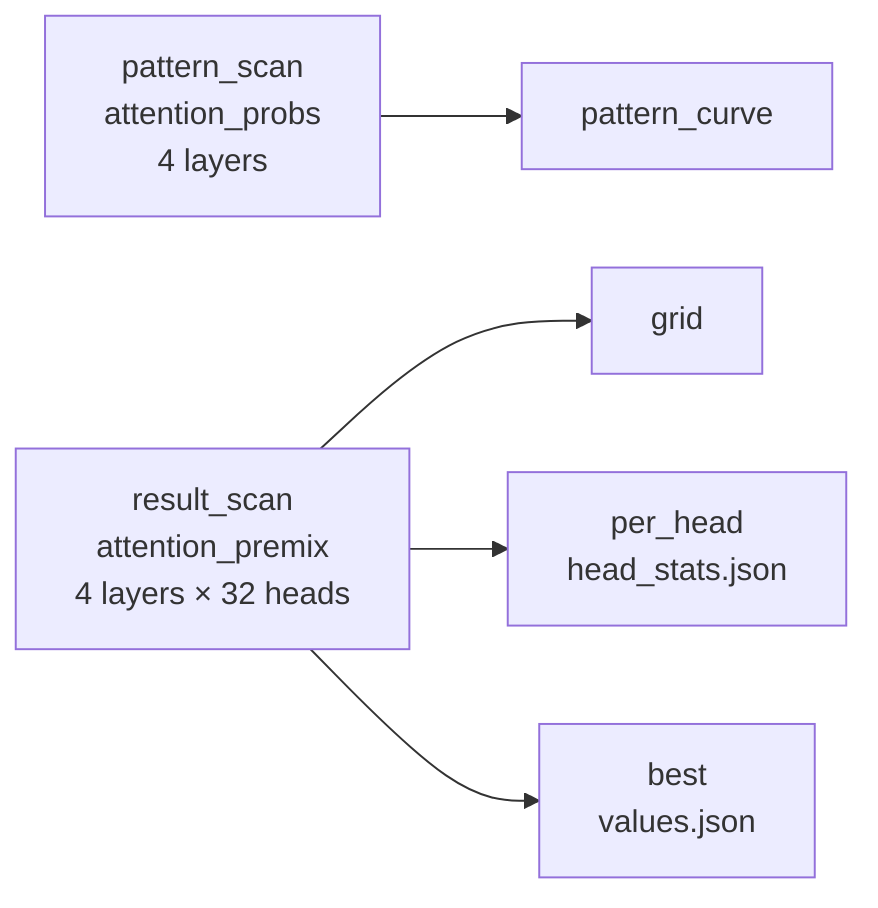
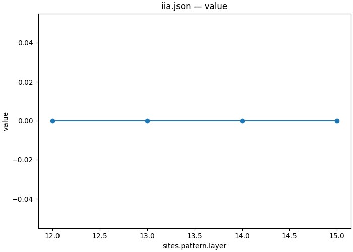
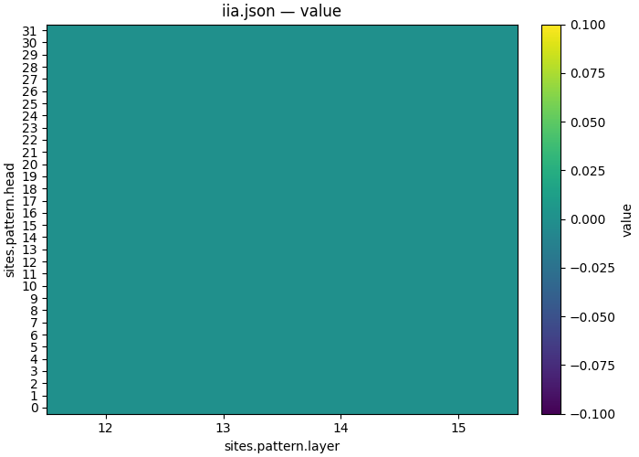

# 08 — Which attention head moves the answer symbol into the answer slot?

| | |
|---|---|
| **Question** | [06](06_components.md) found layer 14's attention writes the answer symbol. Which of its 32 heads, and is it the pattern or the value that carries it? |
| **Method** | two interchanges over the same band — one on the post-softmax pattern, one on each head's slice of the o-projection's input |
| **Model** | `meta-llama/Llama-3.2-1B-Instruct` @ `main`, bf16 |
| **Data** | `mcqa/pairs_n64_s0` — 64 pairs, `different_symbol` design ([01](01_define.md)) |
| **Documents** | [`workflows/mcqa_heads.json`](workflows/mcqa_heads.json) · [`protocols/mcqa_head_scan.json`](protocols/mcqa_head_scan.json) · [`protocols/mcqa_head_premix_scan.json`](protocols/mcqa_head_premix_scan.json) |
| **Cost** | (4 + 128) points × 2 forwards × 64 rows |
| **Reproduced** | ✓ 2026-08-31, `pytorch_hooks` on one H100 80GB, digest `d191113a1388aa4b…` |

## TL;DR

An attention head does two separable things: a **pattern** decides which
positions to read, and the **values** it reads are what gets delivered.
Interchanging a whole layer's pattern over layers 12–15 moves the answer on
**0 of 64 pairs at every layer**. Interchanging one head's slice of what the
o-projection consumes finds a single cell in 128: **layer 14, head 11, IIA
0.375** — 24 of 64 pairs — with 125 of the other 127 cells at exactly 0.000.
The symbol rides in what a head delivers, not in where it looks. And L14 H11 is
the head the notebook this demo replaces picked by hand, which the scan had no
way to know.

## The protocol

[`workflows/mcqa_heads.json`](workflows/mcqa_heads.json), inlined verbatim:

```json
{
  "version": "1",
  "description": "The 08_attention demo end to end: interchange a whole layer's attention pattern, then interchange each head's contribution to the residual stream, and draw both. The two scans are the demo's contrast -- where a head looks against what it delivers -- and they share a band, a position, a dataset and a metric so that the difference between them is the site and nothing else. head_stats is told which columns hold the layer and the head, because its defaults name a site called 'target' and this document's sites are called 'pattern' and 'contribution'.",
  "output_dir": "mcqa_heads",
  "steps": {
    "pattern_scan": {
      "type": "intervention_protocol",
      "document": "../protocols/mcqa_head_scan.json"
    },
    "pattern_curve": {
      "type": "script",
      "script": {
        "module": "causalab.io.plots.workflow_figures"
      },
      "inputs": {
        "table": {
          "step": "pattern_scan",
          "file": "iia.json"
        },
        "plot": "lines",
        "x": "sites.pattern.layer"
      },
      "outputs": {
        "figure": "pattern_iia.png",
        "plotted": {
          "file": "pattern_iia.json"
        }
      }
    },
    "result_scan": {
      "type": "intervention_protocol",
      "document": "../protocols/mcqa_head_premix_scan.json"
    },
    "grid": {
      "type": "script",
      "script": {
        "module": "causalab.io.plots.workflow_figures"
      },
      "inputs": {
        "table": {
          "step": "result_scan",
          "file": "iia.json"
        },
        "plot": "heatmap",
        "x": "sites.contribution.layer",
        "y": "sites.contribution.head"
      },
      "outputs": {
        "figure": "head_iia.png",
        "plotted": {
          "file": "head_iia.json"
        }
      }
    },
    "per_head": {
      "type": "script",
      "script": {
        "module": "causalab.analysis.head_stats"
      },
      "inputs": {
        "table": {
          "step": "result_scan",
          "file": "iia.json"
        },
        "layer_column": "sites.contribution.layer",
        "head_column": "sites.contribution.head"
      },
      "outputs": {
        "stats": {
          "file": "head_stats.json",
          "columns": {
            "layer": "int64",
            "head": "int64",
            "n": "int64",
            "mean": "float64",
            "std": "float64"
          }
        }
      }
    },
    "best": {
      "type": "script",
      "script": {
        "module": "causalab.workflow.scripts.select"
      },
      "inputs": {
        "table": {
          "step": "result_scan",
          "file": "iia.json"
        },
        "choose": "max",
        "emit": {
          "best_layer": "sites.contribution.layer",
          "best_head": "sites.contribution.head"
        }
      },
      "outputs": {
        "values": {
          "file": "values.json",
          "keys": {
            "best_layer": 14,
            "best_head": 11
          }
        }
      }
    }
  }
}
```



**Two roots, no edge between them.** The scans share a band, a position, a
dataset and a metric and depend on nothing of each other's, so the runner
schedules them together — and the demo's question is precisely the difference
between two things that are otherwise identical.

| step | document | what it contributes |
|---|---|---|
| `pattern_scan` | [`mcqa_head_scan.json`](protocols/mcqa_head_scan.json) | interchanges a whole layer's post-softmax pattern, layers 12–15 (no head axis — see Limits) |
| `pattern_curve` | `causalab.io.plots.workflow_figures` | draws the pattern arm's IIA against layer |
| `result_scan` | [`mcqa_head_premix_scan.json`](protocols/mcqa_head_premix_scan.json) | interchanges one head's slice of the o-projection's input, 4 layers × 32 heads |
| `grid` | `causalab.io.plots.workflow_figures` | draws the scan as a grid, and records the exact rows drawn |
| `per_head` | `causalab.analysis.head_stats` | mean and spread of the metric over each (layer, head) |
| `best` | `causalab.workflow.scripts.select` | groups the metric table by the producing document's own sweep coordinates and emits the argmax cell |

### The step documents, verbatim

The table above links each of these; this is what they say. Every block is
the file byte for byte — the file is what `causalab run` reads, and
`tests/demos/test_demos.py` fails if a copy here stops matching it.

<details>
<summary><code>pattern_scan</code> · <code>protocols/mcqa_head_scan.json</code> — Interchanges a whole layer's post-softmax pattern, layers 12–15 (no head axis — see Limits) (95 lines)</summary>

```json
{
  "version": "1",
  "description": "Does the attention PATTERN carry the answer symbol? A point interchanges one layer's whole post-softmax pattern -- every head, every query, every key -- from the counterfactual into the base, and asks whether the model then answers the counterfactual's symbol. The pattern must be read at pos 'all': a row of it is a distribution over key positions, and a single query position is not the object an interchange on attention moves. The sweep is over layers only, not heads: sites.<name>.head does not reach an attention_probs write on the reference engine, so a head axis here would expand to points that are the same experiment under different names (see the demo's Limits). The band is layers 12-15, which is 06's result rather than a budget.",
  "model": {
    "key": "meta-llama/Llama-3.2-1B-Instruct",
    "revision": "main",
    "dtype": "bf16"
  },
  "data": {
    "base": {
      "dataset": "mcqa/pairs_n64_s0",
      "field": "input"
    },
    "counterfactual": {
      "dataset": "mcqa/pairs_n64_s0",
      "field": "counterfactual_inputs[0]"
    }
  },
  "sites": {
    "pattern": {
      "component": "attention_probs",
      "layer": {
        "sweep": {
          "range": [
            12,
            16
          ]
        }
      }
    },
    "lm_head": {
      "component": "lm_head"
    }
  },
  "reads": {
    "p_cf": {
      "site": "pattern",
      "pos": "all",
      "model": "original",
      "input": "counterfactual"
    },
    "logits": {
      "site": "lm_head",
      "pos": -1,
      "model": "patched",
      "input": "base"
    }
  },
  "writes": {
    "patch": {
      "site": "pattern",
      "pos": "all",
      "do": {
        "swap": "p_cf"
      }
    }
  },
  "intervened_models": {
    "patched": {
      "input": "base",
      "writes": [
        "patch"
      ]
    }
  },
  "metrics": {
    "iia": {
      "kind": "match",
      "of": "logits",
      "expected": "cf_answer",
      "token_form": "space_prefixed"
    },
    "logit_diff": {
      "kind": "logit_diff",
      "of": "logits",
      "a": "cf_answer",
      "b": "base_answer",
      "token_form": "space_prefixed"
    }
  },
  "save": [
    {
      "value": "iia",
      "model": "patched",
      "input": "base",
      "file_path": "iia.json"
    },
    {
      "value": "logit_diff",
      "model": "patched",
      "input": "base",
      "file_path": "logit_diff.json"
    }
  ]
}
```

[`protocols/mcqa_head_scan.json`](protocols/mcqa_head_scan.json), inlined verbatim:


| section | says | why this and not that |
|---|---|---|
| `sites.pattern` | `attention_probs`, **no `head`** | not a simplification — a measured limitation. See [Limits](#limits): a `head` on an `attention_probs` write does not reach the write, so a head axis here would expand to points that are the same experiment under different names |
| `pos: "all"` | the whole (query × key) matrix | a row of the pattern is a distribution over key positions; one query position is not the object an interchange on attention moves. The registry says so in the shape's own note |
| `do: {"swap": …}` | and nothing else is legal here | the pattern's rows sum to 1 and the value multiply downstream assumes it. A delta or a scale would leave rows that nothing renormalizes — `attention_scores`, one step upstream of the softmax, is where those are legal |

</details>

<details>
<summary><code>result_scan</code> · <code>protocols/mcqa_head_premix_scan.json</code> — Interchanges one head's slice of the o-projection's input, 4 layers × 32 heads (108 lines)</summary>

```json
{
  "version": "1",
  "description": "Which head's CONTRIBUTION carries the answer symbol? attention_premix is the o-projection's input, which is head-shaped: naming a head selects that head's slice, and because the projection is linear a swap there moves the head's addition to the residual stream by exactly the projection of what was written. attention_result -- the addition itself -- is the quantity one wants and is not writable: the model never forms it, it forms the sum by projecting the whole premix at once, so a write there is refused at the plan with premix named as the alternative. This is the companion to mcqa_head_scan.json: the pattern says where a head looks, this says what it delivers, and only one of the two turns out to carry the variable. 4 layers x 32 heads over 64 pairs, at the answer slot.",
  "model": {
    "key": "meta-llama/Llama-3.2-1B-Instruct",
    "revision": "main",
    "dtype": "bf16"
  },
  "data": {
    "base": {
      "dataset": "mcqa/pairs_n64_s0",
      "field": "input"
    },
    "counterfactual": {
      "dataset": "mcqa/pairs_n64_s0",
      "field": "counterfactual_inputs[0]"
    }
  },
  "positions": {
    "slot": {
      "index": -1
    }
  },
  "sites": {
    "contribution": {
      "component": "attention_premix",
      "layer": {
        "sweep": {
          "range": [
            12,
            16
          ]
        }
      },
      "head": {
        "sweep": {
          "range": [
            0,
            32
          ]
        }
      }
    },
    "lm_head": {
      "component": "lm_head"
    }
  },
  "reads": {
    "v_cf": {
      "site": "contribution",
      "pos": "slot",
      "model": "original",
      "input": "counterfactual"
    },
    "logits": {
      "site": "lm_head",
      "pos": -1,
      "model": "patched",
      "input": "base"
    }
  },
  "writes": {
    "patch": {
      "site": "contribution",
      "pos": "slot",
      "do": {
        "swap": "v_cf"
      }
    }
  },
  "intervened_models": {
    "patched": {
      "input": "base",
      "writes": [
        "patch"
      ]
    }
  },
  "metrics": {
    "iia": {
      "kind": "match",
      "of": "logits",
      "expected": "cf_answer",
      "token_form": "space_prefixed"
    },
    "logit_diff": {
      "kind": "logit_diff",
      "of": "logits",
      "a": "cf_answer",
      "b": "base_answer",
      "token_form": "space_prefixed"
    }
  },
  "save": [
    {
      "value": "iia",
      "model": "patched",
      "input": "base",
      "file_path": "iia.json"
    },
    {
      "value": "logit_diff",
      "model": "patched",
      "input": "base",
      "file_path": "logit_diff.json"
    }
  ]
}
```

[`protocols/mcqa_head_premix_scan.json`](protocols/mcqa_head_premix_scan.json), inlined verbatim:


`attention_premix` is the o-projection's **input**, which is head-shaped — so
naming a head selects that head's slice, and the projection being linear is what
makes a swap there equivalent to swapping that head's addition to the residual
stream.

> **Why not `attention_result`, which is the addition itself?** Because the model
> never forms it. A block projects the whole premix at once and adds the sum; the
> per-head contribution is a linear function of the premix that no tensor in the
> forward holds. The runner refuses a write there at the plan and names the
> alternative:
>
> ```
> [P4] write 'patch' targets 'attention_result', which no write may change:
> it is derived, not computed: the model never forms the per-head
> contribution at all — it forms their sum, by projecting the whole
> 'attention_premix' at once — so there is no tensor here for a write to
> change. Write 'attention_premix' instead, with the same 'head'.
> ```
>
> That refusal arrives at the **plan**, not at load: `validate` and `explain`
> both pass on the document that cannot run. See [Limits](#limits).

</details>

## Run it

```bash
uv run causalab validate demos/onboarding_tutorial/workflows/mcqa_heads.json \
    --data-root demos/onboarding_tutorial/data
# OK: demos/onboarding_tutorial/workflows/mcqa_heads.json — 6 steps, digest d191113a1388aa4b…
```

```bash
uv run causalab explain demos/onboarding_tutorial/workflows/mcqa_heads.json \
    --data-root demos/onboarding_tutorial/data
# digest    d191113a1388aa4b438adfba9dedd03e364753478c147347537b027ee5e6e1db
# schedule  2 levels
#   level 0: pattern_scan, result_scan
#   level 1: pattern_curve, grid, per_head, best
#   pattern_scan: intervention_protocol ../protocols/mcqa_head_scan.json — 4 point(s), campaign digest 6b0a2fe73e87b2cf…
#   pattern_curve: script causalab.io.plots.workflow_figures -> pattern_iia.json, pattern_iia.png
#   result_scan: intervention_protocol ../protocols/mcqa_head_premix_scan.json — 128 point(s), campaign digest 4d7801c0e2c70b16…
#   grid: script causalab.io.plots.workflow_figures -> head_iia.json, head_iia.png
#   per_head: script causalab.analysis.head_stats -> head_stats.json
#   best: script causalab.workflow.scripts.select -> values.json
```

```bash
uv run causalab run demos/onboarding_tutorial/workflows/mcqa_heads.json \
    --data-root demos/onboarding_tutorial/data \
    --out runs --device cuda
```

**Hardware.** 16 896 row-forwards over 22-token rows. `attention_probs` requires
the eager attention path (`explain`'s `requires` lists
`writable_attention_probs`), which materializes the full (batch, head, query,
key) tensor — the reason the band is four layers wide and not sixteen; see
[Limits](#limits). **Measured: 48 s** of wall clock on one H100 80GB for all six
steps, two model loads included.

## Experimental design

[06](06_components.md) narrowed this to one layer: `attention_output` scores
**0.719** at L14 and **0.000** at every other layer, while every MLP in the model
scores at most 0.016. So the writer is layer 14's attention, and what is left is
which head and which half of a head.

The band is **layers 12–15**, and it is 06's result rather than a budget: a head
at a layer whose entire attention output moves nothing cannot itself move
something. L12 and L13 are included as controls precisely because 06 measured
them at 0.000.

**Q1 — does the pattern carry the answer symbol?** `pattern_scan`'s IIA per
layer. Null: 0.000. A high value at L14 would mean the counterfactual's routing —
*where* the head looks — is what installs the symbol.

**Q2 — which head's delivered value carries it?** `result_scan`'s grid, and the
cell `best` emits. Ceiling: **0.719**, the whole layer's attention output from
06, since one head's slice cannot beat all 32.

**Q3 — how many heads are involved?** The count of non-zero cells. A distributed
circuit would light several heads across several layers; a single writer lights
one.

**Q4 — does the scan agree with the head the notebook chose by hand?** The
notebook this demo replaces fixed `TARGET_LAYER = 14, TARGET_HEAD = 11` and
described its attention statistics. It never ran an intervention, so it never
established that the head *does* anything. That is a genuine prediction with a
publicly recorded value, and the scan is blind to it.

> **Why does the pattern arm predict a null and run anyway?** Because the null is
> informative here rather than empty. Both prompts of a `different_symbol` pair
> have the identical structure — same template, same length, same positions —
> and differ only in which letters sit in the symbol slots. Two prompts that look
> the same *should* attend the same way, so swapping the pattern should be close
> to a no-op. Measuring it is what turns "the symbol must be in the values" from
> an argument into a result, and it costs four points.

## Results

Run on 2026-08-31, one H100 80GB, reference engine (`pytorch_hooks`), bf16,
workflow digest `d191113a1388aa4b…`. All six steps completed.

### Q1 — no. The pattern carries none of it



*This run: `pattern_scan/iia.json`, drawn by the workflow's own `pattern_curve`
step — IIA against the layer whose entire post-softmax pattern was interchanged.
The line is on zero at all four points; the y-axis is the whole story.*

| layer | 12 | 13 | 14 | 15 |
|---|---|---|---|---|
| IIA | 0.000 | 0.000 | 0.000 | 0.000 |
| `logit_diff` | −8.287 | −8.346 | −8.262 | −8.280 |

**Finding.** Zero at every layer, including the one 06 named. The graded metric
confirms it is not a near miss: `logit_diff` stays between −8.35 and −8.26, and
an un-intervened forward at this cell sits around −8.5, so the whole intervention
moves the margin by roughly 0.2 out of 8.5.

Replacing *every head's* routing at the layer that writes the answer changes
nothing about the answer. Whatever L14's attention delivers, it delivers it from
the same places in both prompts.

**Verdict.** No. 0.000 at four of four layers.

### Q2 — layer 14, head 11



*This run: all 128 cells of `result_scan/iia.json`, drawn by the workflow's own
`grid` step — rows are the 32 heads, columns the four layers, brightness is IIA
over 64 pairs. Look at how much of it is exactly zero.*

`best/values.json`, the `select` step's own output:

```json
{
  "best_layer": 14,
  "best_head": 11
}
```

**Finding.** **IIA 0.375 at (L14, H11)** — 24 of 64 pairs — with `logit_diff`
**+1.209**, the only cell in the grid where that quantity is positive at all.
Swapping one head's slice of one layer's o-projection input flips the model's
answer on more than a third of the population.

Against 06's 0.719 for the whole layer's attention output, one head of
thirty-two recovers **52%** of what all thirty-two do together.

**Verdict.** Layer 14, head 11, at 0.375.

### Q3 — three cells in 128, and one of them matters

**Finding.** **125 of 128 cells are exactly 0.000.** The three that are not:

| cell | IIA | pairs | `logit_diff` |
|---|---|---|---|
| L14 H11 | **0.375** | 24/64 | **+1.209** |
| L12 H13 | 0.078 | 5/64 | −5.565 |
| L14 H14 | 0.031 | 2/64 | −4.275 |

The second and third are small, and their `logit_diff` values say how small:
both are still strongly negative, so they nudge the margin without ever winning
the argmax on more than a handful of pairs. L14 H11 is a different kind of
object — it is the only cell that crosses zero.

✓ L13 is **0.000 across all 32 heads**, which is 06's `attention_output` = 0.000
at L13 reproduced one level down. A layer whose whole attention output moves
nothing has no head that moves something, and the grid says so 32 times.

**Verdict.** Effectively one. Three non-zero cells, one of them an order of
magnitude above the others.

### Q4 — yes, exactly

**Finding, and it is the demo's nicest result.** The notebook this demo replaces
opens with

```python
TARGET_LAYER = 14
TARGET_HEAD = 11
```

and spends its length characterizing that head's attention statistics — entropy
1.264 bits against a random head's 2.062, max attention 0.776 against 0.564 —
without ever intervening on it. The scan here is blind to that choice: it ran
128 cells and its `select` step emitted `{"best_layer": 14, "best_head": 11}`.

So the descriptive method and the causal method name the same head. That is
worth stating carefully, because it is the kind of agreement that is easy to
overclaim: one head, one task, one model, and the notebook's author may well have
found H11 by looking at exactly this sort of evidence in the first place. What
the scan adds is the thing statistics cannot give — that the head is not merely
*distinctive* but *load-bearing*, on 24 of 64 pairs.

**Verdict.** Yes. `best_head` = 11 at `best_layer` = 14.

## Limits

- **`sites.<name>.head` does not reach an `attention_probs` write**, on this
  engine at this commit. A first version of the pattern arm swept 4 layers × 32
  heads; per-example `logit_diff` came back **bit-identical across all 32 heads**
  of a layer (`max |H0 − H31|` over 64 examples is exactly 0.0 at L14) and
  differed across layers (`max |L14H0 − L13H0|` = 1.4375). The write replaces the
  whole layer's pattern. The document validated, the sweep expanded to 128 points
  with 128 distinct point digests, and 32 of every 32 were the same experiment —
  a wrong result the record itself could not catch. The arm sweeps layers only
  for that reason, and the defect is not fixed here.
- **Two of this demo's three refusals arrive after `validate` and `explain`.**
  The `attention_result` write is refused at the *plan*, and the pure verbs pass
  on a document that can never run. `validate --data` catches a metric naming a
  dead column before a GPU is booked; write legality against the site table is
  not in that class, and it cost a job.
- **The full 16 × 32 grid does not fit.** 16 layers × 32 heads × 64 pairs is
  32 768 row-forwards planned as one campaign, and the executor batches points:
  `torch.OutOfMemoryError` in llama's own attention, 79.16 GiB in use of 79.18
  on an H100 80GB. The band is four layers for that reason as well as 06's, and
  a workflow step cannot be sharded with `--points` the way a bare protocol run
  can.
- 0.375 is not 0.719. Head 11 is the largest single contributor and it is not the
  only one — the remaining 0.344 is either distributed below this scan's
  resolution, or lives in the interaction between heads that single-cell patching
  cannot see.
- The pattern arm's null is a statement about `different_symbol` pairs, which
  are structurally identical by construction. On a task whose counterfactual
  changes prompt *structure*, the pattern would carry a great deal.
- 64 pairs, so every cell moves in steps of 1/64 = 0.016, and the two small
  non-zero cells are 5 and 2 pairs respectively.

## Next

- **[04 — How few directions carry it?](04_subspace.md)** asks the same question
  about *width* rather than about heads, at the residual-stream cell this head
  writes into.
- **[10 — Necessity and sufficiency](10_steering.md)** asks what happens when a
  contribution is removed rather than replaced.
