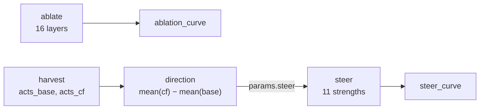
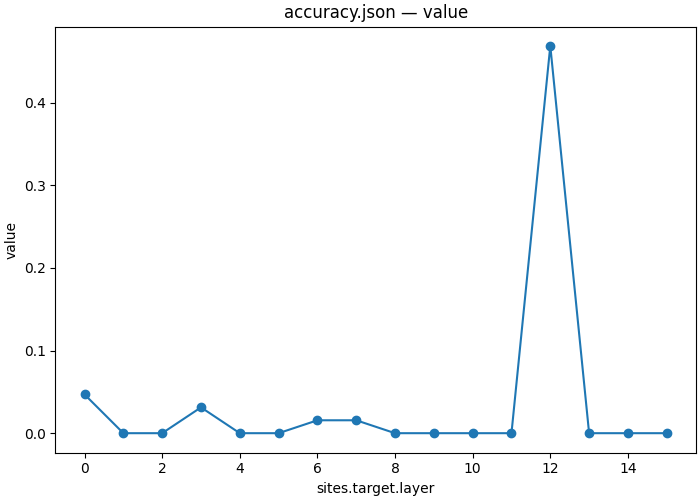
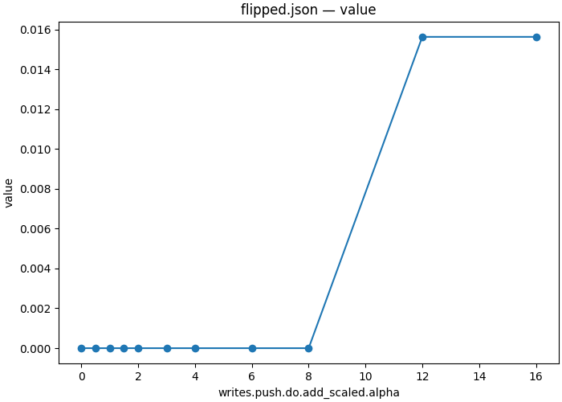

# 10 — Which layers must carry the answer, and can one direction put it back?

| | |
|---|---|
| **Question** | Zeroing the answer slot's residual at one layer: which layers does the model not survive? And does a direction computed from the population restore the counterfactual's answer the way an interchange does? |
| **Method** | zero ablation as a `swap` with a literal 0.0, then a mean-difference direction applied with `add_scaled` at eleven strengths |
| **Model** | `meta-llama/Llama-3.2-1B-Instruct` @ `main`, bf16 |
| **Data** | `mcqa/pairs_n64_s0` to ablate, `mcqa/train_n128_s1` to build the direction, `mcqa/test_n64_s2` to steer |
| **Documents** | [`workflows/mcqa_steering.json`](workflows/mcqa_steering.json) · [`protocols/mcqa_ablate.json`](protocols/mcqa_ablate.json) · [`protocols/mcqa_contrast_harvest.json`](protocols/mcqa_contrast_harvest.json) · [`protocols/mcqa_steer.json`](protocols/mcqa_steer.json) |
| **Cost** | 16 + 1 + 11 points over 64–128 rows |
| **Reproduced** | ✓ 2026-08-31, `pytorch_hooks` on one H100 80GB, digest `a7955cba25723b42…` |

## TL;DR

Two questions about one cell, and they come apart. **Necessity**: zeroing the
answer slot's residual destroys the answer at **fifteen of sixteen layers** —
accuracy 0.000 against a clean 0.891 — with one striking exception at L12, where
0.469 survives. **Sufficiency**: adding the population's mean base→counterfactual
difference at the located cell installs the counterfactual's answer on
**0.016** of pairs at its best, α = 12, while merely degrading the model. The
same cell where a *row's own* activation flips the answer 62 times in 64
([03](03_localize.md)) is a cell where the *average* of those activations flips
it once. A direction only exists when the contrast has a consistent sign, and a
resampled symbol has none.

## The protocol

[`workflows/mcqa_steering.json`](workflows/mcqa_steering.json), inlined verbatim:

```json
{
  "version": "1",
  "description": "The 10_steering demo end to end: ablate every layer to find which ones the answer needs, harvest the contrast at the located cell, subtract the means into a direction, and add it back at eleven strengths. The ablation arm and the steering arm share no data edge, so the runner may run them together -- necessity and sufficiency are two independent questions about the same cell.",
  "output_dir": "mcqa_steering",
  "steps": {
    "ablate": {
      "type": "intervention_protocol",
      "document": "../protocols/mcqa_ablate.json"
    },
    "ablation_curve": {
      "type": "script",
      "script": {"module": "causalab.io.plots.workflow_figures"},
      "inputs": {
        "table": {"step": "ablate", "file": "accuracy.json"},
        "plot": "lines",
        "x": "sites.target.layer"
      },
      "outputs": {"figure": "ablation.png", "plotted": {"file": "ablation.json"}}
    },
    "harvest": {
      "type": "intervention_protocol",
      "document": "../protocols/mcqa_contrast_harvest.json"
    },
    "direction": {
      "type": "script",
      "script": {"module": "causalab.analysis.harvest_difference"},
      "inputs": {
        "positive": {"step": "harvest", "file": "acts_cf.safetensors"},
        "negative": {"step": "harvest", "file": "acts_base.safetensors"},
        "normalize": false
      },
      "outputs": {
        "weight": "direction.safetensors",
        "stats": {"file": "stats.json", "columns": {"dim": "int64", "value": "float64"}}
      }
    },
    "steer": {
      "type": "intervention_protocol",
      "document": "../protocols/mcqa_steer.json"
    },
    "steer_curve": {
      "type": "script",
      "script": {"module": "causalab.io.plots.workflow_figures"},
      "inputs": {
        "table": {"step": "steer", "file": "flipped.json"},
        "plot": "lines",
        "x": "writes.push.do.add_scaled.alpha"
      },
      "outputs": {"figure": "steering.png", "plotted": {"file": "steering.json"}}
    }
  }
}
```



**Four levels, and the top one has two independent roots.** `ablate` and
`harvest` share no data edge, so the runner may run them together: necessity and
sufficiency are two questions about the same cell that happen not to depend on
each other.

| step | document | what it contributes |
|---|---|---|
| `ablate` | [`mcqa_ablate.json`](protocols/mcqa_ablate.json) | zeroes the answer slot's residual one layer at a time, and measures the clean accuracy in the same run |
| `ablation_curve` | `causalab.io.plots.workflow_figures` | draws accuracy against the layer ablated |
| `harvest` | [`mcqa_contrast_harvest.json`](protocols/mcqa_contrast_harvest.json) | reads both halves of every pair at the located cell, so their difference varies only the symbol |
| `direction` | `causalab.analysis.harvest_difference` | subtracts the two harvest means into a single (2048,) steering direction |
| `steer` | [`mcqa_steer.json`](protocols/mcqa_steer.json) | adds the harvested direction at eleven strengths; α = 0 is the un-intervened control |
| `steer_curve` | `causalab.io.plots.workflow_figures` | draws the flipped fraction against steering strength |

### The step documents, verbatim

The table above links each of these; this is what they say. Every block is
the file byte for byte — the file is what `causalab run` reads, and
`tests/demos/test_demos.py` fails if a copy here stops matching it.

<details>
<summary><code>ablate</code> · <code>protocols/mcqa_ablate.json</code> — Zeroes the answer slot's residual one layer at a time, and measures the clean accuracy in the same run (33 lines)</summary>

```json
{
  "version": "1",
  "description": "Zero-ablate the residual stream at the answer slot, one layer at a time, and ask whether the model still answers. A swap whose operand is the literal 0.0 is the ablation: with no featurizer the feature space is the whole vector, so the write replaces the activation and the error term contributes nothing. Scored against base_answer rather than cf_answer -- this document has no counterfactual, and the question is whether the model survives, not whether it can be redirected. 16 layers over 64 rows.",
  "model": {"key": "meta-llama/Llama-3.2-1B-Instruct", "revision": "main", "dtype": "bf16"},
  "data": {
    "base": {"dataset": "mcqa/pairs_n64_s0", "field": "input"}
  },
  "positions": {
    "slot": {"index": -1}
  },
  "sites": {
    "target":  {"component": "block_output", "layer": {"sweep": {"range": [0, 16]}}},
    "lm_head": {"component": "lm_head"}
  },
  "reads": {
    "logits":       {"site": "lm_head", "pos": -1, "model": "ablated",  "input": "base"},
    "logits_clean": {"site": "lm_head", "pos": -1, "model": "original", "input": "base"}
  },
  "writes": {
    "zero": {"site": "target", "pos": "slot", "do": {"swap": 0.0}}
  },
  "intervened_models": {
    "ablated": {"input": "base", "writes": ["zero"]}
  },
  "metrics": {
    "accuracy":       {"kind": "match", "of": "logits",       "expected": "base_answer", "token_form": "space_prefixed"},
    "accuracy_clean": {"kind": "match", "of": "logits_clean", "expected": "base_answer", "token_form": "space_prefixed"}
  },
  "save": [
    {"value": "accuracy",       "model": "ablated",  "input": "base", "file_path": "accuracy.json"},
    {"value": "accuracy_clean", "model": "original", "input": "base", "file_path": "accuracy_clean.json"}
  ]
}
```

[`protocols/mcqa_ablate.json`](protocols/mcqa_ablate.json), inlined verbatim:


| section | says | why this and not that |
|---|---|---|
| `writes.zero` | `{"swap": 0.0}` | §2.8's operand grammar admits a **literal scalar**, so ablation needs no new mechanism and no zero tensor. With no featurizer the feature space is the whole vector, so this replaces the activation outright |
| two reads of `lm_head` | one in `ablated`, one in `original` | the clean accuracy is measured *by the same document, on the same rows, in the same run*. A baseline quoted from elsewhere is a baseline that can drift |
| `metrics.*.expected` | `base_answer`, not `cf_answer` | there is no counterfactual here. The question is whether the model survives, not whether it can be redirected |

</details>

<details>
<summary><code>harvest</code> · <code>protocols/mcqa_contrast_harvest.json</code> — Reads both halves of every pair at the located cell, so their difference varies only the symbol (23 lines)</summary>

```json
{
  "version": "1",
  "description": "Read the located cell on both halves of every pair in one forward each, so the two harvests differ in exactly the thing the pair was built to vary: the answer symbol. Subtracting their means gives a direction that points from 'the base's symbol' to 'the counterfactual's symbol' and is contaminated by nothing else, which a split by answer_position would not be.",
  "model": {"key": "meta-llama/Llama-3.2-1B-Instruct", "revision": "main", "dtype": "bf16"},
  "data": {
    "base":           {"dataset": "mcqa/train_n128_s1", "field": "input"},
    "counterfactual": {"dataset": "mcqa/train_n128_s1", "field": "counterfactual_inputs[0]"}
  },
  "positions": {
    "slot": {"index": -1}
  },
  "sites": {
    "target": {"component": "block_output", "layer": 14}
  },
  "reads": {
    "acts_base": {"site": "target", "pos": "slot", "model": "original", "input": "base"},
    "acts_cf":   {"site": "target", "pos": "slot", "model": "original", "input": "counterfactual"}
  },
  "save": [
    {"value": "acts_base", "model": "original", "input": "base",           "file_path": "acts_base.safetensors"},
    {"value": "acts_cf",   "model": "original", "input": "counterfactual", "file_path": "acts_cf.safetensors"}
  ]
}
```

[`protocols/mcqa_contrast_harvest.json`](protocols/mcqa_contrast_harvest.json), inlined verbatim:


Both halves of every pair are read in one document, so the two harvests differ
in exactly what the pair was built to vary. `causalab.analysis.harvest_difference`
then subtracts their means into a single `(2048,)` vector.

> **Why not split by `answer_position`, as the notebook did?** Because that
> would answer a different question. `answer_position` is binary and its two
> classes have a stable geometric relationship, so a mean difference between
> them is a plausible direction. The variable this whole series localizes is the
> **answer symbol**, which `different_symbol` resamples per row from 26 letters.
> Asking whether *that* has a mean direction is the sharper question, and
> [Results](#q4--no-the-mean-direction-does-not-steer) is why.

</details>

<details>
<summary><code>steer</code> · <code>protocols/mcqa_steer.json</code> — Adds the harvested direction at eleven strengths; α = 0 is the un-intervened control (37 lines)</summary>

```json
{
  "version": "1",
  "description": "Add the harvested contrast direction to the located cell at eleven strengths and watch the answer move. alpha=0 is the un-intervened model, so the sweep contains its own control; the direction enters as a params constant because a write operand is a name or a scalar and never a tensor. Compare the curve to 03's interchange: an interchange replaces the cell with one particular row's value, while this adds the same population-mean difference to every row, so anything the two agree on is a property of the direction rather than of a pair.",
  "model": {"key": "meta-llama/Llama-3.2-1B-Instruct", "revision": "main", "dtype": "bf16"},
  "data": {
    "base": {"dataset": "mcqa/test_n64_s2", "field": "input"}
  },
  "positions": {
    "slot": {"index": -1}
  },
  "sites": {
    "target":  {"component": "block_output", "layer": 14},
    "lm_head": {"component": "lm_head"}
  },
  "params": {
    "steer": {"file_path": "direction/direction.safetensors", "entry": {"slot": "weight"}}
  },
  "reads": {
    "logits": {"site": "lm_head", "pos": -1, "model": "steered", "input": "base"}
  },
  "writes": {
    "push": {"site": "target", "pos": "slot",
             "do": {"add_scaled": {"op": "steer",
                                   "alpha": {"sweep": [0.0, 0.5, 1.0, 1.5, 2.0, 3.0, 4.0, 6.0, 8.0, 12.0, 16.0]}}}}
  },
  "intervened_models": {
    "steered": {"input": "base", "writes": ["push"]}
  },
  "metrics": {
    "accuracy": {"kind": "match", "of": "logits", "expected": "base_answer", "token_form": "space_prefixed"},
    "flipped":  {"kind": "match", "of": "logits", "expected": "cf_answer",   "token_form": "space_prefixed"}
  },
  "save": [
    {"value": "accuracy", "model": "steered", "input": "base", "file_path": "accuracy.json"},
    {"value": "flipped",  "model": "steered", "input": "base", "file_path": "flipped.json"}
  ]
}
```

[`protocols/mcqa_steer.json`](protocols/mcqa_steer.json), inlined verbatim:


| section | says | why this and not that |
|---|---|---|
| `params.steer` | a `file_path` into the `direction` step | a write operand is a name or a scalar, never a tensor, so a constant vector enters as a `params` entry — the same channel [07](07_cross_model.md) uses, here for the purpose it was designed for |
| `writes.push.do` | `add_scaled`, with `alpha` swept | the one **additive** mechanism in the algebra. Any number of additive writes may coexist at an address; only one absolute write may |
| the sweep including `0.0` | eleven strengths, the first a no-op | `α = 0` *is* the un-intervened model, so the control is a point of the sweep rather than a second document |

</details>

## Run it

```bash
uv run causalab validate demos/onboarding_tutorial/workflows/mcqa_steering.json \
    --data-root demos/onboarding_tutorial/data
# OK: demos/onboarding_tutorial/workflows/mcqa_steering.json — 6 steps, digest a7955cba25723b42…
```

```bash
uv run causalab explain demos/onboarding_tutorial/workflows/mcqa_steering.json \
    --data-root demos/onboarding_tutorial/data
# digest    a7955cba25723b42f9fc76eb1219e02a66100dfd3382b5ae4dcb2ae5dd1f7cd4
# schedule  4 levels
#   level 0: ablate, harvest
#   level 1: ablation_curve, direction
#   level 2: steer
#   level 3: steer_curve
#   ablate: intervention_protocol ../protocols/mcqa_ablate.json — 16 point(s), campaign digest 273ec7e987603b95…
#   ablation_curve: script causalab.io.plots.workflow_figures -> ablation.json, ablation.png
#   harvest: intervention_protocol ../protocols/mcqa_contrast_harvest.json — 1 point(s), campaign digest 48eccf4fbbf877e5…
#   direction: script causalab.analysis.harvest_difference -> direction.safetensors, stats.json
#   steer: intervention_protocol ../protocols/mcqa_steer.json — 11 point(s), authored digest bbf113c1576785c8…
#   steer_curve: script causalab.io.plots.workflow_figures -> steering.json, steering.png
```

```bash
uv run causalab run demos/onboarding_tutorial/workflows/mcqa_steering.json \
    --data-root demos/onboarding_tutorial/data \
    --out runs --device cuda
```

**Hardware.** 1024 row-forwards for the ablation, 256 for the harvest, 704 for
the sweep. Any GPU with 8 GB. **Measured: 22 s** of wall clock on one H100 80GB
for all six steps, three model loads included.

## Experimental design

**Q1 — what is the clean accuracy?** `accuracy_clean`, measured by the ablation
document itself. Everything below is read against it, and it is not 1.0: these
64 pairs were never filtered for the model getting them right.

**Q2 — which layers does the model not survive?** `accuracy` per layer, against
Q1. Null: the clean value at every layer, meaning the answer slot's residual at
that depth is redundant.

**Q3 — is necessity monotone in depth?** The shape of the curve. The naive
expectation is that early layers matter less, since later layers can rebuild
from other positions. A non-monotone curve would be a finding.

**Q4 — does the mean difference steer?** `flipped` — a `match` against
`cf_answer` — against α. Ceiling: [03](03_localize.md)'s **0.969**, what a
*row's own* counterfactual activation achieves at this cell. Floor: 0.000 at
α = 0 by construction.

**Q5 — what does the strength buy, if not the answer?** `accuracy` against α.
A direction that is doing something interpretable degrades the answer gradually;
one that is noise degrades it only when it is large enough to break the model.

> **Why is ablation a `swap` with a scalar and not a mechanism of its own?**
> Because the error-term contract already makes it one. §2.5: `err` and
> unselected dimensions come from the pre-write value, so a zero write through a
> *featurizer* ablates only the feature contribution, and a zero write with no
> featurizer ablates the whole vector. Two useful ablations, one operand,
> no new vocabulary.

## Results

Run on 2026-08-31, one H100 80GB, reference engine (`pytorch_hooks`), bf16,
workflow digest `a7955cba25723b42…`. All six steps completed.

### Q1 — 0.891 clean

`accuracy_clean` is **0.8906** — 57 of 64 — and identical at all 16 points,
which is the check that the un-intervened read really is un-intervened: the same
forward is scored 16 times and gives the same number 16 times.

**Verdict.** 0.891. Seven of 64 pairs the model gets wrong before anything is
done to it.

### Q2 — fifteen of sixteen layers are load-bearing



*This run: `ablate/accuracy.json`, drawn by the workflow's own `ablation_curve`
step — accuracy after zeroing the answer slot's residual, against the layer
zeroed. The clean value is 0.891 at every layer. Look at the single point that
is not on the floor.*

| layer | 0 | 1 | 2 | 3 | 4 | 5 | 6 | 7 | 8 | 9 | 10 | 11 | **12** | 13 | 14 | 15 |
|---|---|---|---|---|---|---|---|---|---|---|---|---|---|---|---|---|
| accuracy | 0.047 | 0.000 | 0.000 | 0.031 | 0.000 | 0.000 | 0.016 | 0.016 | 0.000 | 0.000 | 0.000 | 0.000 | **0.469** | 0.000 | 0.000 | 0.000 |

**Finding.** Eleven of sixteen layers give exactly **0.000** — the model answers
correctly on none of 64 pairs — and the four others besides L12 are at or below
0.047. Zeroing the last token's residual anywhere is close to fatal, which says
the answer slot is a bottleneck at every depth rather than only where the answer
arrives.

**Verdict.** Fifteen of sixteen. The exception is L12.

### Q3 — no, and L12 is the anomaly

**Finding.** The curve is not monotone and not even nearly. **L12 retains 0.469**
— 30 of 64 pairs, more than half the clean accuracy — while its immediate
neighbours L11 and L13 are 0.000 and 0.000. A single layer, in the middle of the
stack, that the model routes around.

This demo does not explain it, and the honest thing is to say so rather than to
invent a story. What can be said is what it is *not*: it is not the layer where
the answer arrives ([03](03_localize.md) and [06](06_components.md) both put
that at L14), and it is not an edge effect, since L0 and L15 are 0.047 and
0.000. Whatever L12's block output at the answer slot contributes, the two
layers after it can reconstruct it from the other positions and the two before
it cannot.

The next experiment is obvious and is not run here: ablate L12 at *every*
position, and ablate L12's `attention_output` and `mlp_output` separately, which
is [06](06_components.md)'s document with a different write.

**Verdict.** No. 0.469 at L12 against 0.000 at both neighbours, unexplained.

### Q4 — no. The mean direction does not steer



*This run: `steer/flipped.json`, drawn by the workflow's own `steer_curve` step —
the fraction of pairs answering the counterfactual's symbol, against steering
strength. The ceiling this is read against is 0.969, off the top of the plot.*

| α | 0.0 | 0.5 | 1.0 | 1.5 | 2.0 | 3.0 | 4.0 | 6.0 | 8.0 | 12.0 | 16.0 |
|---|---|---|---|---|---|---|---|---|---|---|---|
| `flipped` | 0.000 | 0.000 | 0.000 | 0.000 | 0.000 | 0.000 | 0.000 | 0.000 | 0.000 | **0.016** | **0.016** |
| `accuracy` | 0.953 | 0.953 | 0.953 | 0.953 | 0.953 | 0.938 | 0.938 | 0.922 | 0.938 | 0.734 | 0.453 |

**Finding, and it is the demo's point.** The best `flipped` anywhere on the
sweep is **0.016 — one pair in 64** — at α = 12, where the model has already
lost a fifth of its accuracy. Against the 0.969 that the *same cell* delivers
under an interchange, that is not a weak effect; it is no effect.

The reason is in the construction, and the demo predicted it in the box above.
`different_symbol` resamples the answer symbol per row from 26 letters, so each
pair's base→counterfactual difference points from *this* row's symbol toward
*that* row's symbol, and the 128 such differences point in 128 unrelated
directions. Their mean is not "the direction of the answer symbol"; it is what
is left when 128 unrelated vectors are averaged, which is close to nothing plus
whatever the sampling happens to leave.

✓ `flipped` at α = 0 is 0.000 and `accuracy` at α = 0 is 0.953. Both are the
un-intervened model, so this is the sweep's own control passing.

**Verdict.** No. 0.016 against a ceiling of 0.969, and the failure is a property
of the contrast, not of the cell.

### Q5 — strength buys damage, not direction

**Finding.** Accuracy is flat at **0.953** through α = 2, drifts to 0.938 by
α = 8, and then falls to **0.734** at α = 12 and **0.453** at α = 16. So the
direction is inert until it is large enough to break the model, and then it
breaks it without ever installing the counterfactual's answer — `flipped` is
0.016 at exactly the α values where accuracy is collapsing.

That is the signature of a *norm* effect rather than a semantic one: what the
large-α model does is not "answer the counterfactual", it is "answer something
else". A steering vector that worked would show the two curves crossing —
accuracy falling as `flipped` rises. These two both fall.

**Verdict.** Damage. The two curves never cross, which is the cleanest available
evidence that the direction carries no answer-symbol content.

## Limits

- **L12 is unexplained.** It is the most interesting number in the demo and the
  one with the least behind it. One dataset, one position, one component.
- The steering arm is a negative result about **one** way of building a
  direction. A direction built from a variable with two stable classes — the
  notebook's `answer_position` split — could well steer, and this demo does not
  test that. What it establishes is that "mean difference over a counterfactual
  pair set" is not automatically a steering vector.
- The direction is not normalized (`"normalize": false`), so α is in units of
  that particular difference's norm and is not comparable across cells or
  datasets.
- Ablation is at one position. A layer that is necessary at the answer slot may
  be irrelevant elsewhere, and Q2's "fifteen of sixteen" is a statement about
  the answer slot only.
- 64 pairs everywhere, so every number moves in steps of 1/64 = 0.016 — and
  Q4's headline 0.016 **is** one step, which is why it is reported as one pair
  rather than as a rate.
- The ablation and the steering use different splits (`pairs_n64_s0` and
  `test_n64_s2`), so their accuracies — 0.891 and 0.953 — are not directly
  comparable. Each arm's control is measured within its own arm for that reason.

## Next

- **[06 — Which component writes it?](06_components.md)** is the document Q3's
  follow-up needs: the same write, with the component as an axis, pointed at
  L12.
- **[04 — How few directions carry it?](04_subspace.md)** is what a direction
  looks like when it is *fitted* rather than averaged, at the same cell — and
  it needs 32 to 64 of them.
