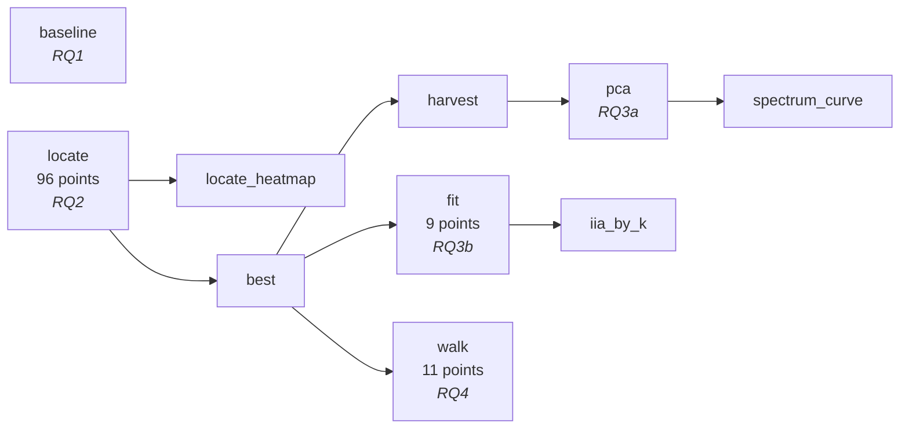
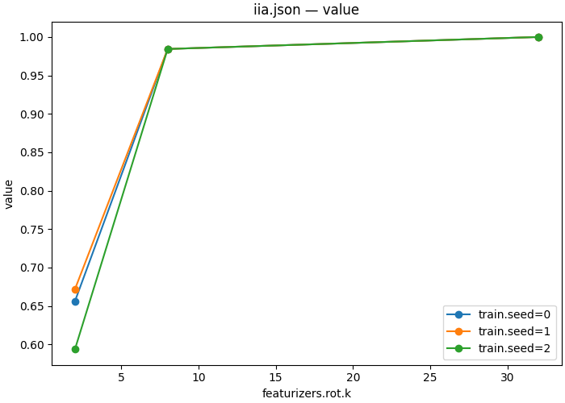

# Weekdays geometry — four questions about one variable

| | |
|---|---|
| **Question** | Where and how does the model represent the weekday it is about to answer — and what does it say from the points in between two answers? |
| **Method** | a workflow: baseline → interchange scan → PCA and DAS at the located cell → an interpolation walk |
| **Model** | `meta-llama/Llama-3.1-8B` @ `main`, bf16 |
| **Data** | `weekdays/train` (64 pairs), `weekdays/test` (32) — `natural_domains_arithmetic`, `domain_type=weekdays` |
| **Documents** | [`workflows/weekdays_geometry.json`](workflows/weekdays_geometry.json) → five [`protocols/`](protocols/) |
| **Cost** | 10 steps, 118 points; the DAS step trains 9 rotations |
| **Reproduced** | ⚠ all ten steps re-run 2026-08-31 on one H100 80GB (at digest `b4c84874445539d3…`) and every number below is this run's; the run predates the `token_form: "space_prefixed"` pin these documents now carry, which is the form `auto` already resolved to, so the token ids and every number are unchanged and only the digest moved — the workflow now digests `cf6041e74c91a7a2…`; RQ3's 2D/3D views and RQ4's two walks are still the pre-refactor reference — they need script steps that do not ship |

## TL;DR

The task is weekday arithmetic — *"What day is four days after Sunday?"* — and
the variable is the answer day. Llama-3.1-8B solves it (**0.828**, against a
1-in-7 floor of 0.143), and an interchange scan puts it at the answer slot from
**L18** on, sharply: 0.281 at L17, 0.891 at L18, a 0.953 plateau from L26. The
representation there is not one direction — six principal components carry 70% of
the kept variance, and a DAS rotation needs **eight** dimensions to match what
the whole residual stream achieves, where two reach only 0.641. Walking the
residual stream in a straight line from one answer to another passes *through* a
third weekday on 9 of 64 rows without ever leaving the region where the model's
answers live, which is a question about geometry rather than about a direction —
though the comparison against the curve the seven answers lie on still needs a
script step that does not ship.

## The protocol

A workflow demo: the thesis is the chain. It is inlined here in full, and its
five step documents follow it, folded, under
[*The step documents, verbatim*](#the-step-documents-verbatim) — so that the
chain stays the thing this section reads as.

[`workflows/weekdays_geometry.json`](workflows/weekdays_geometry.json), inlined
verbatim — the file is what `causalab run` reads, and
`tests/demos/test_demos.py` checks these bytes against it.

```json
{
  "version": "1",
  "description": "The weekdays_geometry demo end to end: check the model can do the task, locate the cell that carries the answer, ask how few directions in that cell suffice, and walk the straight line between two answers. Nothing here declares an order -- every edge is a reference to an earlier step's output, and the runner derives the rest.",
  "output_dir": "weekdays_geometry",
  "steps": {
    "baseline": {
      "type": "intervention_protocol",
      "document": "../protocols/weekdays_baseline.json"
    },
    "locate": {
      "type": "intervention_protocol",
      "document": "../protocols/weekdays_locate_scan.json"
    },
    "locate_heatmap": {
      "type": "script",
      "script": {"module": "causalab.io.plots.workflow_figures"},
      "inputs": {
        "table": {"step": "locate", "file": "iia.json"},
        "plot": "heatmap",
        "x": "sites.target.layer",
        "y": "positions.tap"
      },
      "outputs": {"figure": "locate_iia.png", "plotted": {"file": "locate_iia.json"}}
    },
    "best": {
      "type": "script",
      "script": {"module": "causalab.workflow.scripts.select"},
      "inputs": {
        "table": {"step": "locate", "file": "iia.json"},
        "choose": "max",
        "emit": {"best_layer": "sites.target.layer", "best_pos": "positions.tap"}
      },
      "outputs": {
        "values": {"file": "values.json", "keys": {"best_layer": 26, "best_pos": {"index": -1}}}
      }
    },
    "harvest": {
      "type": "intervention_protocol",
      "document": "../protocols/weekdays_harvest.json",
      "set": {
        "sites.target.layer": {"artifact": "best", "key": "best_layer"},
        "positions.best": {"artifact": "best", "key": "best_pos"}
      }
    },
    "pca": {
      "type": "script",
      "script": {"module": "causalab.analysis.fit_pca"},
      "inputs": {"acts": {"step": "harvest", "file": "acts.safetensors"}, "k": 32},
      "outputs": {
        "weight": "basis.safetensors",
        "spectrum": {"file": "spectrum.json",
                     "columns": {"pc": "int64",
                                 "explained_variance": "float64",
                                 "explained_variance_ratio": "float64"}}
      }
    },
    "spectrum_curve": {
      "type": "script",
      "script": {"module": "causalab.io.plots.workflow_figures"},
      "inputs": {
        "table": {"step": "pca", "file": "spectrum.json"},
        "plot": "lines",
        "x": "pc",
        "value": "explained_variance_ratio"
      },
      "outputs": {"figure": "pca_spectrum.png"}
    },
    "fit": {
      "type": "intervention_protocol",
      "document": "../protocols/weekdays_das_sweep.json",
      "set": {
        "sites.target.layer": {"artifact": "best", "key": "best_layer"},
        "positions.best": {"artifact": "best", "key": "best_pos"}
      }
    },
    "iia_by_k": {
      "type": "script",
      "script": {"module": "causalab.io.plots.workflow_figures"},
      "inputs": {
        "table": {"step": "fit", "file": "iia.json"},
        "plot": "lines",
        "x": "featurizers.rot.k",
        "series": "train.seed"
      },
      "outputs": {"figure": "iia_by_k.png", "plotted": {"file": "iia_by_k.json"}}
    },
    "walk": {
      "type": "intervention_protocol",
      "document": "../protocols/weekdays_linear_walk.json",
      "set": {
        "sites.target.layer": {"artifact": "best", "key": "best_layer"},
        "positions.best": {"artifact": "best", "key": "best_pos"}
      }
    }
  }
}
```

The derived schedule — five levels, none of them authored:



`baseline` and `locate` share level 0 because neither references the other.
Everything downstream of `best` waits on it — not because the document says so,
but because three `set` blocks name it.

| step | document | what it contributes |
|---|---|---|
| `baseline` | [`weekdays_baseline.json`](protocols/weekdays_baseline.json) | one un-intervened forward per row; `match` accuracy. No `writes`, therefore no `intervened_models` |
| `locate` | [`weekdays_locate_scan.json`](protocols/weekdays_locate_scan.json) | 32 layers × 3 positions of interchange, scored by IIA |
| `best` | `causalab.workflow.scripts.select` | groups the metric table by the producing document's sweep coordinates — read from the step's `_step.json`, not authored — and emits the argmax cell |
| `harvest` | [`weekdays_harvest.json`](protocols/weekdays_harvest.json) | pure reads at that cell. No `reduce`: a mean has no variance to decompose |
| `fit` | [`weekdays_das_sweep.json`](protocols/weekdays_das_sweep.json) | trains a rotation and interchanges only its first *k* coordinates, over k × seed |
| `walk` | [`weekdays_linear_walk.json`](protocols/weekdays_linear_walk.json) | `lerp` from base activation to counterfactual activation, α in 11 steps |

The handoff worth reading twice is `best` → `fit`. `select` emits
`best_layer` and `best_pos` into `values.json`; `fit`'s `set` block re-points
the DAS document's site and position at them. The DAS document is therefore
*not* pinned to a layer — the scan chooses it, and if the scan chooses
differently the fit follows, with no edit anywhere.

### The step documents, verbatim

The table above links each of these; this is what they say. Every block is the
file byte for byte — the file is what `causalab run` reads, and
`tests/demos/test_demos.py` fails if a copy here stops matching it.

<details>
<summary><code>baseline</code> · <code>protocols/weekdays_baseline.json</code> — one un-intervened forward per row (22 lines)</summary>

```json
{
  "version": "1",
  "description": "RQ1 -- can the model solve the task at all? No writes, so no intervened models: one un-intervened forward per row, scored against the row's own answer. A localization result on a task the model cannot do is a measurement of noise, so this document runs first and gates the rest.",
  "model": {"key": "meta-llama/Llama-3.1-8B", "revision": "main", "dtype": "bf16"},
  "data": {
    "base": {"dataset": "weekdays/train", "field": "input"}
  },
  "sites": {
    "lm_head": {"component": "lm_head"}
  },
  "reads": {
    "logits": {"site": "lm_head", "pos": -1, "model": "original", "input": "base"}
  },
  "metrics": {
    "accuracy": {"kind": "match",  "of": "logits", "expected": "base_answer_forms", "mode": "first_token", "token_form": "space_prefixed"},
    "said":     {"kind": "top_k",  "of": "logits", "k": 3, "by": "prob"}
  },
  "save": [
    {"value": "accuracy", "model": "original", "input": "base", "file_path": "accuracy.json"},
    {"value": "said",     "model": "original", "input": "base", "file_path": "said.json"}
  ]
}
```

</details>

<details>
<summary><code>locate</code> · <code>protocols/weekdays_locate_scan.json</code> — 32 layers × 3 positions, scored by IIA (109 lines)</summary>

```json
{
  "version": "1",
  "description": "RQ2 -- which position carries the result? Interchange the residual stream at a 32-layer x 3-position grid and score IIA. The task's generator samples the counterfactual independently, so entity AND number differ between the two prompts: each input token therefore carries half of what determines the answer, and only the answer slot can carry the whole result. The entity and number columns are the control -- a scan that lights them up is reading something other than the result.",
  "model": {
    "key": "meta-llama/Llama-3.1-8B",
    "revision": "main",
    "dtype": "bf16"
  },
  "data": {
    "base": {
      "dataset": "weekdays/train",
      "field": "input"
    },
    "counterfactual": {
      "dataset": "weekdays/train",
      "field": "counterfactual_inputs[0]"
    }
  },
  "positions": {
    "tap": {
      "sweep": [
        {
          "variable": "entity"
        },
        {
          "variable": "number"
        },
        {
          "index": -1
        }
      ]
    }
  },
  "sites": {
    "target": {
      "component": "block_output",
      "layer": {
        "sweep": {
          "range": [
            0,
            32
          ]
        }
      }
    },
    "lm_head": {
      "component": "lm_head"
    }
  },
  "reads": {
    "v_cf": {
      "site": "target",
      "pos": "tap",
      "model": "original",
      "input": "counterfactual"
    },
    "logits": {
      "site": "lm_head",
      "pos": -1,
      "model": "patched",
      "input": "base"
    }
  },
  "writes": {
    "patch": {
      "site": "target",
      "pos": "tap",
      "do": {
        "swap": "v_cf"
      }
    }
  },
  "intervened_models": {
    "patched": {
      "input": "base",
      "writes": [
        "patch"
      ]
    }
  },
  "metrics": {
    "iia": {
      "kind": "match",
      "of": "logits",
      "expected": "label_forms",
      "mode": "first_token",
      "token_form": "space_prefixed"
    },
    "logit_diff": {
      "kind": "logit_diff",
      "of": "logits",
      "a": "cf_answer",
      "b": "base_answer",
      "token_form": "space_prefixed"
    }
  },
  "save": [
    {
      "value": "iia",
      "model": "patched",
      "input": "base",
      "file_path": "iia.json"
    },
    {
      "value": "logit_diff",
      "model": "patched",
      "input": "base",
      "file_path": "logit_diff.json"
    }
  ]
}
```

</details>

<details>
<summary><code>harvest</code> · <code>protocols/weekdays_harvest.json</code> — pure reads at the located cell (42 lines)</summary>

```json
{
  "version": "1",
  "description": "RQ3a -- the activations a principal basis is fitted to. Pure reads at the located cell: one un-intervened forward per row, one row per activation. No `reduce`, because a mean has no variance to decompose.",
  "model": {
    "key": "meta-llama/Llama-3.1-8B",
    "revision": "main",
    "dtype": "bf16"
  },
  "data": {
    "base": {
      "dataset": "weekdays/train",
      "field": "input"
    }
  },
  "positions": {
    "best": {
      "index": -1
    }
  },
  "sites": {
    "target": {
      "component": "block_output",
      "layer": 18
    }
  },
  "reads": {
    "acts": {
      "site": "target",
      "pos": "best",
      "model": "original",
      "input": "base"
    }
  },
  "save": [
    {
      "value": "acts",
      "model": "original",
      "input": "base",
      "file_path": "acts.safetensors"
    }
  ]
}
```

</details>

<details>
<summary><code>fit</code> · <code>protocols/weekdays_das_sweep.json</code> — a trained rotation, over k × seed (49 lines)</summary>

```json
{
  "version": "1",
  "description": "RQ3b -- how few directions carry the variable? Train an orthogonal rotation at the located cell and interchange only its first k coordinates, over k x seed = 9 fits from one harvest. The k axis is the question: the smallest k whose IIA still matches the whole-cell interchange bounds the variable's causal dimensionality.",
  "model": {"key": "meta-llama/Llama-3.1-8B", "revision": "main", "dtype": "bf16"},
  "data": {
    "base":           {"dataset": "weekdays/train", "field": "input"},
    "counterfactual": {"dataset": "weekdays/train", "field": "counterfactual_inputs[0]"}
  },
  "positions": {
    "best": {"index": -1}
  },
  "sites": {
    "target":  {"component": "block_output", "layer": 18},
    "lm_head": {"component": "lm_head"}
  },
  "featurizers": {
    "rot": {"kind": "subspace", "k": {"sweep": [2, 8, 32]}, "parametrization": "cayley"}
  },
  "reads": {
    "v_cf":   {"site": "target",  "pos": "best", "model": "original", "input": "counterfactual", "featurizer": "rot"},
    "logits": {"site": "lm_head", "pos": -1,     "model": "patched",  "input": "base"}
  },
  "writes": {
    "patch": {"site": "target", "pos": "best", "featurizer": "rot", "do": {"swap": "v_cf"}}
  },
  "intervened_models": {
    "patched": {"input": "base", "writes": ["patch"]}
  },
  "metrics": {
    "iia": {"kind": "match",         "of": "logits", "expected": "label_forms", "mode": "first_token", "token_form": "space_prefixed"},
    "ce":  {"kind": "cross_entropy", "of": "logits", "target": "label", "token_form": "space_prefixed"}
  },
  "train": {
    "objective":  [[1.0, "ce"]],
    "params":     ["rot"],
    "optimizer":  {"name": "adamw", "lr": 1e-3, "weight_decay": 0.0},
    "steps":      {"epochs": 10},
    "batch":      {"pairs": 16},
    "precision":  {"feature": "fp32", "loss": "fp32"},
    "eval":       {"every": {"epochs": 1}, "split": "weekdays/test", "metrics": ["iia"]},
    "early_stop": {"metric": "iia", "patience": 3, "mode": "max"},
    "seed":       {"sweep": [0, 1, 2]}
  },
  "save": [
    {"value": "iia", "model": "patched", "input": "base", "file_path": "iia.json"},
    {"value": "ce",  "model": "patched", "input": "base", "file_path": "ce.json"},
    {"value": "rot", "site": "target", "file_path": "rot.safetensors"}
  ]
}
```

</details>

<details>
<summary><code>walk</code> · <code>protocols/weekdays_linear_walk.json</code> — <code>lerp</code> from base to counterfactual, α in 11 steps (118 lines)</summary>

```json
{
  "version": "1",
  "description": "RQ4 -- what does the model say from the points between two answers? Interpolate the located cell's activation from the base row's value to the counterfactual row's, alpha in 11 steps, and read the probability mass on each of the seven weekday tokens. alpha=0 is the un-intervened model and alpha=1 is the full interchange of RQ2, so the two endpoints are results this demo already has: the sweep is the straight line between them.",
  "model": {
    "key": "meta-llama/Llama-3.1-8B",
    "revision": "main",
    "dtype": "bf16"
  },
  "data": {
    "base": {
      "dataset": "weekdays/train",
      "field": "input"
    },
    "counterfactual": {
      "dataset": "weekdays/train",
      "field": "counterfactual_inputs[0]"
    }
  },
  "positions": {
    "best": {
      "index": -1
    }
  },
  "sites": {
    "target": {
      "component": "block_output",
      "layer": 18
    },
    "lm_head": {
      "component": "lm_head"
    }
  },
  "reads": {
    "v_cf": {
      "site": "target",
      "pos": "best",
      "model": "original",
      "input": "counterfactual"
    },
    "logits": {
      "site": "lm_head",
      "pos": -1,
      "model": "walked",
      "input": "base"
    }
  },
  "writes": {
    "walk": {
      "site": "target",
      "pos": "best",
      "do": {
        "lerp": {
          "op": "v_cf",
          "alpha": {
            "sweep": [
              0.0,
              0.1,
              0.2,
              0.3,
              0.4,
              0.5,
              0.6,
              0.7,
              0.8,
              0.9,
              1.0
            ]
          }
        }
      }
    }
  },
  "intervened_models": {
    "walked": {
      "input": "base",
      "writes": [
        "walk"
      ]
    }
  },
  "metrics": {
    "day_probs": {
      "kind": "class_probs",
      "of": "logits",
      "groups": {
        "Monday": [
          "Monday"
        ],
        "Tuesday": [
          "Tuesday"
        ],
        "Wednesday": [
          "Wednesday"
        ],
        "Thursday": [
          "Thursday"
        ],
        "Friday": [
          "Friday"
        ],
        "Saturday": [
          "Saturday"
        ],
        "Sunday": [
          "Sunday"
        ]
      },
      "token_form": "space_prefixed"
    }
  },
  "save": [
    {
      "value": "day_probs",
      "model": "walked",
      "input": "base",
      "file_path": "day_probs.json"
    }
  ]
}
```

</details>
## Run it

```bash
uv run causalab validate demos/weekdays_geometry/workflows/weekdays_geometry.json \
    --data-root demos/weekdays_geometry/data
# OK: demos/weekdays_geometry/workflows/weekdays_geometry.json — 10 steps, digest cf6041e74c91a7a2…
```

```bash
uv run causalab explain demos/weekdays_geometry/workflows/weekdays_geometry.json \
    --data-root demos/weekdays_geometry/data
# digest    cf6041e74c91a7a2f35de1f0618b3415302a764d1c3a9f2ab7ac05955030f614
# schedule  5 levels
#   level 0: baseline, locate
#   level 1: locate_heatmap, best
#   level 2: harvest, fit, walk
#   level 3: pca, iia_by_k
#   level 4: spectrum_curve
#   baseline: intervention_protocol ../protocols/weekdays_baseline.json — 1 point(s), campaign digest 36a05bad111cd1b7…
#   locate: intervention_protocol ../protocols/weekdays_locate_scan.json — 96 point(s), campaign digest 5467d39d0f247e4d…
#   locate_heatmap: script causalab.io.plots.workflow_figures -> locate_iia.json, locate_iia.png
#   best: script causalab.workflow.scripts.select -> values.json
#   harvest: intervention_protocol ../protocols/weekdays_harvest.json — 1 point(s), authored digest 4548aa315625b3f1…
#   pca: script causalab.analysis.fit_pca -> basis.safetensors, spectrum.json
#   spectrum_curve: script causalab.io.plots.workflow_figures -> pca_spectrum.png
#   fit: intervention_protocol ../protocols/weekdays_das_sweep.json — 9 point(s), authored digest 5069c4d0f7cfc6f6…
#   iia_by_k: script causalab.io.plots.workflow_figures -> iia_by_k.json, iia_by_k.png
#   walk: intervention_protocol ../protocols/weekdays_linear_walk.json — 11 point(s), authored digest 96965272bd8b65bb…
```

```bash
uv run causalab run demos/weekdays_geometry/workflows/weekdays_geometry.json \
    --data-root demos/weekdays_geometry/data \
    --out runs --device cuda
```

**Hardware.** One GPU with ≥40 GB: 8 B parameters in bf16 is ~16 GB of weights,
and the `fit` step holds gradients for a 4096 × k rotation on top. That step's
`requires` includes `grad`, which only the reference engine declares — so the
document routes there whatever `--engine` says, while the read-only steps could
run on either. **Measured: 132 s of wall clock** for all ten steps on one H100
80GB, model load included — the nine DAS rotations of the `fit` step included.

> **No `--dtype` on a workflow.** The flag sets `model.dtype` on *one* protocol
> document, so the CLI refuses it here: *"a workflow's steps each declare their
> own realization — set it in the step's document, or with that step's own `set`
> block"*. All five protocols under `protocols/` already pin `"dtype": "bf16"`.
> The single-protocol shard command below is a protocol document, so it takes
> `--dtype` normally.

Shard a long scan rather than growing the job:

```bash
uv run causalab run demos/weekdays_geometry/protocols/weekdays_locate_scan.json \
    --data-root demos/weekdays_geometry/data --out runs/scan/shard_0 \
    --points 0:24 --device cuda --dtype bf16
```

Each point's digest is the provenance unit, so four shards of 24 merge by
coordinate into the same campaign.

## Experimental design

A single question — "how is the weekday represented" — decomposes into four that
feed each other. Each RQ's answer is the next one's input, which is exactly what
makes this a workflow rather than four demos.

**RQ1 — can the model do the task at all?** `accuracy` from `baseline`. Floor:
0.143, one in seven. A localization result on a task the model cannot do is a
measurement of noise, so this gates everything below it.

**RQ2 — which (layer, position) carries the answer?** The IIA grid over 32
layers × {entity token, number word, answer slot}.

Two properties of the dataset set the reading, and both are
[01](../onboarding_tutorial/01_define.md)'s lesson arriving as numbers. The
task's generator samples the counterfactual **independently** — it is 01's
`random_counterfactual`, not a crafted design — so over the 64 training pairs:

| | count | consequence |
|---|---|---|
| identical prompts | 3 / 64 | the interchange is a no-op by construction |
| `base_answer == cf_answer` | 14 / 64 | a patch that does nothing still scores 1 |
| same entity | 10 / 64 | the entity token is not the only difference |
| same number | 8 / 64 | neither is the number word |

So the **floor is 0.219**, not 0: a cell reading 0.22 has done nothing at all.
And because entity *and* number both differ, each input token carries only half
of what determines the answer — the entity token cannot install the
counterfactual's result unless the number happens to agree too.

**Expectation.** The answer slot is high from the layer the arithmetic completes
at; the entity and number columns stay near the floor at every layer. Those two
columns are the **control**: a scan that lights them up is reading something
other than the result.

**RQ3 — how few directions carry it?** Two different senses of "few", each with
its own tool:

| sense | tool | reads |
|---|---|---|
| the directions the activations *vary* along | PCA over the harvest (`pca`) | `explained_variance_ratio` vs k |
| the directions an intervention *needs* | DAS over a k sweep (`fit`) | IIA vs k |

They are not the same question and can disagree: a variable can be causally
mediated by a direction that carries little variance. Floor for the IIA curve is
0.219 again; the ceiling is RQ2's whole-cell IIA, because interchanging a
subspace cannot beat interchanging everything.

**RQ4 — what does the model say between two answers?** `class_probs` over the
seven weekday tokens as α runs 0 → 1. α = 0 is the un-intervened model and α = 1
is RQ2's interchange at the located cell, so both endpoints are already known;
the sweep is the straight line between them. Two outcomes are interesting and
they differ qualitatively:

- the model **passes through** the days between — Tuesday and Wednesday rise and
  fall on a Monday → Thursday walk;
- the model **crosses over** — Monday falls, Thursday rises, and the mass in
  between goes to neither, landing on tokens that are not weekdays at all.

> **Why the last token, when the entity token scores higher early?** Because the
> two are the same information at different times. The scan is expected to show
> the answer readable at the entity token from the first layers — the model knows
> which day was named — and at the answer slot only after the arithmetic has been
> done. The variable this demo is about is the *result*, so the cell to work in
> is the later one.

> **Why `lerp` and not a steering vector?** A steering vector is a direction with
> a magnitude, and choosing the magnitude is a free parameter. `lerp` between two
> real activations has neither: α = 1 is a point the model actually produces on
> some input, so the walk stays inside the region the network puts activations in
> — up to whatever the straight line between two such points passes through,
> which is exactly RQ4's question.

## Results

Run on 2026-08-31, one H100 80GB, reference engine (`pytorch_hooks`), bf16,
workflow digest `cf6041e74c91a7a2…`. All ten steps completed in 132 s.

Run twice: once with the declared `best_layer` at its inherited 18 and once at
the reconciled 26, into separate output directories with nothing resumed. Every
number below is bit-identical across the two — `best/values.json`, the baseline
accuracy, the locate maximum, the PCA spectrum to nine decimals, all three
`iia_by_k` means, and the 704 walk records. The declared value is validated
against, not measured with, and this is the check that says so.

**The layer is selected, not pinned, and it is 26.** `best` is a `select` step,
so the layer the downstream steps use is whatever `locate`'s argmax turns out to
be — and it is **L26**, on a plateau running L26–L31. Every RQ3 and RQ4 number
below is therefore a layer-26 measurement. The workflow's
`best.outputs.values.keys` now declares `{"best_layer": 26, …}` to match; before
this run it declared 18, inherited from the source notebook's prose.

### RQ1 — yes, 0.828


*Reference run (pre-refactor), retained for the shape of the errors only: rows
are the true weekday, columns the predicted one. Its 0.918 is over all 49
entity × number combinations; the `baseline` document above scores the 64 rows
of `weekdays/train`, so the two numbers are not the same quantity. Look at the
diagonal, then at the Monday row.*

**This run: accuracy 0.828 over 64 rows** — 53 of 64 — against a 1-in-7 floor of
0.143. Not the reference's 0.918, and not a contradiction of it either: a
different population, scored by the document that ships.

**Finding.** The task is solved well above floor by a margin of 0.685, which is
what RQ2 needs in order to mean anything. It is also comfortably below the
reference's number, so the 11 rows the model gets wrong are part of the
population every interchange below is averaged over.

**Verdict.** Yes. 0.828 against 0.143.

### RQ2 — the answer slot, jumping at L18 exactly, peaking at L26


*This run: Llama-3.1-8B, `locate`'s 32 layers × 3 positions, `match` IIA over 64
pairs, rendered by the workflow's own `locate_heatmap` step from `iia.json`. The
one bright row is `{"index": -1}`, the answer slot; the `entity` and `number`
rows never leave the floor.*

The bright row is the whole of RQ2: flat at the floor for two thirds of the
stack, one sharp step, then a plateau to the end.

✓ **The L18 handoff is confirmed to the layer.** 0.281 at L17, **0.891 at L18** —
one layer, and the answer has arrived at the slot the unembedding reads. That was
the reference's claim under a different counterfactual design, and it survives
the change.

✓ **The entity column sits at the floor throughout, exactly as this document
predicted.** Under the reference's entity-only counterfactual the entity token
carried the answer from L0 at 0.98. Under this document's *independent*
resampling it reads 0.141–0.219 across all 32 layers, mean 0.181 — because
knowing the entity is not knowing the answer when the number moved too. The
prediction written into this section before the run was "the entity column
should sit near 0.219 throughout"; it does.

✓ `number` likewise never leaves the floor: 0.125–0.219, max 0.219.

**Finding, and it is about the floor rather than the model.** 0.219 is not
approximately the floor — it is *exactly* the value at essentially every
unresponsive cell, and it is the number the dataset's own duplication implies
(3 pairs in 64 are literally the same prompt, 14 more share an answer). An
interchange that does nothing still scores 0.219 here, so the readable range of
this grid is 0.219 to 1.0, not 0 to 1.0.

**Verdict.** The answer slot. Handoff at L18 (0.891), plateau at L26–L31
(0.953), and `best` emits `{"best_layer": 26, "best_pos": {"index": -1}}`.

### RQ3a — not one direction: six components for 70%, and it takes eight to intervene


*This run: cumulative variance of the activations `harvest` collected at **L26**,
rendered by the workflow's own `spectrum_curve` step. Note the denominator —
`fit_pca` writes `explained_variance_ratio` over the **32 components it keeps**
(they sum to 0.9959), not over the full 4096-dimensional space. The reference
figure's 16.5% / 63% / 82% / 98% were full-space fractions at layer 28, so these
numbers are not comparable to those and neither is a correction of the other.*

Cumulative, over the kept 32:

| first *k* PCs | 1 | 2 | 3 | 6 | 12 | 16 | 32 |
|---|---|---|---|---|---|---|---|
| variance retained | 22.5% | 36.7% | 48.9% | 69.7% | 87.6% | 93.1% | 99.6% |

**Finding.** The leading component carries 22.5% and it takes six to pass 70%.
Whatever "the weekday direction" would mean, one vector is not it: a single
direction discards 77% of the variance that the kept subspace contains.


*Both are the pre-refactor reference at layer 28 — the ring, and a closed spline
through the seven class centroids. The shipped workflow produces neither: a 2D
scatter and a fitted manifold are script steps that do not exist in
`causalab/analysis/`, which is why these two remain the ⚠ in this demo's
header. They are shown because the ring is what makes RQ4 a question about
geometry, and RQ3b below is the first evidence for it that this document itself
produces.*

**Verdict, RQ3a.** Six components for 70%, twelve for 88% — a subspace, not a
line.

### RQ3b — no longer a gap: k = 2 is *not* enough, k = 8 is



*This run: the `fit` step's nine DAS rotations, rendered by the workflow's own
`iia_by_k` step. Three seeds at each of k ∈ {2, 8, 32}, trained at L26.*

This section said "no result" because the sweep had not been run. It has now:

| k | seed 0 | seed 1 | seed 2 | mean | reaches RQ2's 0.953? |
|---|---|---|---|---|---|
| 2 | 0.656 | 0.672 | 0.594 | **0.641** | no, short by 0.31 |
| 8 | 0.984 | 0.984 | 0.984 | **0.984** | yes, and above it |
| 32 | 1.000 | 1.000 | 1.000 | **1.000** | yes, perfectly |

**Finding, and it is the answer RQ3a was reaching for.** Two dimensions are
enough to *draw* a ring and not enough to *be* the variable: k = 2 reaches 0.641,
well short of the 0.953 the whole residual stream achieves at the same cell. Eight
dimensions reach 0.984 — **higher than the full residual** — and 32 reach 1.000 on
all three seeds. So the representation is genuinely low-dimensional, the number
is nearer 8 than 2, and a rotation into it is *cleaner* than intervening on the
raw residual: the 4096-dimensional patch drags along whatever else lives at that
cell, and an 8-dimensional one does not.

The three seeds agree to the digit at k = 8 and k = 32 and spread 0.594–0.672 at
k = 2, which is itself the signal: the fit is only seed-sensitive where the
subspace is too small to hold the variable.

**Verdict, RQ3b.** k = 2 does not reach RQ2's number; k = 8 exceeds it. Six to
eight directions, matching RQ3a's spectrum.

### RQ4 — under this document's construction the line does *not* cross over


*Reference run (pre-refactor `path_steering`), Monday → Thursday: **top** along a
spline fitted to the ring, **bottom** along the straight line between two class
centroids in a 32-dimensional PCA subspace. Both are centroid-to-centroid walks
in PCA space. The document above walks between two **rows'** activations in the
**full** space at L26 — a different construction, and the numbers below show it
answers differently.*

`walk` produced 704 records: 11 values of α over 64 rows. Aggregating them is
the wrong move and worth saying why — each row interpolates between *its own*
two answers, so the mean over rows smears eleven different endpoint pairs into a
curve whose argmax is "Sunday" at every α. Per row it is sharp. One row, verbatim:

```
alpha |    Mon    Tue    Wed    Thu    Fri    Sat    Sun  non-weekday
 0.00 |  0.012  0.010  0.028  0.445  0.127  0.014  0.024        0.339
 0.20 |  0.013  0.019  0.108  0.485  0.074  0.008  0.024        0.269
 0.40 |  0.013  0.033  0.350  0.309  0.035  0.005  0.020        0.236
 0.50 |  0.011  0.037  0.514  0.189  0.021  0.003  0.017        0.207
 0.60 |  0.010  0.040  0.633  0.110  0.012  0.002  0.014        0.178
 1.00 |  0.010  0.068  0.731  0.012  0.002  0.001  0.011        0.164
```

Thursday → Wednesday, handed over cleanly at α ≈ 0.45, and the non-weekday mass
*falls* from 0.339 to 0.164 along the way.

Over all 64 rows, 9 interior α each:

| | |
|---|---|
| rows whose two endpoints are different days | 49 / 64 |
| rows where some interior α's argmax is a day that is **neither** endpoint | **9 / 64** |
| interior points where non-weekday mass beats every weekday | **55 / 576** (9.5%) |

**Finding, and it contradicts the reference under this construction.** The
reference's straight line left the answer region — at its midpoint more mass sat
on non-weekday tokens than on any weekday. Interpolating between two **rows'
activations in the full residual stream** does not do that: only 9.5% of interior
points put non-weekday mass on top, and on the row above the non-weekday mass
declines monotonically. The line stays inside the region where the model's
answers live.

So "a straight line crosses over" is a property of the **centroid-in-PCA-space**
construction, not of linear interpolation as such. What survives is the weaker
and better-supported claim: on 9 of 64 rows the straight path passes *through* a
third weekday, which is evidence that the days are not arranged so that any two
are adjacent — but this document cannot compare a line against the ring, because
the geodesic arm does not ship.

15 of the 64 rows interpolate between two activations with the **same** answer
day, which is the generator's failure to deconfound showing up a third time.

**Verdict.** Under this document's row-to-row, full-space construction: the line
does **not** cross over; it passes through a third day on 9 of 64 rows. The
ring-versus-line comparison remains unanswered — see Limits.

## Limits

- **The declared `best_layer` is a validation placeholder, not a pin, and it is
  now 26.** The source notebook's prose said layer 18 and its config said 28;
  neither is what runs, because `best` is a `select` step and the layer is
  `locate`'s argmax — **L26** (0.953, plateau L26–L31). What the declared value
  in `best.outputs.values.keys` actually does is get substituted into the
  downstream documents at *load* time, so it is bounds-checked: declaring 999
  is refused with `[V4] at sites.target.layer … layer 999 out of range for the
  32-layer model`. It does **not** enter those steps' authored digests —
  `harvest`, `fit` and `walk` keep `4548aa31…`, `5069c4d0…` and `96965272…`
  across the 18 → 26 change, which is the point of calling them *authored*
  rather than campaign digests: they are the step's document with its `set`
  block applied symbolically, and the artifact's value is a runtime fact. The
  change does move the **workflow** digest, `8143a336…` → `b4c84874…`, because
  the workflow document's own bytes changed. (The `token_form` pin has since
  moved it again, to `cf6041e7…` — a document's digest is the identity of its
  bytes, so every edit moves it, including one that changes no number.)
- **`fit_pca`'s spectrum is normalized over the components it keeps**, so
  RQ3a cannot state what fraction of the *full* 4096-dimensional variance the
  32-component subspace retains — the reference figure's 98% was that quantity
  and this run's 99.6% is not. A full-space denominator needs `fit_pca` to write
  the total variance alongside the kept ratios.
- **The weekday generator does not deconfound.** It samples the counterfactual
  independently, so 3 pairs in 64 are literally the same prompt, 14 share an
  answer, and both input variables move at once. That sets a 0.219 floor under
  every cell and makes the entity and number columns uninterpretable as
  localization. The fix is a crafted generator of the kind
  [01](../onboarding_tutorial/01_define.md) demonstrates — a `resample_entity`
  beside `generate_dataset` in the task package — not a scoring change.
- **The geodesic arm is not expressible today**, which is why RQ4's verdict is
  one-armed. Fitting a spline to the ring and walking it needs a script step that
  does not ship; `causalab/analysis/` has `fit_pca`, `harvest_difference`,
  `head_stats` and `paired_ttest`. The linear arm is a document
  (`weekdays_linear_walk.json`) and it ran; the comparison is not yet. Until it
  exists, RQ4's reference figures and RQ4's numbers describe two different
  constructions and the demo says so rather than blending them.
- **RQ4's figure is one series per weekday, which the shipped renderer does not
  draw.** `causalab.io.plots.workflow_figures` plots one value column, and
  `class_probs` writes seven. The numbers land in `day_probs.json` regardless —
  a figure is a rendering, not the record — and a seven-series plot is one more
  script step.
- **Every answer is tokenizer-ambiguous, and the documents now say which form
  they mean.** `" Thursday"` is token 7950 space-prefixed and 38888 bare, and
  both forms are single tokens naming different rows, so the resolver had a
  choice to make for `logit_diff`, `cross_entropy` and the class probabilities
  alike. The run above made it implicitly: `token_form` was left on `auto`,
  which tries the space-prefixed form first. That is the right choice for this
  template — the answer follows `"is "` — and on a template whose answer starts
  a line it would have been the wrong one, silently. Every metric here now pins
  `token_form: "space_prefixed"` explicitly, which is what `auto` resolved to,
  so **the numbers above are unchanged and only the digests moved**. The field
  is required as of the same change, so no later document can inherit the guess
  instead of stating it.
- **One model, one task, one prompt template.** Whether the ring is a fact about
  weekdays, about cyclic categories, or about this checkpoint is not asked here.

## Next

- **Three script steps stand between this demo and a ✓ header**: a 2D PCA
  scatter, a spline fit through the class centroids (which is also RQ4's missing
  arm), and a multi-series probability-vs-α plot. Each is a `script` step over
  artifacts the run already produces — `pca/basis.safetensors`,
  `harvest/acts.safetensors`, `walk/day_probs.json` — so none of them needs a
  new document or a new GPU hour.
- The declared `best_layer` is reconciled with the selected one (18 → 26), so
  the value the downstream documents are validated against is the value the run
  actually uses. A model with fewer than 27 layers would now be refused at load
  rather than at the GPU, which is the whole reason the placeholder is
  bounds-checked.
- The missing spline-fit script is the one piece between the linear arm and the
  comparison — it is a `script` step over `harvest`'s activations, which is what
  the step type exists for ([`docs/workflow_protocol.md`](../../docs/workflow_protocol.md) §2.3).
- Cyclic structure is a claim that should transfer: the same four RQs over
  `natural_domains_arithmetic` with `domain_type=months` need a new data table
  and no new documents.
