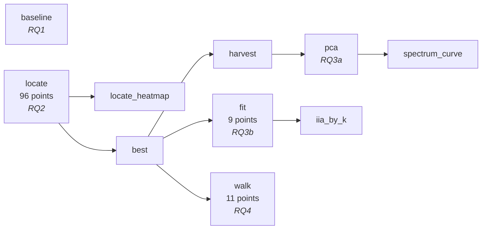
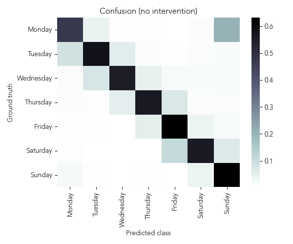
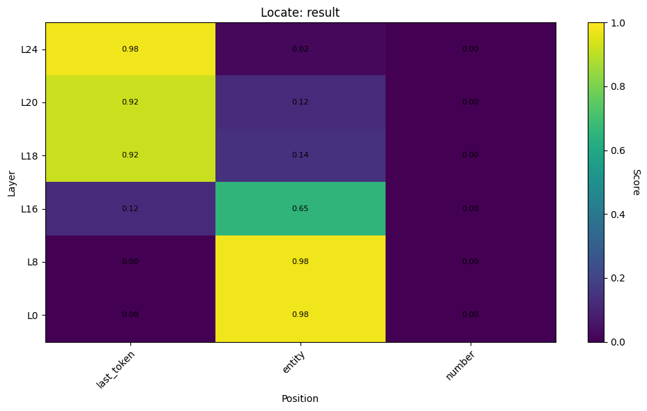
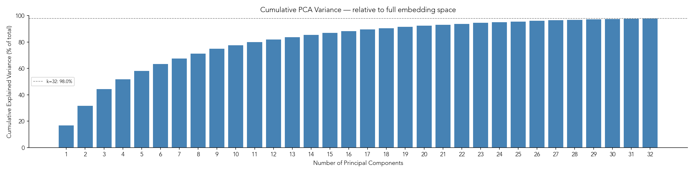
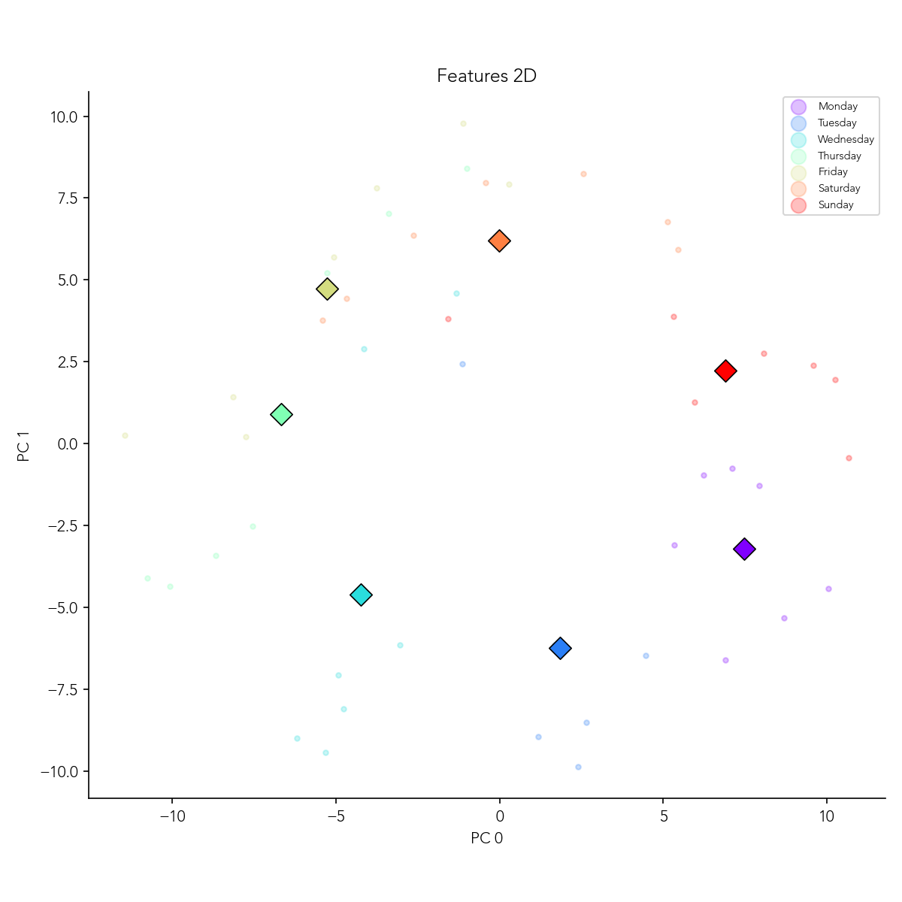
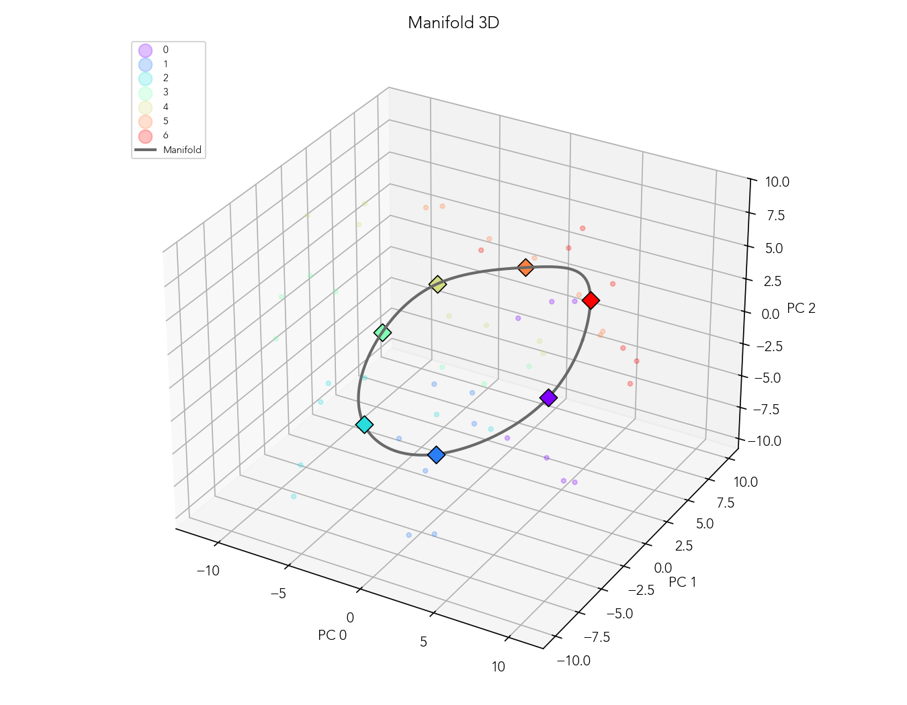
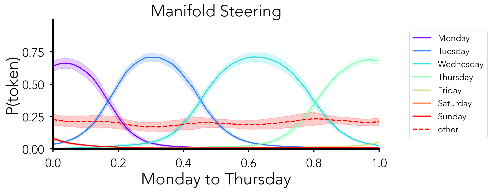
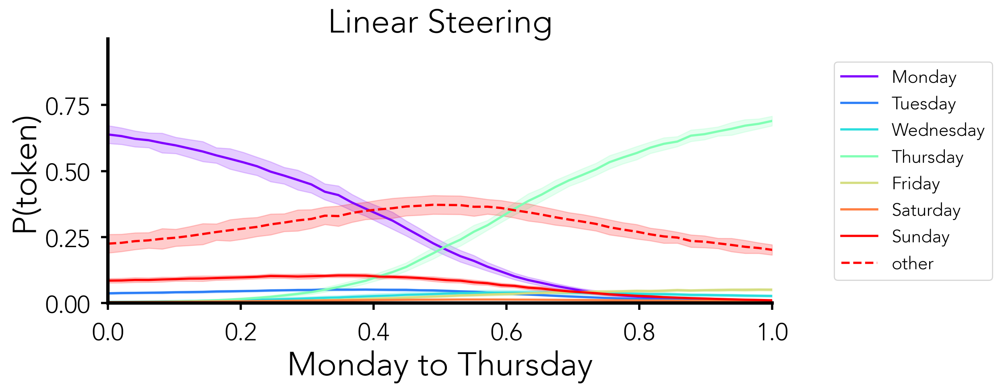

# Weekdays geometry — four questions about one variable

| | |
|---|---|
| **Question** | Where and how does the model represent the weekday it is about to answer — and what does it say from the points in between two answers? |
| **Method** | a workflow: baseline → interchange scan → PCA and DAS at the located cell → an interpolation walk |
| **Model** | `meta-llama/Llama-3.1-8B` @ `main`, bf16 |
| **Data** | `weekdays/train` (64 pairs), `weekdays/test` (32) — `natural_domains_arithmetic`, `domain_type=weekdays` |
| **Documents** | [`workflows/weekdays_geometry.json`](workflows/weekdays_geometry.json) → five [`protocols/`](protocols/) |
| **Cost** | 10 steps, 118 points; the DAS step trains 9 rotations |
| **Reproduced** | ⚠ figures carried from the pre-refactor reference run, some at a different layer than the documents pin |

## TL;DR

The task is weekday arithmetic — *"What day is four days after Sunday?"* — and
the variable is the answer day. Llama-3.1-8B solves it (**0.918**, against a
1-in-7 floor of 0.143), and an interchange scan puts it at the answer slot from
**L18** on. The representation there is not one direction: 32 principal components are needed
for 98% of the variance, and 6 for 63%. Walking the residual stream from one
answer to another along a straight line takes the model *through* no other
weekday; walking it along the curve the seven answers lie on does — which is the
whole reason to ask about geometry rather than about a direction.

## The protocol

A workflow demo: the thesis is the chain, and each step's document is linked
rather than inlined.

```json
{
  "version": "1",
  "output_dir": "weekdays_geometry",
  "steps": {
    "baseline":       {"type": "intervention_protocol", "document": "../protocols/weekdays_baseline.json"},
    "locate":         {"type": "intervention_protocol", "document": "../protocols/weekdays_locate_scan.json"},
    "locate_heatmap": {"type": "script", "script": {"module": "causalab.io.plots.workflow_figures"},
                       "inputs": {"table": {"step": "locate", "file": "iia.json"},
                                  "plot": "heatmap", "x": "sites.target.layer", "y": "positions.tap"},
                       "outputs": {"figure": "locate_iia.png", "plotted": {"file": "locate_iia.json"}}},
    "best":           {"type": "script", "script": {"module": "causalab.workflow.scripts.select"},
                       "inputs": {"table": {"step": "locate", "file": "iia.json"}, "choose": "max",
                                  "emit": {"best_layer": "sites.target.layer", "best_pos": "positions.tap"}},
                       "outputs": {"values": {"file": "values.json",
                                              "keys": {"best_layer": 18, "best_pos": {"index": -1}}}}},
    "harvest":        {"type": "intervention_protocol", "document": "../protocols/weekdays_harvest.json",
                       "set": {"sites.target.layer": {"artifact": "best", "key": "best_layer"},
                               "positions.best":     {"artifact": "best", "key": "best_pos"}}},
    "pca":            {"type": "script", "script": {"module": "causalab.analysis.fit_pca"},
                       "inputs": {"acts": {"step": "harvest", "file": "acts.safetensors"}, "k": 32},
                       "outputs": {"weight": "basis.safetensors",
                                   "spectrum": {"file": "spectrum.json",
                                                "columns": {"pc": "int64",
                                                            "explained_variance": "float64",
                                                            "explained_variance_ratio": "float64"}}}},
    "spectrum_curve": {"type": "script", "script": {"module": "causalab.io.plots.workflow_figures"},
                       "inputs": {"table": {"step": "pca", "file": "spectrum.json"},
                                  "plot": "lines", "x": "pc", "value": "explained_variance_ratio"},
                       "outputs": {"figure": "pca_spectrum.png"}},
    "fit":            {"type": "intervention_protocol", "document": "../protocols/weekdays_das_sweep.json",
                       "set": {"sites.target.layer": {"artifact": "best", "key": "best_layer"},
                               "positions.best":     {"artifact": "best", "key": "best_pos"}}},
    "iia_by_k":       {"type": "script", "script": {"module": "causalab.io.plots.workflow_figures"},
                       "inputs": {"table": {"step": "fit", "file": "iia.json"},
                                  "plot": "lines", "x": "featurizers.rot.k", "series": "train.seed"},
                       "outputs": {"figure": "iia_by_k.png", "plotted": {"file": "iia_by_k.json"}}},
    "walk":           {"type": "intervention_protocol", "document": "../protocols/weekdays_linear_walk.json",
                       "set": {"sites.target.layer": {"artifact": "best", "key": "best_layer"},
                               "positions.best":     {"artifact": "best", "key": "best_pos"}}}
  }
}
```

The derived schedule — five levels, none of them authored:



`baseline` and `locate` share level 0 because neither references the other.
Everything downstream of `best` waits on it — not because the document says so,
but because three `set` blocks name it.

| step | document | what it contributes |
|---|---|---|
| `baseline` | [`weekdays_baseline.json`](protocols/weekdays_baseline.json) | one un-intervened forward per row; `match` accuracy. No `writes`, therefore no `intervened_models` |
| `locate` | [`weekdays_locate_scan.json`](protocols/weekdays_locate_scan.json) | 32 layers × 3 positions of interchange, scored by IIA |
| `best` | `causalab.workflow.scripts.select` | groups the metric table by the producing document's sweep coordinates — read from the step's `_step.json`, not authored — and emits the argmax cell |
| `harvest` | [`weekdays_harvest.json`](protocols/weekdays_harvest.json) | pure reads at that cell. No `reduce`: a mean has no variance to decompose |
| `fit` | [`weekdays_das_sweep.json`](protocols/weekdays_das_sweep.json) | trains a rotation and interchanges only its first *k* coordinates, over k × seed |
| `walk` | [`weekdays_linear_walk.json`](protocols/weekdays_linear_walk.json) | `lerp` from base activation to counterfactual activation, α in 11 steps |

The handoff worth reading twice is `best` → `fit`. `select` emits
`best_layer` and `best_pos` into `values.json`; `fit`'s `set` block re-points
the DAS document's site and position at them. The DAS document is therefore
*not* pinned to a layer — the scan chooses it, and if the scan chooses
differently the fit follows, with no edit anywhere.

## Run it

```bash
uv run causalab validate demos/weekdays_geometry/workflows/weekdays_geometry.json \
    --data-root demos/weekdays_geometry/data
# OK: demos/weekdays_geometry/workflows/weekdays_geometry.json — 10 steps, digest 8143a3361bb0326e…
```

```bash
uv run causalab explain demos/weekdays_geometry/workflows/weekdays_geometry.json \
    --data-root demos/weekdays_geometry/data
# digest    8143a3361bb0326e7a1c58561f4ca715e45404ec48b2e76324d11afc2689ba1a
# schedule  5 levels
#   level 0: baseline, locate
#   level 1: locate_heatmap, best
#   level 2: harvest, fit, walk
#   level 3: pca, iia_by_k
#   level 4: spectrum_curve
#   baseline: intervention_protocol ../protocols/weekdays_baseline.json — 1 point(s), campaign digest 527242f281bea3cf…
#   locate: intervention_protocol ../protocols/weekdays_locate_scan.json — 96 point(s), campaign digest cb532909ac4829fb…
#   locate_heatmap: script causalab.io.plots.workflow_figures -> locate_iia.json, locate_iia.png
#   best: script causalab.workflow.scripts.select -> values.json
#   harvest: intervention_protocol ../protocols/weekdays_harvest.json — 1 point(s), authored digest 4548aa315625b3f1…
#   pca: script causalab.analysis.fit_pca -> basis.safetensors, spectrum.json
#   spectrum_curve: script causalab.io.plots.workflow_figures -> pca_spectrum.png
#   fit: intervention_protocol ../protocols/weekdays_das_sweep.json — 9 point(s), authored digest 386b7941ee33fc33…
#   iia_by_k: script causalab.io.plots.workflow_figures -> iia_by_k.json, iia_by_k.png
#   walk: intervention_protocol ../protocols/weekdays_linear_walk.json — 11 point(s), authored digest 95cadecd15fe1b94…
```

```bash
uv run causalab run demos/weekdays_geometry/workflows/weekdays_geometry.json \
    --data-root demos/weekdays_geometry/data \
    --out runs --device cuda --dtype bf16
```

**Hardware.** One GPU with ≥40 GB: 8 B parameters in bf16 is ~16 GB of weights,
and the `fit` step holds gradients for a 4096 × k rotation on top. That step's
`requires` includes `grad`, which only the reference engine declares — so the
document routes there whatever `--engine` says, while the read-only steps could
run on either. Sizing comes from `explain`'s point counts (118 across the five
protocol steps); it is not a measured wall clock.

Shard a long scan rather than growing the job:

```bash
uv run causalab run demos/weekdays_geometry/protocols/weekdays_locate_scan.json \
    --data-root demos/weekdays_geometry/data --out runs/scan/shard_0 \
    --points 0:24 --device cuda --dtype bf16
```

Each point's digest is the provenance unit, so four shards of 24 merge by
coordinate into the same campaign.

## Experimental design

A single question — "how is the weekday represented" — decomposes into four that
feed each other. Each RQ's answer is the next one's input, which is exactly what
makes this a workflow rather than four demos.

**RQ1 — can the model do the task at all?** `accuracy` from `baseline`. Floor:
0.143, one in seven. A localization result on a task the model cannot do is a
measurement of noise, so this gates everything below it.

**RQ2 — which (layer, position) carries the answer?** The IIA grid over 32
layers × {entity token, number word, answer slot}.

Two properties of the dataset set the reading, and both are
[01](../onboarding_tutorial/01_define.md)'s lesson arriving as numbers. The
task's generator samples the counterfactual **independently** — it is 01's
`random_counterfactual`, not a crafted design — so over the 64 training pairs:

| | count | consequence |
|---|---|---|
| identical prompts | 3 / 64 | the interchange is a no-op by construction |
| `base_answer == cf_answer` | 14 / 64 | a patch that does nothing still scores 1 |
| same entity | 10 / 64 | the entity token is not the only difference |
| same number | 8 / 64 | neither is the number word |

So the **floor is 0.219**, not 0: a cell reading 0.22 has done nothing at all.
And because entity *and* number both differ, each input token carries only half
of what determines the answer — the entity token cannot install the
counterfactual's result unless the number happens to agree too.

**Expectation.** The answer slot is high from the layer the arithmetic completes
at; the entity and number columns stay near the floor at every layer. Those two
columns are the **control**: a scan that lights them up is reading something
other than the result.

**RQ3 — how few directions carry it?** Two different senses of "few", each with
its own tool:

| sense | tool | reads |
|---|---|---|
| the directions the activations *vary* along | PCA over the harvest (`pca`) | `explained_variance_ratio` vs k |
| the directions an intervention *needs* | DAS over a k sweep (`fit`) | IIA vs k |

They are not the same question and can disagree: a variable can be causally
mediated by a direction that carries little variance. Floor for the IIA curve is
0.219 again; the ceiling is RQ2's whole-cell IIA, because interchanging a
subspace cannot beat interchanging everything.

**RQ4 — what does the model say between two answers?** `class_probs` over the
seven weekday tokens as α runs 0 → 1. α = 0 is the un-intervened model and α = 1
is RQ2's interchange at the located cell, so both endpoints are already known;
the sweep is the straight line between them. Two outcomes are interesting and
they differ qualitatively:

- the model **passes through** the days between — Tuesday and Wednesday rise and
  fall on a Monday → Thursday walk;
- the model **crosses over** — Monday falls, Thursday rises, and the mass in
  between goes to neither, landing on tokens that are not weekdays at all.

> **Why the last token, when the entity token scores higher early?** Because the
> two are the same information at different times. The scan is expected to show
> the answer readable at the entity token from the first layers — the model knows
> which day was named — and at the answer slot only after the arithmetic has been
> done. The variable this demo is about is the *result*, so the cell to work in
> is the later one.

> **Why `lerp` and not a steering vector?** A steering vector is a direction with
> a magnitude, and choosing the magnitude is a free parameter. `lerp` between two
> real activations has neither: α = 1 is a point the model actually produces on
> some input, so the walk stays inside the region the network puts activations in
> — up to whatever the straight line between two such points passes through,
> which is exactly RQ4's question.

## Results

> **Not yet regenerated.** These documents have not been run since the protocol
> refactor. Every figure below is from the pre-refactor pipeline; RQ1 and RQ2 are
> the same quantities the documents compute, RQ3 and RQ4 are not — each caption
> says how it differs.

### RQ1 — yes, 0.918



*Reference run: Llama-3.1-8B, pre-refactor `baseline` over all 49
entity × number combinations. Rows are the true weekday, columns the predicted
one, cells the probability mass. Look at the diagonal, then at the Monday row.*

45 of 49 correct — 0.918 against a 0.143 floor. The mean probability on the
correct token is 0.569, so the model is right without being certain.

**Finding.** The one substantial off-diagonal is Monday predicted as Sunday,
carrying roughly a quarter of the Monday row. Errors are adjacent-day errors,
not arbitrary ones — a hint about the representation that RQ3 comes back to.

**Verdict.** Yes. The task is solved well enough for an intervention on it to
mean something.

### RQ2 — the entity token early, the answer slot from L18



*Reference run: Llama-3.1-8B, pre-refactor `locate` in pairwise mode — the same
quantity as this document's `match` IIA — over six sampled layers and three
positions. **Its counterfactual resampled the entity only**, where this
document's table resamples entity and number both. The `last_token` column is
therefore comparable and the `entity` column is not. Look at the right-hand
column across rows.*

`last_token` reads 0.00 up to L8, 0.12 at L16, then 0.92, 0.92, 0.98 at L18, L20,
L24. The handoff is sharp: one layer either side of L18 and the answer has
arrived at the slot the unembedding reads.

✓ `number` reads 0.00 at all six sampled depths. Under the reference design the
number never varied, so there was nothing at that token to interchange — the
check that the scan reads what the dataset varies.

**Finding.** Under an entity-only counterfactual the entity token carries the
answer from L0 (0.98) and hands it over between L16 and L18. That is the
model routing a variable it can compute early. Whether the *same* handoff is
visible under this document's independent resampling is what running it decides:
the expectation above says the entity column should sit near 0.219 throughout,
because knowing the entity is not knowing the answer when the number moved too.

**Verdict.** L18 at the answer slot, at IIA 0.92 against a 0.219 floor. The
entity column's reading is the reference design's, not this document's.

### RQ3 — not one direction, and the seven answers lie on a ring



*Reference run: cumulative variance of the harvested activations, as a fraction
of the **full** embedding space — the denominator is every singular value, not
just the 32 kept. Note the caption in [Limits](#limits): this fit is at layer 28,
where the document pins layer 18.*

The first component carries 16.5%, six reach 63%, twelve reach 82%, and the
32-component subspace retains 98%.

**Finding.** The representation is low-dimensional relative to 4096 and *not*
low-dimensional in the sense a single steering direction assumes. Anything that
treats "the weekday direction" as one vector is discarding 83% of the variance.



*Same fit, first two components. Small dots are individual examples coloured by
their answer day, diamonds are the seven class centroids.*

**Finding.** The seven centroids sit on a closed curve, in weekday order:
Monday and Sunday are neighbours on it, which is what RQ1's Monday-for-Sunday
confusion looks like from the inside. The examples of one class scatter widely
around their centroid — the ring is a statement about class means, not about
individual activations.



*Same fit, first three components, with a closed spline fitted through the seven
centroids (legend indices 0–6 are Monday–Sunday). This curve is what RQ4's first
walk follows; producing it needs a script step that does not ship — see
[Limits](#limits).*

**Verdict, RQ3a.** Six to twelve directions, arranged as a ring rather than a
line — a curve a walk can follow, which is what makes RQ4 a question about
geometry rather than about a direction.

**RQ3b — no result.** The `fit` step's IIA-vs-k curve has not been run. The
document sweeps k ∈ {2, 8, 32} × seed ∈ {0, 1, 2}; the question it answers is
whether k = 2 — enough for a ring — already reaches RQ2's 0.92.

### RQ4 — a straight line crosses over, the ring passes through




*Reference run: pre-refactor `path_steering`, Monday → Thursday, probability of
each weekday token along the walk. **Top**: along a spline fitted to the ring.
**Bottom**: along the straight line between the Monday and Thursday centroids in
PCA space. The dashed line is the mass on everything that is not a weekday.
Both are walks between class **centroids** in a 32-dimensional PCA subspace; the
document above walks between two **rows'** activations in the full space, so
these answer RQ4's question under a different construction.*

Along the ring, Tuesday peaks at ≈0.71 near α = 0.3 and Wednesday at ≈0.72 near
α = 0.6, and the non-weekday mass stays flat at 0.17–0.25 throughout. Along the
straight line, no intermediate day exceeds ≈0.11 and the non-weekday mass rises
from 0.23 to a peak of ≈0.37 at α ≈ 0.5 before falling back.

**Finding.** The straight line between two answers leaves the region where the
model's answers live: at the midpoint, more mass sits on non-weekday tokens than
on any weekday. The curve the answers lie on does not — it walks the model
through Tuesday and Wednesday at nearly the confidence it has for the endpoints.
The seven-day structure of RQ3's ring is therefore *causal*, not decorative: the
path between two points matters, and the ring is the path the model behaves
along.

**Verdict.** Passes through along the ring; crosses over along the line.

## Limits

- **The RQ3 and RQ4 figures are fitted at layer 28; the documents pin layer 18.**
  The source notebook's prose says layer 18 while its config says 28, and the
  figures are the config's. At deeper layers the `last_token` residual is
  dominated by the *number* variable, and because each result class spans all
  seven numbers uniformly, the result centroids can collapse toward the global
  mean — a mathematical identity, not a bug. That the layer-28 fit still shows a
  clean ring is worth re-checking when these are regenerated at 18.
- **The weekday generator does not deconfound.** It samples the counterfactual
  independently, so 3 pairs in 64 are literally the same prompt, 14 share an
  answer, and both input variables move at once. That sets a 0.219 floor under
  every cell and makes the entity and number columns uninterpretable as
  localization. The fix is a crafted generator of the kind
  [01](../onboarding_tutorial/01_define.md) demonstrates — a `resample_entity`
  beside `generate_dataset` in the task package — not a scoring change.
- **The geodesic arm is not expressible today.** Fitting a spline to the ring and
  walking it needs a script step that does not ship; `causalab/analysis/` has
  `fit_pca`, `harvest_difference`, `head_stats` and `paired_ttest`. The linear
  arm is a document (`weekdays_linear_walk.json`); the comparison is not yet.
- **RQ4's figure is one series per weekday, which the shipped renderer does not
  draw.** `causalab.io.plots.workflow_figures` plots one value column, and
  `class_probs` writes seven. The numbers land in `day_probs.json` regardless —
  a figure is a rendering, not the record — and a seven-series plot is one more
  script step.
- **One model, one task, one prompt template.** Whether the ring is a fact about
  weekdays, about cyclic categories, or about this checkpoint is not asked here.

## Next

- Regenerate at the pinned layer: `causalab run` on the workflow above turns
  every ⚠ in this file into a ✓ and a digest.
- The missing spline-fit script is the one piece between the linear arm and the
  comparison — it is a `script` step over `harvest`'s activations, which is what
  the step type exists for ([`docs/workflow_protocol.md`](../../docs/workflow_protocol.md) §2.3).
- Cyclic structure is a claim that should transfer: the same four RQs over
  `natural_domains_arithmetic` with `domain_type=months` need a new data table
  and no new documents.
